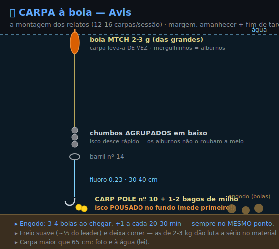
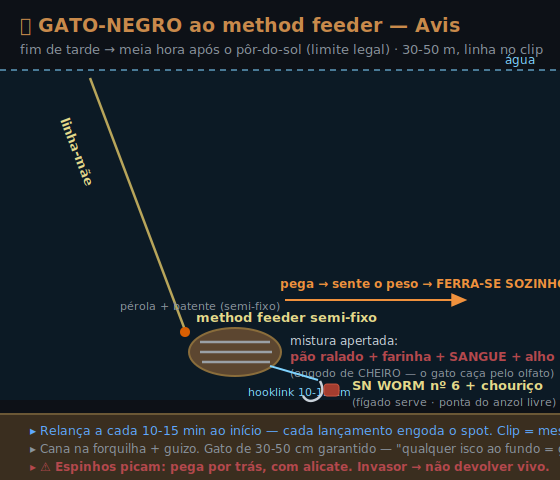
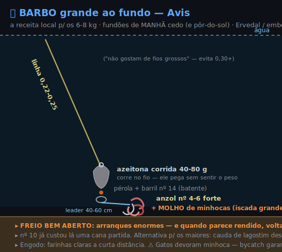

# 🏕️ Avis — Barragem do Maranhão *(guia da semana)*

> 🗒️ Guia prático para a semana de campismo em Avis. Baseado em **relatos reais de 2007-2025** (fóruns, provas FPPD, locais). *(Secção temporária, como os Campings.)*

**A água em 1 parágrafo:** provavelmente [**a barragem com mais carpas de Portugal**](https://www.pesqueiro.pt/index.php?topic=20843.0) — médias de **0,5-3 kg em quantidade industrial** (sessões reais: [12-16 à boia](https://web.archive.org/web/20080317055117/http://pescador.com.pt/livre/viewtopic.php?f=16&t=1922), ["22 ao feeder"](https://www.youtube.com/watch?v=7M3comwFv9g); nas provas de 72h fazem-se [100+ kg/dupla](https://www.fppd.pt/wp-content/uploads/2025/Agua%20Doce/Classifica%C3%A7%C3%B5es/Camp.%20Nac.%20Carpas%20-%202025.pdf)). Grandes (10 kg+) existem mas são fantasmas — [os relatos acabam em anzol/linha partidos](https://www.pesqueiro.pt/index.php?topic=31951.0). ⚠️ O **fundo está infestado de peixe-gato-negro** (30-50 cm, ["toneladas"](https://www.pesqueiro.pt/index.php?topic=38123.0)) — [qualquer isco pousado = gato](https://www.pesqueiro.pt/index.php?topic=16049.0). Por isso: **carpa à boia de dia · gato ao fundo ao anoitecer.**

---

## 🎣 O plano das 2 canas

| | 🪶 Cana pequena — **boia** | 💪 Cana grande — **method feeder** |
|---|---|---|
| **Alvo** | carpa (dia) | gato-negro (fim de tarde) + carpa grande |
| **Quando** | amanhecer + fim de tarde | tarde → meia hora após pôr-do-sol (limite legal) |
| **Onde** | margem, 5-15 m | 30-50 m, linha no clip |
| **Anzol** | **CARP POLE nº 10** + 1-2 bagos milho | **500 Wide nº 6** (carpa: 2-3 bagos no pêlo) · **SN WORM nº 6** (gato: chouriço/fígado) |
| **Leader** | fluoro **0,23** · 30-40 cm | hooklink curto 10-15 cm |

> Direções/distâncias **diferentes** para as duas canas, e engoda os 2 spots separados — a luta numa não espanta a outra. (Máx. legal: 2 canas.)

### 🟠 Montagem da boia (carpa)

- **Isco POUSADO no fundo** (carpa pasta no fundo): mede primeiro — chumbo no anzol, ajusta até a boia ficar direita, soma um palmo.
- Chumbos **agrupados junto ao barril** = desce rápido pelos alburnos (praga à superfície).
- Picada de carpa = boia **vai-se embora de vez** (mergulhinhos = alburnos). Freio suave, deixa correr.
- Fundos reais: 3-12 m — se a fixa não chegar, passa a **deslizante** (nó-batente + pérola).

### 🧺 Method feeder (gato + carpa grande)

- Semi-fixo (efeito bolt) · mistura apertada à volta do feeder · ponta do anzol livre.
- **P/ gato, mistura de CHEIRO:** pão ralado + farinha + **sangue de talho + alho** (caça pelo olfato) → [receitas](ISCOS.md). P/ carpa grande: a mistura normal + 2-3 bagos no pêlo (500 Wide nº 6).
- **Relança a cada 10-15 min** ao início — cada lançamento engoda o spot. Linha no **clip** = cai sempre no mesmo sítio.
- [Receita local (morador)](https://www.youtube.com/watch?v=7M3comwFv9g): *hair rig auto-ferrante + cesto de engodo + milho no cabelo* — é literalmente isto.

---

## 🍞 Iscos — o que funciona LÁ (18 anos de relatos)

- 🥇 **Milho doce e asticot** — os únicos consensuais. Milho p/ carpa; asticot rende mas **à boia chama os alburnos**.
- 🟤 **Gato:** chouriço / fígado / minhoca ao fundo — "qualquer isco ao fundo = gato", nem precisas de esforço.
- ❌ **Boilies às cegas NÃO** — só funcionam com **engodagem prévia de 2 dias a 1 semana** ([relato 2007: "morango/tutti-frutti, nem um toque"](https://web.archive.org/web/20080317055117/http://pescador.com.pt/livre/viewtopic.php?f=16&t=1922)). Para uma semana de férias, esquece.
- **Engodo carpa:** [pão ralado + farinha de milho + milho + asticot](https://web.archive.org/web/20080317055117/http://pescador.com.pt/livre/viewtopic.php?f=16&t=1922) → bolas de tangerina; 3-4 ao chegar, reforço a cada 20-30 min, **sempre no mesmo ponto**.
- Verão = farinhas **claras** + asticot branco/milho ([guia de competição local, 2006](https://www.geralforum.com/board/threads/locais-de-pesca-descricao-tecnicas-utilizadas.1487/)).

---

## 🔵 Barbo — o troféu histórico escondido (6-8 kg nos relatos)

**Existe mesmo:** as [estatísticas oficiais das provas (ICNF 2001-07)](https://www.icnf.pt/api/file/doc/c3bd81fd35bf22e0) registam barbo todos os anos (3ª espécie, ~4% das capturas — raro mas presente), e os locais lembram-no como **o troféu histórico** de Avis ([2024: "quando vazaram a barragem havia verdadeiros monstros junto à comporta"; "os maiores que vi, não cabiam na caixa de uma 4L"](https://www.pesqueiro.pt/index.php?topic=38123.0)). Relatos independentes de [**6-8 kg**](https://www.pesqueiro.pt/index.php?topic=38123.0) — mas **nunca ninguém publicou foto**: podes ser o primeiro. 😄

**Onde/quando:** **braço do Ervedal** (2 fontes com 18 anos de intervalo: [guia 2006](https://www.geralforum.com/board/threads/locais-de-pesca-descricao-tecnicas-utilizadas.1487/) + [2024: "Ervedal para barbos, Benavila para carpas"](https://www.pesqueiro.pt/index.php?topic=38123.0)) · **embocaduras** das ribeiras · no verão estão nos **fundões — de manhã cedo** (e ao pôr-do-sol).

**Para os GRANDES ([receita local, 2024](https://www.pesqueiro.pt/index.php?topic=38123.0)):**
- **Fundo com iscada GRANDE de minhoca** (várias minhocas num molho — não 1 minhoquinha)
- Anzol **nº 4-6** forte *(um nº 10 lá já custou uma cana partida — pequeno demais)* · linha **0,22-0,25** ("não gostam de fios grossos", evita 0,30+)
- **Freio bem aberto**: arranques enormes — e quando parece rendido, **volta a arrancar** (é a marca dele)

**Para números:** curiosamente o [**feeder fino seleciona carpa** — o barbo lá sai mais **à boia/inglesa**](https://www.pesqueiro.pt/index.php?topic=37882.0) (isco a rasar o fundo, anzol nº 14 fino, 0,16-0,18 — [técnica em detalhe: artigo "Pesca de Barbos"](https://www.pesqueiro.pt/index.php?topic=165.0)). Se as carpas não largam o method, é a cana da boia que te dá o barbo.

**Iscos por ordem local:** minhoca (o rei) · [**cauda de lagostim descascada** ("o melhor para os maiores")](https://www.pesqueiro.pt/index.php?topic=23463.0) · milho · queijo duro. Engodo de **farinhas claras a curta distância** no verão ([guia 2006](https://www.geralforum.com/board/threads/locais-de-pesca-descricao-tecnicas-utilizadas.1487/)). ⚠️ Os gatos devoram iscos animais — conta com bycatch.

➡️ [Montagem do barbo em detalhe](EXEMPLOS-MODULAR.md#ex-barbo)

---

## 🟢 Achigã — de margem (marginal, mas dá)

Honestidade primeiro: o Maranhão é água de **carpa/ablete**, não de spinning — o achigã é só [~0,15% das capturas em prova](https://www.icnf.pt/api/file/doc/c3bd81fd35bf22e0) e os relatos recentes de margem são escassos. Mas existe e sai:
- 🎯 **O spot com relato concreto:** a **ilha submersa em frente ao campismo** — ["achigãs a atacar à volta da ilha, 20-30 cm de água em cima"](https://www.pesqueiro.pt/index.php?topic=20843.0) (2018). Vinil verde no Texan (offset).
- **Onde procurar:** margens **rochosas e inclinadas** (Clube Náutico, pontes, Ervedal) — o oposto das arenosas rasas de Benavila/Carapeta. Cover: braços estreitos, moitas pendentes, arbustos alagados. O **paredão** concentra peixe visível.
- **Hora:** **nascer do sol** e sai cedo ("às 8h já era tarde"); vinil na lenha durante o dia.
- **Tamanho:** há de [3-5 kg mas raramente picam](https://www.pesqueiro.pt/index.php?topic=38123.0) (fartura de presa natural); populações oscilam muito ano a ano.
- 🛒 O teu **[Texan Wide Gap](https://www.decathlon.pt/p/anzol-de-pesca-de-predadores-texan-wide-gap-abertura-larga/357866/m8911969) + vinil YUBARI** é exatamente o rig → [Achigã](EXEMPLOS-MODULAR.md#ex-achiga).

---

## 🐟 Peixe-almofada — a francesa das tardes (alburno · pimpão · perca-sol)

Quando as carpas não colaboram, isto dá **ação non-stop** — e o alburno é a **pesca do momento** no Maranhão:
- 🐟 **Alburno (ablete):** há **imensidões** — [ganham-se provas com 400-500 abletes](https://www.pesqueiro.pt/index.php?topic=16049.0). **Boia + asticot a meia-água** = garantido (⚠️ rente ao fundo = gato). A **[inglesa a meia-água](https://www.geralforum.com/board/threads/locais-de-pesca-descricao-tecnicas-utilizadas.1487/)** é excelente no verão. Exótico a sul do Douro → **não devolver** (fritam-se, "petinga alentejana").
- ⚪ **Pimpão:** 2ª espécie em biomassa, mas vem no meio (o de [1,9 kg foi ao feeder + minhoca nº10](https://www.pesqueiro.pt/index.php?topic=38123.0)). Milho / asticot / minhoca.
- 🟡 **Perca-sol:** abundante (40-60 g), morde o dia todo — o peixe de treinar a ferrar.
- 💡 **Dica local de engodo:** farinha que faz **nuvem** na água → pesca **fora da nuvem, para o lado**; anzol de **haste maior** que o da carpa (desferra mais rápido). Asticot solto e abundante no calor.
- 🛒 Boia MTCH + CARP POLE nº14 + asticot. *(Trigo congelado p/ engodo: loja Sodarca, Avis.)*

---

## 🦞 Lagostim — apanha-o (e é isco grátis de barbo)

Há lagostim-vermelho quase de certeza (registos GBIF por toda a zona de Avis), e é **legal apanhá-lo SEM licença** ([DL 112/2017, art. 47](https://files.diariodarepublica.pt/1s/2017/09/17200/0527605296.pdf)):
- **Como:** camaroeiro, **balança/ratel** (rede com isco no fundo) ou à mão. ⚠️ **Covo/nassa = só pesca profissional** (infração na lúdica).
- ⚠️ **Mata na hora:** é invasor → **não o transportes vivo nem o devolvas** ([DL 92/2019](https://diariodarepublica.pt/dr/detalhe/decreto-lei/92-2019-123025739)).
- 🎣 **Cauda descascada = isco de topo p/ barbo grande** — e é **legal** (a proibição de isco cobre só *peixes*; lagostim é crustáceo). Fluxo limpo: **apanha → mata → usa a cauda no mesmo sítio**.

---

## 📍 Spots (zonas oficiais FPPD + fóruns)

| Spot | Pesqueiros · acesso | Diz-se | 📍 |
|---|---|---|---|
| **Clube Náutico / campismo** | 20 · razoável | ["feeder e à boia, deu para brincar bastante" (2015)](https://www.pesqueiro.pt/index.php?topic=8807.0) · ilha submersa em frente | [39.0571, -7.9116](https://www.google.com/maps?q=39.0571,-7.9116) — **a pé da tenda** |
| **Carapeta** | **100 · bom** | a maior zona de prova ([FPPD](https://www.fppd.pt/locais-de-pesca-agua-doce/)); margens batidas/engodadas há anos | [39.039, -7.931](https://www.google.com/maps?q=39.0387,-7.9310) *(Monte da Carapeta — margem adjacente)* |
| **Benavila 1+2** | 120 · bom | **a zona de carpa** — o [Nacional 2016 foi lá (597 kg)](https://web.archive.org/web/20161110175030/http://www.cm-avis.pt/menu-1/1023-albufeira-do-maranhao-recebeu-etapa-decisiva-do-campeonato-nacional-de-pesca-a-carpa); ["carpas loucas à superfície"](https://www.pesqueiro.pt/index.php?topic=20843.0) | braço NE · [~39.10, -7.88](https://www.google.com/maps?q=39.10,-7.88) *(aprox.)* |
| **Horta das Rosas (Ervedal)** | 50 · fraco | braço leste; [Ervedal dá **barbos**](https://www.pesqueiro.pt/index.php?topic=38123.0) | [~39.051, -7.837](https://www.google.com/maps?q=39.0507,-7.8374) *(aprox. — bica homónima; a zona noturna 5 abaixo dá o troço exato)* |
| **Entre Pontes** | 40 · fraco | pontes da estrada Avis↔Benavila | zona central |
| **Paredão** | — | os "monstros" ferram-se lá (e partem tudo) | [39.037, -7.928](https://www.google.com/maps?q=39.037,-7.928) ⚠️ respeitar zona de segurança |
| **Horta dos Frades** | [dica de veterano (2007)](https://web.archive.org/web/20080317055117/http://pescador.com.pt/livre/viewtopic.php?f=16&t=1922) | braço **a poente** de Avis — fundo onde "as carpas pastam, muito localizado, **pouca pressão**" | sem registo em mapas (lado SW/Carapeta) — **pergunta a um local** |
| **Fábrica do Leite** | [dica de veterano (2007)](https://web.archive.org/web/20080317055117/http://pescador.com.pt/livre/viewtopic.php?f=16&t=1922) | zona **funda** perto de Avis — "saem grandes carpas" ao fundo | referência local — pergunta no Clube Náutico |

> **Pesqueiro** = posto de competição numerado na margem: mato limpo, acesso à água, spot batido. Fora de prova, pesca-se lá à vontade.

---

## 🌊 Água & condições (fim de julho)

- 💧 **Nível:** chega ao verão **cheia e desce devagar** — projeção p/ fim jul 2026 ~**72-76%** (SNIRH/ARBVS); margens acessíveis, sem seca extrema. O braço de **Benavila** (arenoso) é o que fica mais exposto; a **ilha submersa** do campismo fica com 20-30 cm à tona no fim do verão.
- ⚠️ **Cianobactérias:** houve [bloom em maio 2023](https://quercus.pt/2023/05/quercus-alerta-para-proliferacao-de-cianobacterias-na-albufeira-do-maranhao-avis/) (espuma/manchas azuis, escorrências do olival) — **sem recorrência noticiada desde**. No calor, **evita a espuma azul** junto à margem e pondera antes de consumir o peixe.
- 🏖️ **Praia Fluvial do Clube Náutico** = qualidade **"Excelente"** / Bandeira Azul, mesmo ao pé da tenda (água limpa + bar/restaurante). Época balnear **1 jul-31 ago** → não pescar na zona balnear nesse período.

---

## ⚖️ Regras específicas (verificado)

- **Águas livres** → licença geral ICNF chega. Máx. **2 canas**.
- **Carpa >65 cm devolve-se** por lei ([Portaria 108/2018](https://diariodarepublica.pt/dr/detalhe/portaria/108-2018-115090161)). Foto e à água.
- **Gato-negro = invasor** → **devolução proibida** ([abate-se, não se devolve vivo](https://diariodarepublica.pt/dr/detalhe/portaria/108-2018-115090161)). Fica pequeno (um palmo, quase sempre <1 kg) — é **praga/bycatch, não troféu**; para monstros é o **siluro em [Idanha](IDANHA.md)**, não o gato daqui.
- 🐍 **Enguia:** se ferrares uma, **devolve** — a **pesca lúdica da enguia é proibida** em água doce ([Portaria 108/2018](https://diariodarepublica.pt/dr/detalhe/portaria/108-2018-115090161); saiu das espécies pescáveis lúdicas). Não a podes reter.
- **Noite:** pesca só até **meia hora após o pôr-do-sol** — EXCETO **carpfishing noturno** nas 6 zonas delimitadas pelo ICNF (só carpa: 3 canas, hair rig, a 250 m de habitações; o gato à noite fica de fora). **As 6 zonas (cada uma = troço de margem entre os 2 pontos):**

| Zona | Onde fica | 📍 Limites (WGS84) |
|:--:|---|---|
| 1 | perto de Avis | [39.07022, -7.90081](https://www.google.com/maps?q=39.07022,-7.90081) ↔ [39.06931, -7.90378](https://www.google.com/maps?q=39.06931,-7.90378) |
| 2 | braço de Benavila (norte) | [39.12783, -7.86183](https://www.google.com/maps?q=39.12783,-7.86183) ↔ [39.11819, -7.85158](https://www.google.com/maps?q=39.11819,-7.85158) |
| 3 | Benavila | [39.11086, -7.87789](https://www.google.com/maps?q=39.11086,-7.87789) ↔ [39.10800, -7.88292](https://www.google.com/maps?q=39.10800,-7.88292) |
| 4 | Avis (junto à vila) | [39.06647, -7.89992](https://www.google.com/maps?q=39.06647,-7.89992) ↔ [39.06481, -7.89961](https://www.google.com/maps?q=39.06481,-7.89961) |
| 5 | braço leste (Figueira e Barros / Ervedal) | [39.04378, -7.78978](https://www.google.com/maps?q=39.04378,-7.78978) ↔ [39.04828, -7.80344](https://www.google.com/maps?q=39.04828,-7.80344) |
| 6 | Carapeta (SW) | [39.04219, -7.93228](https://www.google.com/maps?q=39.04219,-7.93228) ↔ [39.03478, -7.94464](https://www.google.com/maps?q=39.03478,-7.94464) |

  *(Fonte: [ICNF carpfishing noturno](https://www.icnf.pt/pesca/pescaludicaedesportiva/carpfishingnoturno). Zonas 1 e 4 = a minutos do camping.)*
- Provas nacionais são em **outubro** → julho/agosto sem conflitos de zona.

---

## 🎒 Checklist rápida
Licença (talão MB) + CC · canas 2 · boias MTCH + stops/pérolas · CARP POLE nº10 · 500 Wide nº6 · SN WORM nº6 · fluoro 0,23 · method feeder + barris · milho em lata ×3 · asticot (loja) · chouriço/fígado · pão ralado + farinha de milho · forquilhas + guizos · camaroeiro · alicate (esmagar barbela/desenfiar gato ⚠️ espinhos: pega por trás).

➡️ Montagens em detalhe: [Carpa](EXEMPLOS-MODULAR.md#ex-carpa) · [Peixe-gato](EXEMPLOS-MODULAR.md#ex-gato) · anzóis/leaders → [📏 Tamanhos](TAMANHOS.md#anzol) · receitas → [🍞 Iscos](ISCOS.md)
