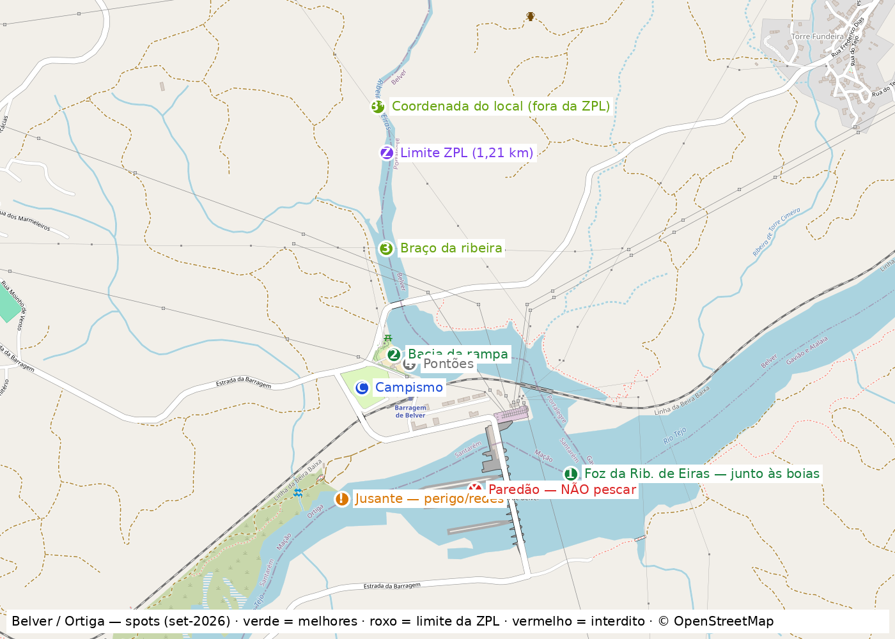

# 🟫 Belver / Ortiga — o siluro *(day-trip ou fim de semana)*

> 🗒️ O troço com **maior densidade de siluro do país** ao alcance de Lisboa. Dorme-se a **300 m do spot**. Fontes linkadas; coordenadas verificadas em OSM.

**A água em 1 parágrafo:** albufeira de Belver (1952, fio-de-água no Tejo, 12,5 hm³), troço **Ponte de Belver ↔ paredão** — 4,5 km onde o [LIFE PREDATOR retirou **254 siluros / 2,3 t num único dia** (mai-2026)](https://wilder.pt/historias/andamos-no-tejo-a-apanhar-siluros-capturadas-mais-de-duas-toneladas), o maior com **2,15 m / 125 kg**. Densidade estimada **~300 siluros/km²**. Saiu um de [**2,00 m / 60 kg junto à barragem** (jul-2026)](https://www.youtube.com/watch?v=Vn_PLHIhxJc).

⚠️ **Noturna ilegal, sem exceção** — o siluro é noturno, joga-se a **primeira e a última hora legal**. 👥 **Água conhecida e pescada** (35 diárias para não residentes, praia, campismo): chega **antes do nascer do sol** para ter o posto.

---

## 📍 Spots — do melhor para o pior

🗺️ **[Abrir mapa interativo (com "onde estou")](belver-mapa.html)** · [Google Maps com os pinos](https://www.google.com/maps/dir/39.48223,-8.00288/39.48000,-7.99586/39.48309,-8.00180/39.48584,-8.00205/39.48285,-8.00128/39.48831,-7.96766/39.48731,-7.96748) *(1.º pino = campismo; ignora a rota)*.

| # | Spot | 📍 | Do campismo | Porquê | Senão |
|:--:|---|---|:--:|---|---|
| 🥇 | **Foz da Ribeira de Eiras** — pescar **fora da linha de boias, subindo a ribeira** | [39.48000, -7.99586](https://www.google.com/maps?q=39.48000,-7.99586) | **350 m** a pé | É a "boca de ribeira" da telemetria, a 500 m do paredão (água mais funda). Dica do local: *"fica onde desagua a Ribeira de Eiras… nesta zona vão aparecendo"* ([vídeo](https://www.youtube.com/watch?v=sfRSzhORw9g)) | Colado à zona interdita — respeita as boias |
| 🥈 | **Bacia da rampa / praia fluvial** | [39.48309, -8.00180](https://www.google.com/maps?q=39.48309,-8.00180) | **289 m** | Onde saíram os **60 kg** e os **45 kg + 6 num dia** ([Tomar na Rede](https://tomarnarede.pt/destaque/pescador-de-tomar-captura-siluro-gigante-no-rio-tejo-c-video/)); lançar para o leito antigo | Gente na praia ao fim de semana — pescar cedo e ao fim do dia |
| 🥉 | **Braço da ribeira** (500-800 m acima da foz) | [39.48584, -8.00205](https://www.google.com/maps?q=39.48584,-8.00205) · coordenada de um local: [39.48952, -8.00233](https://www.google.com/maps?q=39.489518,-8.002333) ([comentário](https://www.youtube.com/watch?v=SBOhb9UbsVg)) | 523-800 m | 3 vídeos de siluro à cana da margem ([2018](https://www.youtube.com/watch?v=sfRSzhORw9g) · [2019](https://www.youtube.com/watch?v=SBOhb9UbsVg) · [2021](https://www.youtube.com/watch?v=soHF2mhVxYg)); menos gente | ⚠️ **Seca no fim do verão** ([9-set-2022](https://www.youtube.com/watch?v=dYkIj1uP0Z8)) — se estiver parada, o peixe está na foz, não aqui. A coordenada do local fica **~130 m para lá do limite da ZPL** (só licença nacional) |
| 4 | **Pontões flutuantes** | [39.48285, -8.00128](https://www.google.com/maps?q=39.48285,-8.00128) | 154 m | Água imediata, acesso fácil | Sem captura documentada |
| 5 | **Praia do Alamal** + foz da Rib. de Belver 400 m a montante | [39.48831, -7.96766](https://www.google.com/maps?q=39.48831,-7.96766) | 3 km (9 km carro) | O MARE [marcou siluros aqui](https://www.youtube.com/watch?v=hQsSu3wzoUY) · [captura de margem](https://www.youtube.com/watch?v=aN6VpxI2GKo) · local recomenda para lucioperca | Enseada rasa — amanhecer e última hora |
| 6 | **Ponte de Belver** (pilares) | [39.48731, -7.96748](https://www.google.com/maps?q=39.48731,-7.96748) | 3 km | Estrutura + corrente; [vídeo de pesca](https://www.youtube.com/watch?v=rwgIH1bRp2Q) · fora da ZPL (só licença nacional) | Sem siluro documentado |
| ⚠️ | **Jusante do paredão** / foz da Rib. da Lampreia | [39.47935, -8.00355](https://www.google.com/maps?q=39.47935,-8.00355) | 404 m | Água turbinada, peixe atordoado | **Perigoso** (turbinamento), ZPP com **redes fixas**, sem captura documentada |
| ⛔ | Junto ao paredão | [39.47958, -7.99908](https://www.google.com/maps?q=39.47958,-7.99908) | — | — | **Não pescar** — regra prática: não passar a linha de boias |

> ⚠️ O que o Google Maps chama "Barragem de Belver" (39.48198, -8.00125) é o **apeadeiro**, não o paredão.

**Porquê estes e não a 10 km:** todas as capturas grandes documentadas são no **último km acima do paredão**; nenhuma fonte aponta melhor sítio no raio de 10 km (o único "paraíso" citado é Fratel, a 25+ km). Telemetria MARE: *"entre Abril e Maio juntam-se nas bocas de ribeiras em Belver"* ([Wilder](https://wilder.pt/historias/siluro-projecto-life-predator-quer-travar-invasao-do-tejo-por-peixe-gigante)). Fozes a montante ≤ 10 km (OSM): **Eiras 0,7 km** · Torre Cimeira 1,0 · **Belver 3,5** · Alvisquer 4,6 · Figueiras 4,9 · Canas 5,7. Em setembro o peixe caça espalhado (a agregação é abril-maio), mas a água funda continua junto ao paredão e o local diz *"só com calor"*. Sem batimetria pública nem relatos datados de setembro.

## 🕐 Horas

| Datas | Legal das … às | Melhor |
|---|---|---|
| 5-6 set | 06:33 → 20:28 | **06:33** (o peixe vem da noite a comer, ainda sem gente) e 19:00-20:28 |
| 12-13 set | 06:40 → 20:16 | idem |
| 19-20 set | 06:46 → 20:05 | idem |
| 3-4 out | 06:59 → 19:42 | idem |

Lei: ½h antes do nascer a ½h depois do pôr-do-sol ([DL 112/2017 art. 14.º](https://files.diariodarepublica.pt/1s/2017/09/17200/0527605296.pdf)); Belver **não** está na [lista de carpfishing noturno](https://www.icnf.pt/pesca/pescaludicaedesportiva/carpfishingnoturno). A noturna no Tejo foi **proposta** pelo MARE, não aprovada.

## 🎣 Como pescar

- **Plano:** 2 canas a 100-200 m — uma na **foz da ribeira**, outra na **bacia da rampa**. Engodar as duas ao chegar, **ficar quieto**, reforçar só de 3-4 em 3-4 h (o siluro ouve; relançar afasta). Mudar de ares (Alamal / Ponte) só depois do meio-dia sem bicadas.
- **Montagens:** paternoster com estação a 40 cm do chumbo e estralho 25-30 cm com flutuador (isco a ~40 cm do fundo) **ou** chumbo corrido com estralho 40-50 cm pousado. Estralho 0,6 · anzol octopus **3/0-4/0** · **fusível** de mono 9-10 kg entre destorcedor e chumbo (parte o chumbo, não a montagem) · chumbo redondo 60-80 g. **1 anzol por cana** (DL 112/2017 art. 12.º n.º 5).
- **Iscos legais:** **molho de 4-6 minhocas** ✅ · **coração/moela de galinha** 2-3 cm ✅ · fígado ✅ *(leitura da lei)* · boilies/pellets ✅ · lagostim ⚠️ zona cinzenta · **peixe e ovas ❌** (art. 13.º). Pescadores do Tejo: *"fígado, moelas, tripas… com boia grande"*.
- **Engodo:** [Caldo do Bicho](ISCOS.md#caldo-do-bicho), 1-2 kg por zona à chegada, **à mão da margem** (ver embarcações em Legal).
- **Cana 2 alternativa (carpa):** method + [Banana Split](ISCOS.md#banana-split) + milho — na ZPL a carpa é sem defeso nem limite.
- **Freio:** à espera ~1,5 kg (cede antes de a cana mexer), na luta 4-5 kg · cana **amarrada** ao apoio. → [dossier do siluro](IDANHA.md#siluro)

## 🎫 Antes de ir

| # | O quê | Como | Quanto |
|:--:|---|---|---|
| 1 | **Licença nacional** de pesca lúdica | Multibanco (Serviços Públicos → ICNF) ou balcão ICNF · **não existe online** · anual | [23,93 €](https://www.icnf.pt/pesca/pescataxas) |
| 2 | 📞 **Ligar ao campismo** | **241 573 464** · campismo@cm-macao.pt — vaga, preço e **se há diárias ZPL** (35/dia p/ não residentes) | — |
| 3 | **Diária da ZPL** | à chegada: Parque de Campismo de Ortiga ou Restaurante **"A Lena"** (☎ 241 573 457, fecha 4ª) · **cartão de cidadão + licença nacional** · perguntar aí: *"pode-se engodar/pescar de caiaque?"* | **3 €** |
| 4 | **Minhocas** | Casa Rosado, Abrantes ☎ 241 361 739 (~25 km) — ou trazer | — |

## ⚖️ Legal (fonte primária)

- 🎫 **ZPL** — [Despacho VPCD_PS/506/2023](https://www.icnf.pt/api/file/doc/9251bc5086e17ced): o **braço da Ribeira de Eiras, 1,21 km** a partir do eixo da barragem (13 ha). ⚠️ O [edital](https://www.icnf.pt/api/file/doc/3d8092efc0748269) e a cartografia ainda dizem **31 ha** (frente de água de Ortiga até ao paredão). **Compra a diária** — cobre-te nas duas versões. A montante do limite (spot 🥉 na coordenada do local, Alamal, Ponte) basta a licença nacional.
- 🚤 **Embarcações na ZPL — por confirmar.** Relato de mai-2026: pescador de pato avisado por um popular de que a concessão só permite pesca de margem ([comentário](https://www.youtube.com/watch?v=4F0dET9liog)). **Não consta do edital** (7 artigos, art. 7.º remete para a lei geral). Caiaque sem cana é navegação. **Perguntar na receção.**
- 🐟 **Siluro: DP** — sem defeso, limite ou tamanho; **retenção obrigatória**, não pode ser devolvido nem transportado vivo (Portaria 360/2017 art. 4.º n.º 3).
- ⛔ **Não pescar junto ao paredão** ([DL 107/2009 art. 23.º b)](https://files.diariodarepublica.pt/gratuitos/1s/2009/05/09400.pdf)) nem a **< 50 m da eclusa de peixes** (Lei 7/2008 art. 18.º i), coima 250-2000 €). Largura exata não é confirmável (sem POAAP) — valem as boias.
- 🪝 **1 anzol por cana · máx. 2 canas** (DL 112/2017 art. 12.º).
- 🚫 **Isco de peixe (vivo/morto) e ovas: proibido** (art. 13.º). Engodo permitido.
- 📅 **Defesos na ZPL** (edital): achigã 16 mar-14 mai (máx. 6, ≥ 20 cm) · barbo e boga 16 mar-14 jun · escalo-do-sul e bordalo = devolução obrigatória · carpa sem limite · pesca todos os dias, **do nascer ao pôr do sol**.
- ✅ Jusante do paredão é **ZPP mas permite pesca lúdica** ([edital ZPP](https://www.icnf.pt/api/file/doc/14e76c52784c11fc)) — com redes fixas na água.

## 🏕️ Campismo de Ortiga

| | |
|---|---|
| 📍 | [39.48223, -8.00288](https://www.google.com/maps?q=39.48223,-8.00288) · Estrada da Barragem, 6120-525 Ortiga |
| ☎️ | **241 573 464** · campismo@cm-macao.pt · receção 09h-17h30 (1 set-30 jun) |
| Preço 2024 | ~**20,55 €/noite** para 2 (adulto 3,60 · tenda 6,60 · carro 3,75 · elet. 3,00) — [tabela CM Mação](https://www.cm-macao.pt/images/2024/tabela_parque.pdf) · 2026 não publicado |
| No local | mercearia, duches quentes, rampa, grelhadores · **vende a diária da ZPL** |

## ⚠️ Segurança — turbinamento

Belver é fio-de-água (80,7 MW); o volume útil escoa em **~5-6 h a plena carga** *(estimativa)*. **A jusante** a água sobe sem aviso: nunca em pedra baixa, material acima do talude, sair ao primeiro sinal de sirene ou de água a subir. Os spots da albufeira são seguros.

## 🛒 Logística

- **Loja de pesca:** Casa Rosado, Abrantes (~25 km) ☎ 241 361 739 *(horário/minhoca não confirmados)* · com sábado confirmado: Nova Pesca, Torres Novas (55 km)
- **Comer:** "A Lena" (☎ 241 573 457, vende diárias, fecha 4ª) · "O Bigodes" ☎ 964 677 705
- **Compras/combustível:** Mação (12 km) ou Abrantes (25 km) — **nada em Ortiga**
- 💧 **Água a 92%** (18 859 de 20 570 dam³, [SNIRH 31-ago-2026](https://apambiente.pt/sites/default/files/_SNIAMB_Agua/DRH/MonitorizacaoAvaliacao/BoletimAlbufeiras/Semanal.pdf)) — muito acima da média de agosto (~55%); Fratel 83%
- 🚗 **De Lisboa: 112 min · 165 km**

## ❓ Lacunas

- Batimetria da albufeira e relatos datados de setembro: não existem públicos.
- Largura exata da interdição do paredão: não confirmável — valem as boias.
- Fígado e lagostim como isco: leitura da lei, sem decisão do ICNF.
- Regra de embarcações na ZPL: só relato, não documento.
- Nível/caudal em tempo real: não obtidos.
