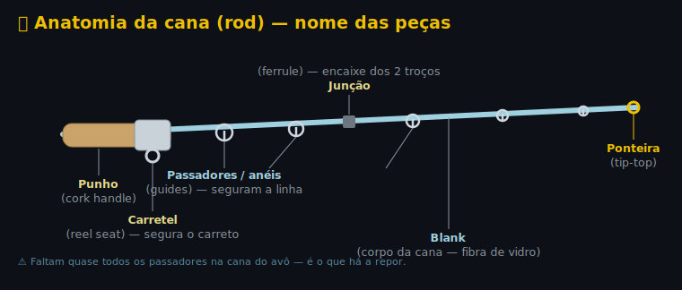

# 🎣 A Cana (rod) — avô, restauro e backup

## 👴 A cana do avô

**Cana de fibra de vidro (fiberglass) vintage**, 2 troços, de spinning. Punho de cortiça (cork) + **carretel (reel seat) de anilhas deslizantes** em cromo. Faltam quase todos os **passadores/anéis (guides)** — só resta a ponteira (tip-top) e 1-2 no meio. Manchas de ferrugem superficiais.

### 💪 Aguenta a nossa pesca? ✅ Sim
- Fibra de vidro é **robusta e perdoa** — ideal p/ iniciante; absorve sacões, protege linha fina.
- Casa bem com o **carreto WXM 2500 + trançado 0,12 + spinners/boia**.
- Apanha tranquilo: achigã, perca-sol, boga, ruivaco, carpa peq.–média, barbo.
- Glass é mais mole/pesada que carbono → menos fina p/ finesse, mas p/ barragem casual **serve muito bem**.

### ⚠️ Verifica antes de gastar em peças
1. **Fissuras no blank (corpo)** — passa o dedo e dobra devagar; atenção à **junção (ferrule)** e aos sítios sem anel. Racha perto da junção = parte com peixe.
2. **Carretel (reel seat)** — as anilhas deslizam e apertam o pé do WXM 2500?

Se o blank estiver são (sem racha) → **vale 100% restaurar** (sentimental + funcional).

---

## 🔩 Anatomia (o que é o quê)

---

## 🔧 Restauro (passo-a-passo)

1. **Mede:** comprimento montada · **diâmetro da ponta em mm** (p/ a ponteira) · **quantas posições** de anel (conta as voltas/wraps).
2. **Limpa ferrugem:** palha-de-aço fina (000) + óleo/WD40, ou pasta de polir metal. No blank, só limpa (não esfregues a fundo). Cortiça → água morna + sabão + lixa fina.
3. **Tira** anéis partidos e voltas velhas.
4. **Posiciona** os anéis novos (~5–7 + ponteira), mais juntos perto da ponta. Cola fita-cola a marcar.
5. **Enrola** cada pé do anel com **fio de montagem (whipping)** bem apertado.
6. **Sela** as voltas com **epoxy de cana (rod finish)**. Versão barata: verniz transparente / cola UV / verniz de unhas em camadas.
7. **Ponteira (tip-top):** cola com **hot-melt** (aquece e enfia).
8. **Junção (ferrule):** limpa; encaixe justo. Folga → esfrega cera de vela no macho.

---

## 📐 Medidas da cana do avô
- **Ponta (tip):** 2,1 mm → ponteira **[BSAT tamanho 2,2](https://www.decathlon.pt/p/passador-de-cana-de-pesca-de-predadores-bsat/X8167255/m8167255)** (enfia por cima dos 2,1 mm).
- **Base:** 7,4 mm → normal; 1.º anel (junto ao carreto) é o **maior**, a diminuir até à ponta.

## 🛒 Peças na Decathlon (vende!)

| Peça | Produto | Preço | Notas |
|---|---|---|---|
| **Ponteira (tip-top)** | [CAPERLAN/DECATHLON Passador BSAT](https://www.decathlon.pt/p/passador-de-cana-de-pesca-de-predadores-bsat/X8167255/m8167255) | 3,90 € | tamanhos 2–4 mm → **a tua = 2,2** (ponta 2,1 mm) |
| Ponteira (alt.) | [Passador BAST 3,6 mm](https://www.decathlon.pt/p/passador-de-cana-de-pesca-de-predadores-bast-3-6-mm/X8271899/m8271899) | 3,90 € | 3,6 mm fixo |
| **Anéis intermédios** | [CAPERLAN Passadores com Abertura](https://www.decathlon.pt/p/passadores-com-abertura-de-pesca/350558/c251m8842999) | 2,50 € | ~10 un, abrem p/ a linha |
| Anéis (alt., inox) | [FLASHMER Passadores Inox 9 mm](https://www.decathlon.pt/p/passadores-de-inox-forjados-para-pesca-no-mar-9-mm/X8298845/m8298845) | 2,90 € | ~10 un, robustos (mar, maiores) |
| Fio + verniz | — | — | **NÃO vende kit completo** — usa fio forte/fly-tying + verniz/cola UV |

> 💡 Para um **jogo graduado** certinho de anéis de spinning + fio + epoxy num só, há **kits de reparação** baratos (~10 €) em AliExpress/Amazon ("rod guide repair kit"). Decathlon cobre a **ponteira + anéis avulsos**, o resto improvisas.

---

## 🎣 Cana backup (se fores pescar ANTES de restaurar)

Cana só, feita p/ casar com o teu carreto WXM 100 2500:

| Cana | Preço | P/ quê |
|---|---|---|
| [CAPERLAN WXM-100 Spinning **1,80 m** ML 5–14 g](https://www.decathlon.pt/p/cana-de-pesca-wxm-100-spinning-1-80m-ml-5-14g/339559/m8739984) | **24,90 €** | leve, achigã/perca, lances curtos |
| [CAPERLAN WXM-100 **2,10 m** M 7–21 g](https://www.decathlon.pt/p/cana-de-pesca-spinning-wxm-100-m-2-10m-7-21g/339478/m8739985) | **27,90 €** | mais versátil, lança mais longe |

---

## 💡 Combo MELHOR que comprar separado

Se **ainda não compraste** o carreto 2500 sozinho, este conjunto bate o teu plano:

| Opção | Conteúdo | Preço |
|---|---|---|
| **Conjunto WXM 100** ✅ | [Cana WXM 100 1,80m ML + carreto **2500**](https://www.decathlon.pt/p/cana-e-carreto-de-pesca-ao-corrico-wxm-100-spinning-1-80m-ml-5-14g-conjunto/339590/m8739959) (6 passadores, antirretorno infinito, travão micrométrico) | **39,90 €** |
| Separado | Carreto 2500 (24,90) + Cana WXM-100 1,80m (24,90) | ~49,80 € |

➡️ **Poupas ~10 €** e fica o mesmo (cana WXM 100 + carreto 2500), pronto a pescar **já**. 4,6★ (127 aval).
A cana do avô fica então como **2.ª cana** (restauras com calma) — bónus sentimental, sem pressa.

> Se **já compraste** o 2500 → leva só a **cana WXM-100 1,80m (24,90 €)** e usa o avô quando estiver pronto.
