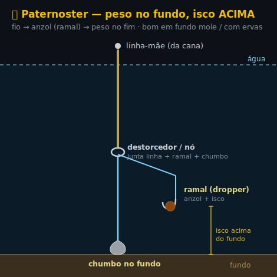

# 🎣 Montagens & como pescar

Três passos: **A)** escolhe a montagem base · **B)** aprende a pescar (profundidade, distância, freio) · **C)** salta para o exemplo pronto do teu peixe. Os nós estão em [**NOS.md**](NOS.md).

---

## 🗺️ Mapa rápido — que peixe, onde, como

No fundo só há **3 maneiras de pescar**: **amostra/vinil** (predadores) · **boia** (peixe-pasto, à superfície/meia-água) · **fundo** (peixe grande ou cheiroso). Cada peixe usa uma delas — clica em **Como** para o exemplo pronto, ou na **barragem** para ver onde vive.

| Peixe | Onde vive 🏞️ | Como pescar 🎣 |
|---|---|---|
| 🟢 **Achigã** | [todas as 4](PEIXES-BARRAGENS.md) | 🪶 [Amostra / vinil](EXEMPLOS-MODULAR.md#ex-achiga) |
| 🟣 **Sandre** | [Alqueva](PEIXES-BARRAGENS.md#dam-alqueva) · [C. Bode](PEIXES-BARRAGENS.md#dam-bode) · [Idanha](PEIXES-BARRAGENS.md#dam-idanha) | 🪶 [Vinil ao fundo](EXEMPLOS-MODULAR.md#ex-sandre) |
| 🔵 **Carpa** | [todas as 4](PEIXES-BARRAGENS.md) | 💪 [Fundo](EXEMPLOS-MODULAR.md#ex-carpa) |
| 🔵 **Barbo** | [todas as 4](PEIXES-BARRAGENS.md) | 💪 [Fundo](EXEMPLOS-MODULAR.md#ex-barbo) |
| 🟡 **Boga / ruivaco** | [Odivelas](PEIXES-BARRAGENS.md#dam-odivelas) · [C. Bode](PEIXES-BARRAGENS.md#dam-bode) · [Idanha](PEIXES-BARRAGENS.md#dam-idanha) | 🪶 [Boia](EXEMPLOS-MODULAR.md#ex-boga) |
| 🟡 **Perca-sol** | [todas as 4](PEIXES-BARRAGENS.md) | 🪶 [Boia](EXEMPLOS-MODULAR.md#ex-perca) |
| 🟤 **Peixe-gato** | [Alqueva](PEIXES-BARRAGENS.md#dam-alqueva) · [Odivelas](PEIXES-BARRAGENS.md#dam-odivelas) | 🪶 [Fundo cheiroso](EXEMPLOS-MODULAR.md#ex-gato) |
| ⚪ **Pimpão** | [Odivelas](PEIXES-BARRAGENS.md#dam-odivelas) | 🪶 [Boia](EXEMPLOS-MODULAR.md#ex-pimpao) |

> 💡 Vês a repetição: **boga = perca-sol = pimpão** (boia) e **carpa = barbo** (fundo). Muda sobretudo o **isco/anzol** ([🍞 Iscos](ISCOS.md) · [📏 Tamanhos](TAMANHOS.md)), não a montagem.

---

## 🎯 Qual cana × estilo

- 🪶 **Cana pequena** (WXM) → **spinning** (amostra, achigã) e **boia** perto (boga, perca, carpa média). Linha fina · freio **1,5–2 kg**.
- 💪 **Cana grande** (4,20 m) → **fundo** (carpa, a distância) e **boia deslizante** longe. Mono 0,35 · freio **2–3 kg**.

> ⚖️ Só **2 canas por pescador** ao mesmo tempo → [Regras](REGRAS.md).

---

# 🅰️ A · Montagem base (escolhe uma)

## ✨ Spinning — amostra


`Linha-mãe → nó FG/Albright → leader fluoro → destorcedor snap → spinner`

🛒 **Material:** [linha TX4](https://www.decathlon.pt/p/multifilamento-de-pesca-com-amostra-4-fibras-tx4-130-m-caqui/362170/c109m8933473) · [leader fluoro](https://www.decathlon.pt/p/fio-de-pesca-fluorocarbono-100percent-soft/376353/m8978545) · [snap rolling nº4](https://www.decathlon.pt/p/destorcedor-de-alfinete-de-pesca-rolling-snap-inox-2025-x-10/307904/m8939626) · [colheres rotativas](https://www.decathlon.pt/p/kit-colheres-rotativas-pesca-de-predadores/171832/c255m8405651).

## 🟠 Boia — isco natural


`Linha-mãe → boia → chumbos de pinça → destorcedor barril → leader → anzol + isco`

🛒 **Material:** [boias MTCH](https://www.decathlon.pt/p/boia-polivalente-de-pesca-mtch-100-visi-x3/359268/m8919567) · [chumbos](https://www.decathlon.pt/p/caixa-com-lastro-de-pesca-6-divisorias/7814/m4451823) · [barril nº14](https://www.decathlon.pt/p/destorcedor-de-barril-de-pesca-black-nickel/350475/c1m8842759) · [leader fluoro](https://www.decathlon.pt/p/fio-de-pesca-fluorocarbono-100percent-soft/376353/m8978545) · anzóis [CARP POLE](https://www.decathlon.pt/p/anzol-carp-pole-para-a-pesca-direta-de-carpa/150242/m8371260) / [SN HOOK WORM](https://www.decathlon.pt/p/anzois-de-pesca-a-truta-sn-hook-worm/126170/m8349081).

## 🔁 Sistema modular (quick-change)
Ponta da linha-mãe com **1 snap fixo** → encaixas boia / leader+amostra / amostra. Trocas tudo na margem **sem atar**.


**3 regras (importantes):**
1. **Nó no multi = palomar ou uni, NÃO clinch.** Multi é escorregadio; clinch desliza e solta. Atas **1 vez**, dura imenso.
2. ⚠️ **Destorcedor não passa bem nos anéis.** Leader **curto (~50 cm)** pra a junção ficar **fora da ponta** quando atiras — senão "bate" nos anéis = mau lançamento + nós.
3. **Amostra direta no multi = perdes o leader** (invisibilidade + abrasão). Só em **água turva**. Água limpa / pedras / sandre → **mantém leader**.

> 💡 O nó FG **não se desfaz a cada saída** — dura várias. O snap só acelera trocas; não é obrigatório.

---

# 🅱️ B · Como pescar

## 📏 Comprimento dos fios
| Fio | Comprimento | Notas |
|--|--|--|
| **Leader (spinning)** | **50–100 cm** | mais comprido = mais discreto |
| **Leader/hooklength (boia)** | **30–50 cm** | do anzol ao destorcedor barril |
| **Anzol → chumbo** | **20–30 cm** | distância do isco ao 1.º chumbo |
| **Encher carreto** | até **~2 mm da borda** | pouco = embaraça; demais = salta |

## 🌊 Profundidade
- **Boia fixa** → só até **profundidade = comprimento da cana** (~2–3 m). Água rasa/margens.
- **Boia deslizante** → corre no fio até um **nó-batente** que pões à profundidade que quiseres → pescas **água funda** (Castelo do Bode, canais do Alqueva).
- **Regra do isco:** ajusta até ficar **rente ao fundo** (carpa, barbo, peixe-gato) ou a **meia-água** (perca, boga). Mede o fundo: chumbo pesado no anzol e vê onde a boia assenta.
- **Chumbo (boia):** junta chumbo de pinça até a boia ficar **quase submersa** (só ponta à mostra).
- **Spinning:** deixa a amostra **afundar contando** (1, 2, 3… ≈ 30 cm/seg) p/ escolher a camada; recolhe a profundidades diferentes até achar o peixe.

### 🟠 Boia fixa vs deslizante (em detalhe)

**As duas boias ficam SEMPRE à tona** (à superfície) — é onde vês a mordida. Nenhuma vai para debaixo de água. ❗

**A diferença NÃO é "podes ajustar a profundidade"** (isso fazes nas duas). É conseguires **LANÇAR quando pescas fundo:**


- **Fixa a 5 m:** a boia fica presa 5 m acima do anzol. Mas a tua cana só tem ~2 m → ficas com **5 m de fio pendurado da ponta** → **não consegues lançar**. Por isso a fixa só serve até **profundidade ≤ comprimento da cana**.
- **Deslizante a 5 m:** ao lançar, a boia escorrega para baixo e fica **tudo junto (~30 cm)** → lanças fácil. Ao cair, o chumbo puxa a linha e a boia volta à **tona**, com o isco aos 5 m. → Pescas fundo **e** consegues lançar.

➡️ Resumindo: **mesma profundidade, fixa não dá p/ lançar se for funda; deslizante dá.**

**📌 Fixa (fixed float)** — boia **presa num ponto do fio** (por borrachinhas/silicones). Profundidade = distância anzol→boia, e é **fixa**.
- ✅ Simples, sensível — ótima p/ ver mordidas subtis. **Quando:** água rasa / margens / ≤ 2–3 m (perca-sol, boga, achigã pequeno).
- ❌ Só pescas até **profundidade ≤ comprimento da cana**. Mais fundo → não consegues lançar.

**🎚️ Deslizante (sliding float)** — boia **corre livre** no fio entre dois batentes:


- 🔴 **Nó-batente (stop knot)** — fica **em cima**, à distância do anzol = **a profundidade que queres**. É ele que **trava** a boia ao subir. Mexes o nó → mudas a profundidade.
- ⚪ **Stop / missanga de baixo** — junto ao destorcedor; impede a boia de descer até ao anzol.
- **No lançamento** a boia escorrega para **baixo** até ao stop → montagem **curta e compacta** → lanças longe. **Na água** o chumbo puxa a linha e a boia desliza até o nó-batente bater no topo → o isco fica à profundidade marcada.
- ✅ Pescas **muito mais fundo** que o comprimento da cana. ❌ Mais peças, um pouco menos sensível.

> **Regra:** raso → **fixa**. Fundo (>2–3 m) → **deslizante**.

## 📍 Distância de lançamento (onde estão os peixes)


> 🏞️ **Barragem cai a pique** → água funda **perto** da margem. Muitas vezes **não precisas lançar longe** — mede o fundo junto à borda primeiro.

| Peixe / estilo | Distância | Onde |
|--|--|--|
| Perca-sol / boga / ruivaco (boia) | **3–10 m** | margem, juncos, à tua frente |
| Achigã (spinning) | **à estrutura (5–25 m)** | lança **À** estrutura, não longe por longe |
| Carpa / barbo (boia/fundo) | **5–20 m** (40 c/ feature) | margens ao amanhecer; de dia mais fundo/longe |
| Peixe-gato (fundo, noite) | **5–15 m** | fundo junto a estrutura/margem |
| Sandre / lúcio-perca (vinil) | **15–40 m** ou barco | drop-offs, canais fundos |

- **Leque (fan-cast):** perto → médio → longe, até achares o peixe.
- **Hora:** amanhecer/anoitecer = peixe **raso e perto**. Dia quente = **fundo e mais longe**.

## 🎯 Técnica rápida
- **Spinning (achigã/perca):** atira p/ junto de **estrutura** (pedras, troncos, vegetação, paredão). Recolhe com **paragens** — ataque vem na pausa/queda. Manhã cedo / fim de tarde.
- **Boia (carpa/barbo/boga/peixe-gato):** atira, deixa assentar, **vê a boia**. Afunda/foge → **ferra**. Paciência. Anoitecer = peixe-gato.
- **Água:** limpa → fino + cores naturais. Turva → cor importa pouco (cheiro/vibração).

## 💪 Força — o que aguenta + freio (drag)

Elo mais fraco = **leader fluoro 0,20–0,25 mm (~2,8–4,5 kg)**. É aí que parte — de propósito, salva o resto.

| Peixe | Aguenta? |
|--|--|
| Achigã (2–3 kg), barbo normal, boga, perca-sol, peixe-gato-negro | ✅ **Confortável** |
| Sandre 1–3 kg, carpa/barbo 4–8 kg | ⚠️ **No limite** — freio suave, água aberta |
| Carpa 10 kg+, sandre 4–8 kg | ❌ **Acima** — bycatch que vais perder |
| Siluro, peixe-gato grande (Alqueva) | ❌ **Intocável** — material pesado à parte |

**Freio (drag):** põe a ~⅓ do leader = **~1,5–2 kg**. Nunca no máximo — os 8 kg do carreto são só folga; o **leader é o fusível**. Peixe grande → deixa correr.

| Elemento | Força | Papel |
|---|---|---|
| 🎣 Freio carreto 2500 | máx 8 kg · útil 6 kg | capacidade — só folga |
| 🧵 Braid TX4 0,12 | ~5–6 kg | linha-mãe |
| 🪢 Leader fluoro 0,20–0,25 | ~2,8–4,5 kg | **elo fraco** |
| ⚙️ Freio que **usas** | ~1,5–2 kg | ≈ ⅓ do leader |

➡️ Peixe grande (carpa 10 kg+, peixe-gato grande) = [**💪 Kit Pesado**](KIT-PESADO.md) (cana grande 4,20 m + Sofi M2). Siluro fica fora.

---

# 🅲 C · Setups por peixe

> Cada peixe → a **melhor maneira**. Cana: 🪶 pequena (leve) · 💪 grande (fundo).
> 🔗 Onde há cada peixe → [🐟 Peixes](PEIXES-BARRAGENS.md) · que isco → [🍞 Iscos](ISCOS.md) · nós → [🪢 Nós](NOS.md) · regras → [⚖️ Regras](REGRAS.md).

<a id="ex-achiga"></a>

## 🟢 Achigã · 🪶 pequena (spinning)


```
clipa → leader 50–80 cm → vinil (senko/shad) em jig head 3–7 g
                         ou colher (spinner) 2–5 g · ou amostra de superfície
```
- **A melhor:** **vinil** (Texas / wacky) junto a **estrutura** (pedras, troncos, vegetação) — não enrosca e cobre tudo. Cores naturais em água limpa.
- Spinner / topwater em água aberta, **manhã cedo ou fim de tarde**. Recolhe com **paragens** (ataque na pausa).
- 🛒 vinil [YUBARI](https://www.decathlon.pt/p/amostra-flexivel-de-pesca-do-achiga-yubari-stick-bait-worm-pumpkin-worm-x-10/355324/c213m8883482) + [Texan 1/0–3/0](https://www.decathlon.pt/p/anzol-de-pesca-de-predadores-texan-wide-gap-abertura-larga/357866/m8911969) · [colheres](https://www.decathlon.pt/p/kit-colheres-rotativas-pesca-de-predadores/171832/c255m8405651) · [leader](https://www.decathlon.pt/p/fio-de-pesca-fluorocarbono-100percent-soft/376353/m8978545).

<a id="ex-sandre"></a>

## 🟣 Sandre / lúcio-perca · 🪶 pequena (vinil ao fundo)


```
clipa → leader 60–100 cm → vinil pequeno em jig head (até ~10 g) ou dropshot
        → jigado (sobe-e-desce) junto ao fundo / estrutura
```
- **A melhor:** **vinil jigado no fundo** (sobe-e-desce) junto a estrutura funda — troncos, rochas, drop-offs. Andam em **cardume**: insiste onde sentes toques.
- Cores: **verde-escuro** (água limpa) / **preto** (escura). **Amanhecer/anoitecer**. Melhor época **mar–mai**.
- ⚠️ Sandre grande (4 kg+) está acima do material leve.
- 🛒 vinil [YUBARI](https://www.decathlon.pt/p/amostra-flexivel-de-pesca-do-achiga-yubari-stick-bait-worm-pumpkin-worm-x-10/355324/c213m8883482) + anzol forte [Texan](https://www.decathlon.pt/p/anzol-de-pesca-de-predadores-texan-wide-gap-abertura-larga/357866/m8911969).

<a id="ex-carpa"></a>

## 🔵 Carpa · 💪 grande, ao fundo (milho / boilie)


```
fio → chumbo corrido 60–100 g → barril (batente)
    → leader 40–60 cm → anzol #8–6 + milho / boilie / massa
```
- **A melhor:** **ao fundo** com **milho** (o mais fácil), boilie ou massa. Lança, pousa, espera o guizo. **Engodo** de milho/farinha chama o cardume.
- Água funda → **boia deslizante** (abaixo). Verão / água parada e quente → **pão à superfície**.
- 🛒 [azeitona furada](https://www.decathlon.pt/p/lastro-de-pesca-azeitonas-perfuradas/7820/m4451548) · [barril nº14](https://www.decathlon.pt/p/destorcedor-de-barril-de-pesca-black-nickel/350475/c1m8842759) · [SN HOOK WORM #6–8](https://www.decathlon.pt/p/anzois-de-pesca-a-truta-sn-hook-worm/126170/m8349081). Cana → [💪 Kit Pesado](KIT-PESADO.md).


↑ **Boia deslizante** (água funda): nó-batente regula a profundidade; isco rente ao fundo.

<a id="ex-barbo"></a>

## 🔵 Barbo · 💪 grande, ao fundo (minhoca / milho)



```
fundo (chumbo corrido ou paternoster) → leader 40–60 cm
    → anzol #8–6 + minhoca / milho / larva
```
- **A melhor:** **ao fundo** com **minhoca**, milho ou larva (asticot). Concentra-se nas **embocaduras dos afluentes** e zonas com alguma corrente. Engodo de farinhas + milho.
- Mesmo material da carpa; o **paternoster** mantém o isco visível em fundo mole.
- 🛒 igual ao [Fundo da carpa](EXEMPLOS-MODULAR.md#ex-carpa).

<a id="ex-boga"></a>

## 🟡 Boga / ruivaco · 🪶 pequena (boia leve)


```
clipa → boia fixa 0,5–1 g → chumbos de pinça → leader 30–40 cm
        → anzol #14 + larva (asticot) / massa / pão
```
- **A melhor:** **boia leve** com **larva (asticot)** branca/vermelha ou massa. Andam em **cardume** — engodo de farinhas (amendoim) mantém-nos por baixo. Meia-água, perto da margem.
- 🛒 [boias MTCH](https://www.decathlon.pt/p/boia-polivalente-de-pesca-mtch-100-visi-x3/359268/m8919567) · [CARP POLE #14](https://www.decathlon.pt/p/anzol-carp-pole-para-a-pesca-direta-de-carpa/150242/m8371260) · [chumbos](https://www.decathlon.pt/p/caixa-com-lastro-de-pesca-6-divisorias/7814/m4451823).

<a id="ex-perca"></a>

## 🟡 Perca-sol · 🪶 pequena (boia, a mais fácil)

- **A melhor:** **boia** com **minhoca pequena** ou larva, à margem. Abundante e morde tudo → **ótima para praticar** e para a malta começar. Montagem **igual à boga** ([acima](EXEMPLOS-MODULAR.md#ex-boga)), anzol **#14**.

<a id="ex-gato"></a>

## 🟤 Peixe-gato-negro · 🪶 pequena (fundo cheiroso, anoitecer)


```
boia ou chumbo de fundo → leader 30–40 cm → anzol #6–8 + chouriço / fígado / minhoca
```
- **A melhor:** **ao fundo** com isco **cheiroso** (chouriço, fígado, minhoca), ao **anoitecer/noite**. Come tudo cheiroso.
- ⚠️ **Espinhos** nas barbatanas picam — pega por trás. Invasor → não devolver vivo.
- 🛒 [SN HOOK WORM #6](https://www.decathlon.pt/p/anzois-de-pesca-a-truta-sn-hook-worm/126170/m8349081) · [boia MTCH](https://www.decathlon.pt/p/boia-polivalente-de-pesca-mtch-100-visi-x3/359268/m8919567) ou [azeitona](https://www.decathlon.pt/p/lastro-de-pesca-azeitonas-perfuradas/7820/m4451548).

<a id="ex-pimpao"></a>

## ⚪ Pimpão · 🪶 pequena (boia)

- **A melhor:** **boia ou fundo leve** com **pão ou milho** (Odivelas). Montagem **igual à boga** ([acima](EXEMPLOS-MODULAR.md#ex-boga)), anzol **#14–10**.

## 🏞️ Caso especial — barragem funda (ex. Castelo do Bode)

Água funda e limpa (clear). Precisas chegar fundo + ser discreto.
- **Boia:** usa a **boia deslizante** com nó-batente → pescas a 3, 5, 8 m. Boia fixa não chega.
- **Spinning:** **conta a queda (countdown)** para pescar camadas fundas. Cores naturais, fluoro fino.
- **Sandre / lúcio-perca:** vinil jigado no fundo, ao amanhecer/anoitecer.

---

## 🪢 Nós usados nestas montagens

| Onde | Nó | Dif. |
|--|--|--|
| multi → destorcedor/snap | **Palomar** | 🟢 |
| fluoro/mono → anzol olhal/destorcedor | **Clinch melhorado** | 🟢 |
| multi → leader fluoro | **FG** / **Albright** / **Double Uni** | 🔴/🟡 |
| laço no topo do leader (modular) | **Perfection / Surgeon's loop** | 🟡/🟢 |
| anzol olhal, fisgada direta (avançado) | **Snell** | 🔴 |

➡️ Passo-a-passo de cada um (com vídeo) em [**🪢 NOS.md**](NOS.md). Regra geral: **molha** antes de apertar · aperta devagar · corta a sobra ~2 mm.
