# 🎣 Montagens & como pescar

Três passos: **A)** escolhe a montagem base · **B)** aprende a pescar (profundidade, distância, freio) · **C)** salta para o exemplo pronto do teu peixe. Os nós estão em [**NOS.md**](NOS.md).

---

# 🅰️ A · Montagem base (escolhe uma)

## ✨ Spinning — amostra


`Linha-mãe → nó FG/Albright → leader fluoro → destorcedor snap → spinner`

🛒 **Material:** [linha TX4](https://www.decathlon.pt/p/multifilamento-de-pesca-com-amostra-4-fibras-tx4-130-m-caqui/362170/c109m8933473) · [leader fluoro](https://www.decathlon.pt/p/fio-de-pesca-fluorocarbono-100percent-soft/376353/m8978545) · [snap rolling nº4](https://www.decathlon.pt/p/destorcedor-de-alfinete-de-pesca-rolling-snap-inox-2025-x-10/307904/m8939626) · [colheres rotativas](https://www.decathlon.pt/p/kit-colheres-rotativas-pesca-de-predadores/171832/c255m8405651).

## 🟠 Boia — isco natural


`Linha-mãe → boia → chumbos de pinça → destorcedor barril → leader → anzol + isco`

🛒 **Material:** [boias MTCH](https://www.decathlon.pt/p/boia-polivalente-de-pesca-mtch-100-visi-x3/359268/m8919567) · [chumbos](https://www.decathlon.pt/p/caixa-com-lastro-de-pesca-6-divisorias/7814/m4451823) · [barril nº14](https://www.decathlon.pt/p/destorcedor-de-barril-de-pesca-black-nickel/350475/c1m8842759) · [leader fluoro](https://www.decathlon.pt/p/fio-de-pesca-fluorocarbono-100percent-soft/376353/m8978545) · anzóis [CARP POLE](https://www.decathlon.pt/p/anzol-carp-pole-para-a-pesca-direta-de-carpa/150242/m8371260) / [SN HOOK WORM](https://www.decathlon.pt/p/anzois-de-pesca-a-truta-sn-hook-worm/126170/m8349081).

## 🔁 Sistema modular (quick-change)
Ponta da linha-mãe com **1 snap fixo** → encaixas boia / leader+amostra / amostra. Trocas tudo na margem **sem atar**.


**3 regras (importantes):**
1. **Nó no multi = palomar ou uni, NÃO clinch.** Multi é escorregadio; clinch desliza e solta. Atas **1 vez**, dura imenso.
2. ⚠️ **Destorcedor não passa bem nos anéis.** Leader **curto (~50 cm)** pra a junção ficar **fora da ponta** quando atiras — senão "bate" nos anéis = mau lançamento + nós.
3. **Amostra direta no multi = perdes o leader** (invisibilidade + abrasão). Só em **água turva**. Água limpa / pedras / sandre → **mantém leader**.

> 💡 O nó FG **não se desfaz a cada saída** — dura várias. O snap só acelera trocas; não é obrigatório.

---

# 🅱️ B · Como pescar

## 📏 Comprimento dos fios
| Fio | Comprimento | Notas |
|--|--|--|
| **Leader (spinning)** | **50–100 cm** | mais comprido = mais discreto |
| **Leader/hooklength (boia)** | **30–50 cm** | do anzol ao destorcedor barril |
| **Anzol → chumbo** | **20–30 cm** | distância do isco ao 1.º chumbo |
| **Encher carreto** | até **~2 mm da borda** | pouco = embaraça; demais = salta |

## 🌊 Profundidade
- **Boia fixa** → só até **profundidade = comprimento da cana** (~2–3 m). Água rasa/margens.
- **Boia deslizante** → corre no fio até um **nó-batente** que pões à profundidade que quiseres → pescas **água funda** (Castelo do Bode, canais do Alqueva).
- **Regra do isco:** ajusta até ficar **rente ao fundo** (carpa, barbo, peixe-gato) ou a **meia-água** (perca, boga). Mede o fundo: chumbo pesado no anzol e vê onde a boia assenta.
- **Chumbo (boia):** junta chumbo de pinça até a boia ficar **quase submersa** (só ponta à mostra).
- **Spinning:** deixa a amostra **afundar contando** (1, 2, 3… ≈ 30 cm/seg) p/ escolher a camada; recolhe a profundidades diferentes até achar o peixe.

### 🟠 Boia fixa vs deslizante (em detalhe)

**As duas boias ficam SEMPRE à tona** (à superfície) — é onde vês a mordida. Nenhuma vai para debaixo de água. ❗

**A diferença NÃO é "podes ajustar a profundidade"** (isso fazes nas duas). É conseguires **LANÇAR quando pescas fundo:**

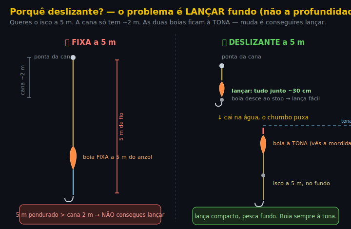

- **Fixa a 5 m:** a boia fica presa 5 m acima do anzol. Mas a tua cana só tem ~2 m → ficas com **5 m de fio pendurado da ponta** → **não consegues lançar**. Por isso a fixa só serve até **profundidade ≤ comprimento da cana**.
- **Deslizante a 5 m:** ao lançar, a boia escorrega para baixo e fica **tudo junto (~30 cm)** → lanças fácil. Ao cair, o chumbo puxa a linha e a boia volta à **tona**, com o isco aos 5 m. → Pescas fundo **e** consegues lançar.

➡️ Resumindo: **mesma profundidade, fixa não dá p/ lançar se for funda; deslizante dá.**

**📌 Fixa (fixed float)** — boia **presa num ponto do fio** (por borrachinhas/silicones). Profundidade = distância anzol→boia, e é **fixa**.
- ✅ Simples, sensível — ótima p/ ver mordidas subtis. **Quando:** água rasa / margens / ≤ 2–3 m (perca-sol, boga, achigã pequeno).
- ❌ Só pescas até **profundidade ≤ comprimento da cana**. Mais fundo → não consegues lançar.

**🎚️ Deslizante (sliding float)** — boia **corre livre** no fio entre dois batentes:

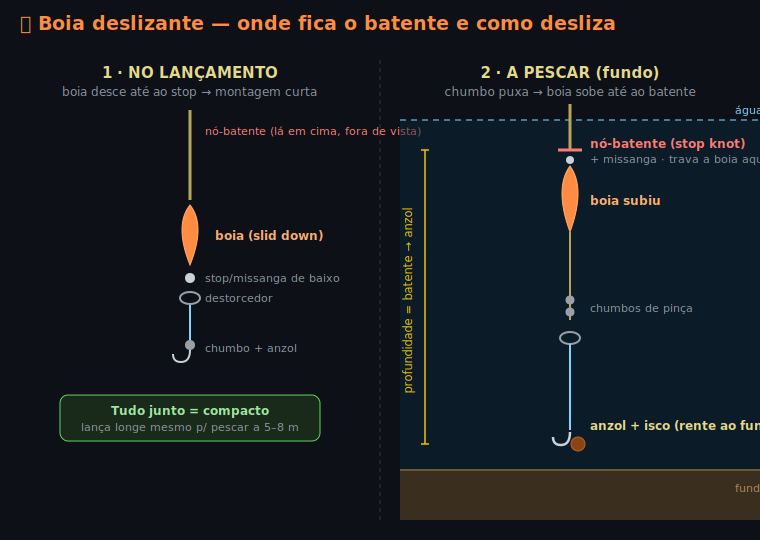

- 🔴 **Nó-batente (stop knot)** — fica **em cima**, à distância do anzol = **a profundidade que queres**. É ele que **trava** a boia ao subir. Mexes o nó → mudas a profundidade.
- ⚪ **Stop / missanga de baixo** — junto ao destorcedor; impede a boia de descer até ao anzol.
- **No lançamento** a boia escorrega para **baixo** até ao stop → montagem **curta e compacta** → lanças longe. **Na água** o chumbo puxa a linha e a boia desliza até o nó-batente bater no topo → o isco fica à profundidade marcada.
- ✅ Pescas **muito mais fundo** que o comprimento da cana. ❌ Mais peças, um pouco menos sensível.

> **Regra:** raso → **fixa**. Fundo (>2–3 m) → **deslizante**.

## 📍 Distância de lançamento (onde estão os peixes)

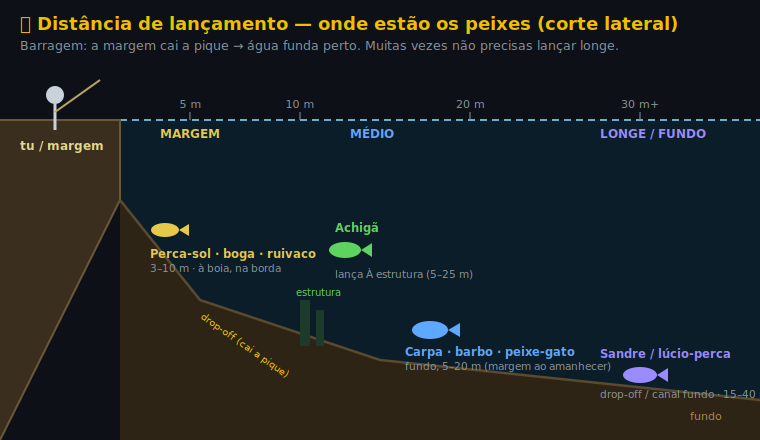

> 🏞️ **Barragem cai a pique** → água funda **perto** da margem. Muitas vezes **não precisas lançar longe** — mede o fundo junto à borda primeiro.

| Peixe / estilo | Distância | Onde |
|--|--|--|
| Perca-sol / boga / ruivaco (boia) | **3–10 m** | margem, juncos, à tua frente |
| Achigã (spinning) | **à estrutura (5–25 m)** | lança **À** estrutura, não longe por longe |
| Carpa / barbo (boia/fundo) | **5–20 m** (40 c/ feature) | margens ao amanhecer; de dia mais fundo/longe |
| Peixe-gato (fundo, noite) | **5–15 m** | fundo junto a estrutura/margem |
| Sandre / lúcio-perca (vinil) | **15–40 m** ou barco | drop-offs, canais fundos |

- **Leque (fan-cast):** perto → médio → longe, até achares o peixe.
- **Hora:** amanhecer/anoitecer = peixe **raso e perto**. Dia quente = **fundo e mais longe**.

## 🎯 Técnica rápida
- **Spinning (achigã/perca):** atira p/ junto de **estrutura** (pedras, troncos, vegetação, paredão). Recolhe com **paragens** — ataque vem na pausa/queda. Manhã cedo / fim de tarde.
- **Boia (carpa/barbo/boga/peixe-gato):** atira, deixa assentar, **vê a boia**. Afunda/foge → **ferra**. Paciência. Anoitecer = peixe-gato.
- **Água:** limpa → fino + cores naturais. Turva → cor importa pouco (cheiro/vibração).

## 💪 Força — o que aguenta + freio (drag)

Elo mais fraco = **leader fluoro 0,20–0,25 mm (~2,8–4,5 kg)**. É aí que parte — de propósito, salva o resto.

| Peixe | Aguenta? |
|--|--|
| Achigã (2–3 kg), barbo normal, boga, perca-sol, peixe-gato-negro | ✅ **Confortável** |
| Sandre 1–3 kg, carpa/barbo 4–8 kg | ⚠️ **No limite** — freio suave, água aberta |
| Carpa 10 kg+, sandre 4–8 kg | ❌ **Acima** — bycatch que vais perder |
| Siluro, peixe-gato grande (Alqueva) | ❌ **Intocável** — material pesado à parte |

**Freio (drag):** põe a ~⅓ do leader = **~1,5–2 kg**. Nunca no máximo — os 8 kg do carreto são só folga; o **leader é o fusível**. Peixe grande → deixa correr.

| Elemento | Força | Papel |
|---|---|---|
| 🎣 Freio carreto 2500 | máx 8 kg · útil 6 kg | capacidade — só folga |
| 🧵 Braid TX4 0,12 | ~5–6 kg | linha-mãe |
| 🪢 Leader fluoro 0,20–0,25 | ~2,8–4,5 kg | **elo fraco** |
| ⚙️ Freio que **usas** | ~1,5–2 kg | ≈ ⅓ do leader |

➡️ Peixe grande (carpa 10 kg+, peixe-gato grande) = [**💪 Kit Pesado**](KIT-PESADO.md) (cana do avô 4,20 m + Sofi M2). Siluro fica fora.

---

# 🅲 C · Exemplo pronto do teu peixe

> 🎣 **Qual cana?** **Boia e spinning, perto/médio** = a **cana leve** (WXM) → exemplos A–D, F, G, H, I. **Fundo a distância para peixe grande** = a **cana grande 4,20 m** → exemplo E, em detalhe no [**💪 Kit Pesado**](KIT-PESADO.md).

> **Legenda:** `clipa →` = encaixas no snap-hub · `→` = ligado a seguir · **profundidade** (depth) = onde fica o isco/amostra.

| # | Exemplo | Peixe | Método |
|---|---|---|---|
| A | Superfície | Achigã | spinning, amostra à tona |
| B | Fundo / meia-água | Achigã | spinning, vinil no jig |
| C | Meia-água à boia | Perca-sol / boga / ruivaco | boia fixa + isco |
| D | Boia funda | Carpa / barbo | boia deslizante |
| E | Fundo (ledger) | Carpa / barbo | chumbo corrido |
| F | Fundo, anoitecer | Peixe-gato-negro | isco cheiroso |
| G | Dropshot fundo | Sandre / lúcio-perca | vinil a abanar parado |
| H | Pão à superfície | Carpa | floating bread (verão) |
| I | Wacky (água limpa) | Achigã | finesse, sem chumbo |

## 🟢 A · ACHIGÃ (largemouth bass) — superfície

Água quente, peixe a caçar à tona junto a **estrutura (structure)** — pedras, troncos, vegetação. Manhã ou fim de tarde.

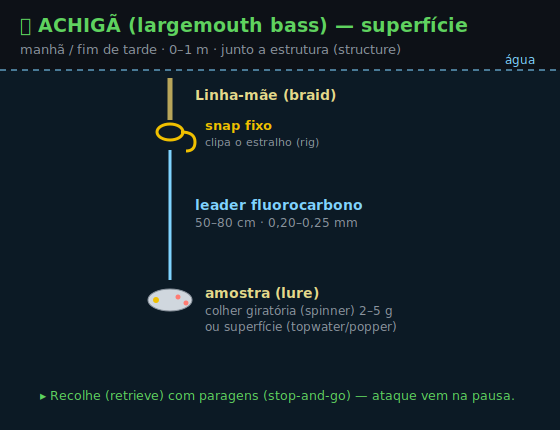

```
clipa → leader fluorocarbono 50–80 cm → colher giratória (spinner) 2–5 g
                                          ou amostra de superfície (topwater/popper)
```
- **Profundidade:** 0–1 m. **Recolhe (retrieve)** com paragens (stop-and-go) — ataque vem na pausa.
- **Anzol:** vem na amostra (lure), montado de fábrica. Não mexas.

## 🟢 B · ACHIGÃ — fundo / meia-água

Dia quente, peixe fundo. **Conta a queda (countdown)** (1, 2, 3… ≈ 30 cm/seg) até achar a camada.

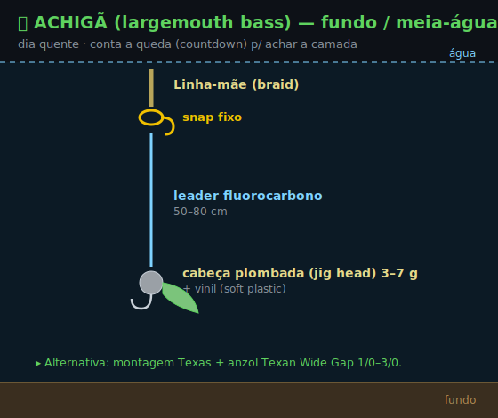

```
clipa → leader 50–80 cm → cabeça plombada (jig head) 3–7 g + vinil (soft plastic)
```
- **Alternativa:** montagem Texas (Texas rig) com anzol **[Texan Wide Gap](https://www.decathlon.pt/p/anzol-de-pesca-de-predadores-texan-wide-gap-abertura-larga/357866/m8911969) 1/0–3/0** (CAPERLAN — Decathlon vende, ver [Material](MATERIAL.md)).

## 🟡 C · PERCA-SOL / BOGA / RUIVACO — meia-água

Margem, fácil (bom p/ começar). Peixe pequeno, boca pequena.

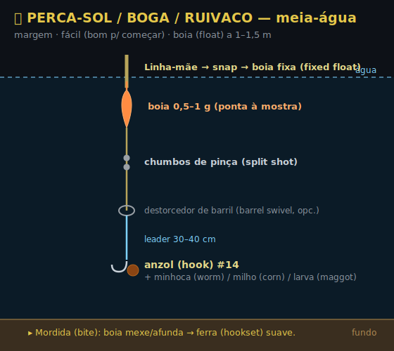

```
clipa → boia fixa (fixed float) 0,5–1 g → chumbos de pinça (split shot)
        → destorcedor de barril (barrel swivel, opcional) → leader 30–40 cm
        → anzol (hook) #14 + minhoca/milho/larva (worm/corn/maggot)
```
- **Profundidade:** boia a **1–1,5 m** (meia-água / mid-water).
- **Mordida (bite):** boia mexe/afunda → **ferra (hookset)** suave.
- 🛒 [boia MTCH](https://www.decathlon.pt/p/boia-polivalente-de-pesca-mtch-100-visi-x3/359268/m8919567) · anzol [CARP POLE #14](https://www.decathlon.pt/p/anzol-carp-pole-para-a-pesca-direta-de-carpa/150242/m8371260) · [chumbos](https://www.decathlon.pt/p/caixa-com-lastro-de-pesca-6-divisorias/7814/m4451823) · [leader fluoro](https://www.decathlon.pt/p/fio-de-pesca-fluorocarbono-100percent-soft/376353/m8978545).

## 🔵 D · CARPA / BARBO — boia deslizante (água funda >2 m)

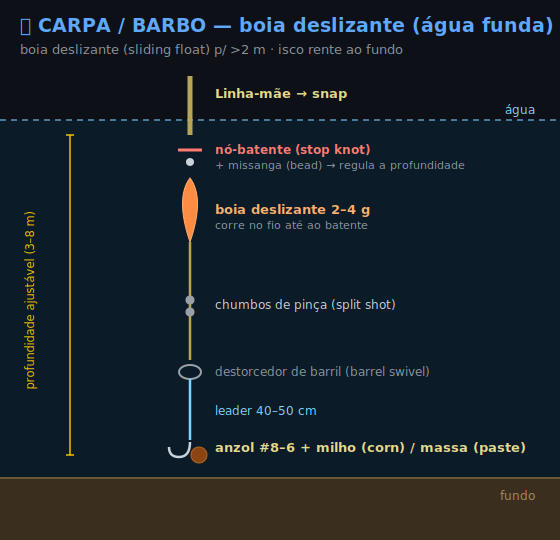

```
clipa → nó-batente (stop knot) + missanga (bead) → boia deslizante (sliding float) 2–4 g
        → chumbos → destorcedor de barril → leader 40–50 cm
        → anzol #8–6 + milho/massa (corn/paste)
```
- **Profundidade:** ajusta o nó-batente até o isco ficar **rente ao fundo (on the bottom)**.
- Mede o fundo primeiro: põe um chumbo pesado no anzol e vê onde a boia assenta (plumbing).
- 🛒 [boia deslizante SF6](https://www.decathlon.pt/p/boias-de-pesca-deslizantes-em-espuma-sf6-4g-e-6g-x2/370126/m8954905) · [barril nº14](https://www.decathlon.pt/p/destorcedor-de-barril-de-pesca-black-nickel/350475/c1m8842759) · anzol [SN HOOK WORM #8](https://www.decathlon.pt/p/anzois-de-pesca-a-truta-sn-hook-worm/126170/m8349081) / [CARP POLE #10](https://www.decathlon.pt/p/anzol-carp-pole-para-a-pesca-direta-de-carpa/150242/m8371260).

## 🔵 E · CARPA / BARBO — pesca ao fundo (ledger, sem boia)

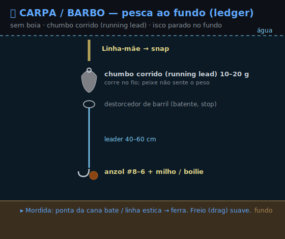

```
clipa → chumbo corrido (running lead) 10–20 g → destorcedor de barril (batente)
        → leader 40–60 cm → anzol #8–6 + milho/boilie
```
- **Profundidade:** no fundo, parado. Paciência; deixa pousar.
- **Mordida:** ponta da cana (rod tip) bate / linha estica → ferra. **Freio (drag)** suave — carpa grande corre.
- 🛒 [chumbo azeitona furada](https://www.decathlon.pt/p/lastro-de-pesca-azeitonas-perfuradas/7820/m4451548) · [barril nº14](https://www.decathlon.pt/p/destorcedor-de-barril-de-pesca-black-nickel/350475/c1m8842759) · anzol [SN HOOK WORM #6–8](https://www.decathlon.pt/p/anzois-de-pesca-a-truta-sn-hook-worm/126170/m8349081). Versão pesada/longe → [💪 Kit Pesado](KIT-PESADO.md).

## 🟤 F · PEIXE-GATO-NEGRO (black bullhead) — fundo, ao anoitecer

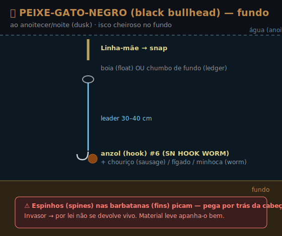

```
clipa → boia (ou ledger) → leader 30–40 cm → anzol #6–8 (SN HOOK WORM)
        + chouriço / fígado / minhoca (sausage / liver / worm)
```
- **Profundidade:** **fundo**. Mais ativo ao anoitecer/noite (dusk/night).
- ⚠️ Cuidado a pegar — **espinhos (spines)** nas barbatanas (fins) picam. Invasor → não devolver vivo.
- 🛒 anzol [SN HOOK WORM #6](https://www.decathlon.pt/p/anzois-de-pesca-a-truta-sn-hook-worm/126170/m8349081) · [boia MTCH](https://www.decathlon.pt/p/boia-polivalente-de-pesca-mtch-100-visi-x3/359268/m8919567) ou [chumbo azeitona](https://www.decathlon.pt/p/lastro-de-pesca-azeitonas-perfuradas/7820/m4451548).

## 🟣 G · SANDRE / LÚCIO-PERCA (zander) — dropshot

Predador de fundo/estrutura funda (Castelo do Bode, Idanha, Alqueva). Amanhecer e anoitecer.

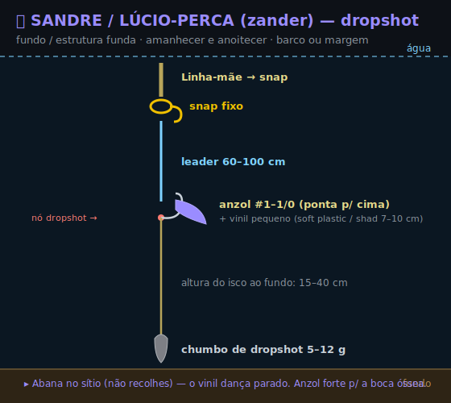

```
clipa → leader 60–100 cm → nó dropshot: anzol #1–1/0 no ramal (ponta p/ cima) + vinil pequeno
                           → linha continua → chumbo de dropshot 5–12 g no fundo
```
- **Profundidade:** chumbo no fundo; isco a **15–40 cm** acima.
- **Técnica:** **abana no sítio** (não recolhes) — o vinil (soft plastic) dança parado. Anzol forte p/ a boca óssea do sandre.
- ⚠️ Sandre grande (4–8 kg) está **acima do teu material** — vai a pequenos/médios.

## 🔵 H · CARPA — pão à superfície (floating bread)

Verão, água parada e quente, margem com sombra. **Sem chumbo.** Visual e barato.

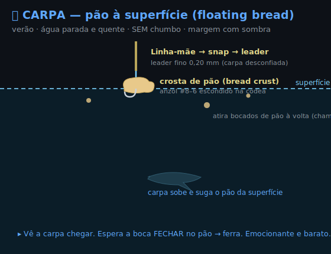

```
clipa → leader fino 0,20 mm → anzol #8–6 escondido numa crosta de pão (bread crust) a flutuar
```
- **Profundidade:** **superfície** (0 m). Atira bocados de pão à volta como chamariz (chum).
- **Mordida (bite):** vês a carpa subir e sugar. Espera a boca **fechar** → **ferra (hookset)**.

## 🟢 I · ACHIGÃ — wacky / sem chumbo (água limpa)

Finesse p/ peixe desconfiado em água limpa (Castelo do Bode). Queda lenta e horizontal.

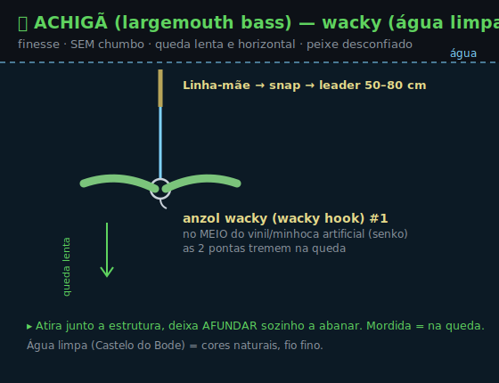

```
clipa → leader 50–80 cm → anzol wacky (wacky hook) #1 espetado no MEIO do vinil/senko
```
- **Profundidade:** **sem chumbo** → afunda sozinho devagar, as 2 pontas a tremer. Mordida **na queda**.
- Atira junto a estrutura (structure), deixa cair. Cores naturais, fio fino.

## 🏞️ Caso especial — barragem funda (ex. Castelo do Bode)

Água funda e limpa (clear). Precisas chegar fundo + ser discreto.
- **Boia:** usa a montagem **D (boia deslizante)** com nó-batente → pescas a 3, 5, 8 m. Boia fixa não chega.
- **Spinning:** montagem **B**, e **conta a queda (countdown)** para pescar camadas fundas. Cores naturais, fluoro fino.
- **Sandre / lúcio-perca:** montagem **G (dropshot)** ou vinil jigado no fundo, ao amanhecer/anoitecer.

---

## 🪢 Nós usados nestas montagens

| Onde | Nó | Dif. |
|--|--|--|
| multi → destorcedor/snap | **Palomar** | 🟢 |
| fluoro/mono → anzol olhal/destorcedor | **Clinch melhorado** | 🟢 |
| multi → leader fluoro | **FG** / **Albright** / **Double Uni** | 🔴/🟡 |
| laço no topo do leader (modular) | **Perfection / Surgeon's loop** | 🟡/🟢 |
| anzol olhal, fisgada direta (avançado) | **Snell** | 🔴 |

➡️ Passo-a-passo de cada um (com vídeo) em [**🪢 NOS.md**](NOS.md). Regra geral: **molha** antes de apertar · aperta devagar · corta a sobra ~2 mm.
