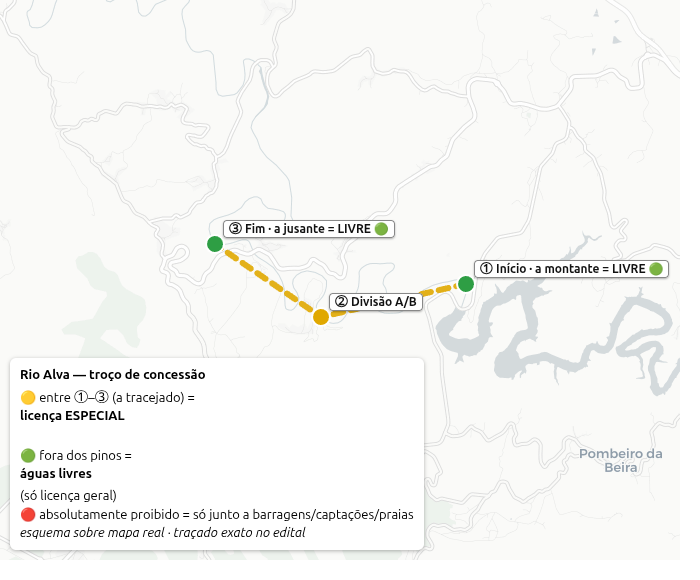
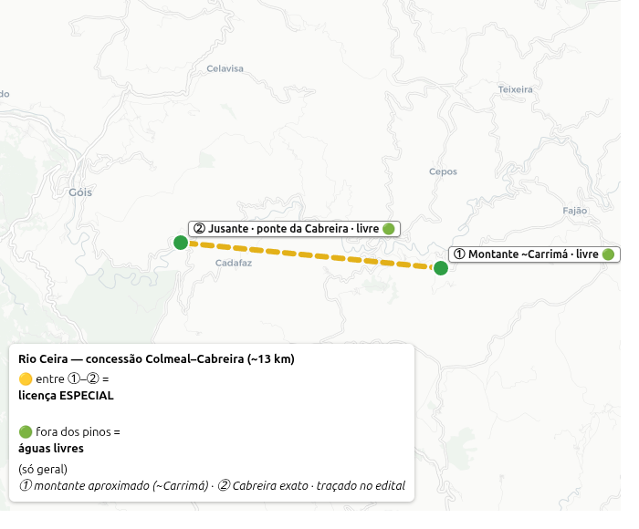
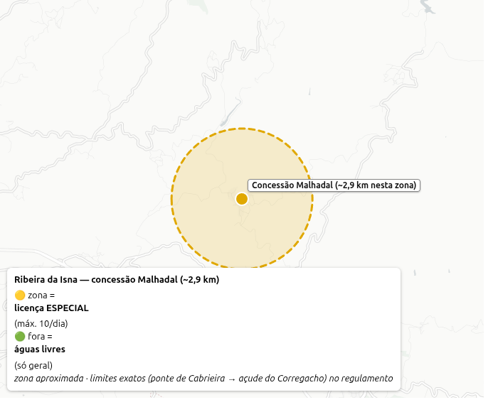

# 💳 Licenças & onde comprar — tudo num sítio

> 🎯 **Resumo (TL;DR):**
> 1. **Sempre** precisas da **Licença Geral** (ICNF) — tira-se no **Multibanco**, é anual, poucos €.
> 2. Nas **barragens** (Alqueva, Odivelas, Idanha) → **só** a geral. Castelo do Bode tem regras extra (POACB).
> 3. Em alguns **troços de rio** (concessões) precisas **também** de uma **licença especial diária**, comprada **localmente**.
> 4. A concessão é **só naquele troço marcado**, **não no rio todo**. Fora dele = águas livres (só a geral).

---

## 1️⃣ Licença Geral (ICNF) — obrigatória sempre

- **Quem:** todos com **16+** (menores isentos, mas só a pescar **acompanhados** por titular).
- **Onde comprar:** **caixa Multibanco** → *Pagamentos e Outros Serviços → Estado e Sector Público → Licenciamento de Pesca Lúdica → **Pesca Águas Doces** → tipo (Nacional/Regional) → nº CC → NIF*. O **talão MB é a própria licença**. Ou balcões do **ICNF**. **Não há portal online.**
- **Tipo:** **anual** (ano civil) — **Nacional** (todo o país) ou **Regional** (Norte/Centro/Sul). **Não há "diária" na geral.**
- **Preço (aprox., confirmar):** Nacional ~**20 €** · Regional ~**12 €** · não-residentes têm 7/30 dias.
- ⚠️ **Não confundir com o BMAR** — esse é pesca **no mar** (DGRM), não serve para águas interiores.
- [Info ICNF](https://www.icnf.pt/pesca/pescaludicaedesportiva/licencas)

---

## 2️⃣ Como funciona o âmbito (lê isto)

- **Concessão = só um TROÇO marcado** do rio (com placas/limites), **não o rio inteiro**. **Fora do troço**, o rio costuma ser **águas livres** → chega a **licença geral**.
- **Barragem ≠ rio que a enche.** Cada **massa de água** tem a sua própria classificação. Uma albufeira pode ser águas livres enquanto o rio a montante é concessão (ou ao contrário). Ex.: o **alto Zêzere (Valhelhas)** e a **albufeira de Castelo do Bode** têm **regras diferentes**.
- **3 regimes:** **águas livres** (só geral) · **concessão/ZPL** (geral + especial) · **zona reservada** (ex.: Lagoas da Estrela, só em provas).

---

## 3️⃣ As 4 barragens do guia

| Barragem | Regime | Precisas |
|---|---|---|
| **Alqueva** | águas livres | só **licença geral** |
| **Odivelas** | águas livres (recinto de provas de feeder) | só **geral** (em provas pode haver zona condicionada) |
| **Idanha** (Marechal Carmona) | águas livres | só **geral** |
| **Castelo do Bode** | águas livres **+ POACB** (água de abastecimento) | **geral**; ⚠️ regras extra: **motores 2 tempos proibidos**, praias = zona balnear |

➡️ Detalhe e regras nacionais (tamanhos, defeso, devolver/abater) → [⚖️ Regras & licença](REGRAS.md).

---

## 4️⃣ Concessões dos rios — licença especial + onde comprar

Aqui precisas da **geral + licença especial diária**, comprada **no ponto local** (não há online). *(Na lei atual chamam-se **ZPL concessionadas**; nos editais ainda lês "concessão" — é o mesmo.)*

| Rio / troço | Especial (preço/dia) | Regras-chave | 🛒 Onde comprar |
|---|---|---|---|
| **Rio Alva** — só troço de **Poiares** (Lavegadas) ⚠️ *não os campings a montante* | residente ~1–2 € · outros ~5 € (c/ morte 10–15 €) | troço A sem morte / B com morte, dias alternados; **só mosca/artificiais, sem barbela**; achigã devolução proibida | Câmara de **V.N. Poiares** · **Junta de Lavegadas** · Centro de Convívio de **Mucela** · cafés (Mucelão) |
| **Rio Ceira** (Góis) | residente 2 € · outros ~5 €; **máx 18/dia** | só **truta, barbo, boga** (sem achigã); truta 10/dia, mín 20 cm; sem barco | **Associação Florestal do Concelho de Góis** · Câmara de Góis |
| **Ribeira da Isna / Malhadal** (Proença-a-Nova) | residente 1–1,5 € · outros 4,99 €; **máx 10/dia** | só presencial; ⚠️ regulamento antigo — **confirmar** | **Câmara M. de Proença-a-Nova** (dias úteis 9–16h) · **Posto de Turismo** (fins de semana) · ☎ 274 670 000 |
| **Lagoas Serra da Estrela** (Vale do Rossim) | **só em provas** (licença coletiva 120 €/lagoa) | sem época individual em 2026; sem morte | via **clube/associação** que organiza a prova (ICNF Manteigas) |
| **Zêzere em Oleiros** (Cambas/Mosteiro) | — (**águas livres**) | só licença geral | nenhum — **só a geral** |

### 🗺️ Onde é o troço (NÃO é o rio todo)

Cada concessão é só um **pedaço marcado** do rio — no terreno há **placas** nos limites. **Fora desse pedaço = águas livres** (só a licença geral). Limites oficiais:

**🔵 Rio Alva** (~7,4 km, entre Lavegadas e S. Martinho da Cortiça):
- 📍 **Início** (montante): [40.2489, -8.1632](https://www.google.com/maps?q=40.2488704,-8.1632354)
- 📍 **Divisão A/B** ("a castinceira"): [40.2446, -8.1881](https://www.google.com/maps?q=40.2446000,-8.1880775) — **Lote A** (montante) = **sempre sem morte** · **Lote B** (jusante) = **com morte** em dias certos
- 📍 **Fim** (jusante): [40.2541, -8.2063](https://www.google.com/maps?q=40.2540845,-8.2063371)
- 🧭 **Os 2 limites juntos no Google Maps** → [início → fim](https://www.google.com/maps/dir/40.2488704,-8.1632354/40.2540845,-8.2063371) *(ignora a rota sugerida — é só para veres os 2 pinos)*
- 🗺️ Mapa oficial → [edital ICNF (PDF)](https://www.icnf.pt/api/file/doc/9278b17ce4bbf86c)

> 🟡 **linha amarela = o rio real no troço da concessão** (licença **especial**) · 🟢 fora dos pinos = **livre** (só geral) · 🔴 proibido só junto a barragens/captações/praias. *Geometria do rio © OpenStreetMap · CARTO; limites no edital.*

**🔵 Rio Ceira — Colmeal–Cabreira** (~13 km):
- Da **confluência da Ribeira de Carrimá** (montante) até à **ponte nova da Cabreira** (jusante).
- 🧭 **2 limites no Maps** → [montante (~Carrimá) → Cabreira](https://www.google.com/maps/dir/40.13256,-7.97427/40.14002,-8.07233) *(montante aproximado)* · 🗺️ [edital (PDF)](https://www.cm-gois.pt/cmgois/uploads/document/file/1217/edital_30_2018___concessao_de_pesca_desportiva___rio_ceira.pdf)

> 🟡 **linha amarela = o rio real** no troço (**especial**) · 🟢 fora = **livre** · ① montante **aproximado** (~Carrimá) · ② Cabreira exato. *Geometria © OpenStreetMap · CARTO.*

**🟡 Ribeira da Isna — Malhadal** (~2,9 km):
- De **100 m a montante da ponte pedonal** (a jusante de Cabrieira) até ao **açude do Corregacho**.
- 📍 **Zona no Maps** → [Malhadal](https://www.google.com/maps?q=39.78216,-7.94807) *(zona aprox. — os extremos não estão em mapas)* · 🗺️ [regulamento (PDF)](https://api.cm-proencanova.pt/uploads/1/3/Municipio/Atividade/Juridico/Regulamentos/Regulamento%20Zona%20de%20Pesca%20Malhadal.pdf)

> 🟡 zona (~2,9 km) = **especial** (máx 10/dia) · 🟢 fora = **livre**. *Zona aproximada; limites exatos no regulamento. © OpenStreetMap · CARTO.*

> 💡 **Na dúvida no terreno:** procura as **placas/sinais** da concessão — marcam onde começa e acaba. **Dentro** = precisas da licença especial; **fora** = só a geral.

---

### 📍 Pontos de venda (morada · ☎ · 🗺️)

**🔵 Rio Alva** — geral + especial:
- **C.M. Vila Nova de Poiares** · Largo da República, 3350-156 V.N. Poiares · ☎ 239 420 850 · dias úteis 8:30–16:00 · [🗺️ Maps](https://www.google.com/maps/search/C%C3%A2mara+Municipal+Vila+Nova+de+Poiares)
- **Junta de Freguesia de Lavegadas** · Rua São José 41, 3350-052 Igreja Nova · ☎ 239 455 667
- Também: Café Vale do Tronco (V.N. Poiares) · Café O Cantinho (Mucelão, Arganil) · Centro de Convívio da Mucela.

**🔵 Rio Ceira** — concessão **Colmeal–Cabreira** (Góis tem 3 concessões; é esta):
- **Associação Florestal do Concelho de Góis** · Praceta Teófilo Braga 3, 3330-345 Góis · ☎ 235 778 828 · 9–13h / 14–17h · [🗺️ Maps](https://www.google.com/maps?q=40.15742,-8.11033)
- Também: Posto de Turismo de Góis · cafés locais.

**🟡 Ribeira da Isna / Malhadal** (Proença-a-Nova):
- **C.M. Proença-a-Nova** · Av. do Colégio, 6150-401 Proença-a-Nova · ☎ 274 670 000 · dias úteis 9–16h · [🗺️ Maps](https://www.google.com/maps/search/C%C3%A2mara+Municipal+Proen%C3%A7a-a-Nova)
- **Posto de Turismo** (fins de semana) · Parque Urbano Comendador João Martins · ☎ 939 623 269

**⛰️ Lagoas da Estrela** (só em provas — licença coletiva 120 €/lagoa, via balcões ICNF):
- Guarda ☎ 271 208 400 · Viseu ☎ 232 427 510 · **PNSE Manteigas** (Rua 1.º de Maio) ☎ 275 980 060 · ICNF-Seia ☎ 238 001 060

**🟢 Zêzere em Oleiros + as 4 barragens** → **não precisam de especial**, só a **geral** (Multibanco).

---

## 5️⃣ Defeso / épocas (águas interiores)

- 🐟 **Truta:** época **1 mar – 31 jul** (fechada ago–fev). Mín. **20 cm** (21 cm no Alva).
- 🐟 **Ciprinídeos nativos** (boga, escalo, barbo): **defeso 16 mar – 14 jun**.
- 🟢 **Achigã:** defeso **~16 mar – 14 mai** (invasor; várias zonas pedem **não devolver**).
- ➡️ Datas variam por edital/zona — **confirma sempre o edital do ano** antes de ir.

---

## ⚠️ Antes de ir — confirma
- Preços e datas **mudam por edital anual** — confirma no [ICNF](https://www.icnf.pt/pesca) ou na câmara.
- **Rio Alva:** há 2 editais em transição (preços diferentes) — confirma com a câmara/junta.
- **Isna/Proença:** regulamento antigo e fora do registo ICNF — **liga à câmara** (274 670 000) a confirmar se está a correr.
- **Leva sempre:** licença geral (talão MB) + cartão de cidadão + (onde aplica) a licença especial.

➡️ Spots de rio e que peixe há em cada → [🏞️ Rios](RIOS.md) · regras nacionais → [⚖️ Regras](REGRAS.md).
