# 🌊 Mar & estuário — Lisboa

> 🗒️ Pesca marítima ao alcance de bike/carro de Lisboa. **Licença DGRM** (marítima) — a do ICNF **não serve** aqui. Coordenadas auditadas. *(Secção temporária.)*

**Em 1 parágrafo:** entre a **linha Bugio ↔ Forte de S. Julião** (jusante) e **Vila Franca de Xira** (montante), o estuário é **jurisdição da Capitania do Porto de Lisboa** e rege-se pelo **regime da pesca lúdica marítima** (DL 246/2000 → **licença DGRM**, a do ICNF não serve). *(Nota de vocabulário: a lei chama-lhes «águas interiores **não marítimas**» — o nome engana, a autoridade é marítima.)* Vantagem grande: **pesca noturna apeada é legal**. Alvos: **robalo** (o rei, melhor ao lusco-fusco e à noite), **dourada**, **linguado** (lodo, noite) e taínha o dia todo. A maré manda mais que a hora.

---

## 📅 Melhores dias — atualiza sozinho

<div id="mares-app">A carregar marés…</div>

<script>

(function(){
  // ── CORREÇÃO DO MODELO ─────────────────────────────────────────────────────
  // O Open-Meteo adianta sistematicamente a maré nesta região. Calibrado contra
  // 35 eventos (9-17 set 2026) da TideTime.org para Lisboa, cruzada com a Tabela
  // de Marés do Porto de Lisboa/IH e o Tides4fishing:
  //   PM: +73,6 min (mediana +73,7 · desvio 1,3 · min +70 max +76)
  //   BM: +44,8 min (mediana +44,8 · desvio 1,3 · min +43 max +47)
  // O desvio é diferente na PM e na BM porque o modelo também erra a assimetria
  // enchente/vazante — por isso são duas correções e não uma.
  var CORR = {PM:74, BM:45};

  var LOCAIS = {
    estuario: {nome:'🧱 Tejo — muralha/Oriente', lat:38.68, lon:-9.32, sol_lat:38.75, sol_lon:-9.10, lag:10, noturna:true,  cal:'✅ calibrado', carro:'🚲 30-40 min'},
    caparica: {nome:'🏖️ Caparica',              lat:38.62, lon:-9.26, sol_lat:38.64, sol_lon:-9.23, lag:0,  noturna:false, cal:'≈ herda a de Lisboa', carro:'🚗 17-40 min (ponte)'},
    sado:     {nome:'⚓ Setúbal / Sado',         lat:38.47, lon:-8.95, sol_lat:38.52, sol_lon:-8.89, lag:20, noturna:false, cal:'≈ herda a de Lisboa', carro:'🚗 51-70 min (ponte)'},
    ericeira: {nome:'🌊 Ericeira / Costa Oeste', lat:38.96, lon:-9.43, sol_lat:38.96, sol_lon:-9.42, lag:0,  noturna:false, cal:'≈ herda a de Lisboa', carro:'🚗 41 min'},
    sesimbra: {nome:'🐙 Sesimbra',               lat:38.42, lon:-9.11, sol_lat:38.44, sol_lon:-9.10, lag:0,  noturna:false, cal:'≈ herda a de Lisboa', carro:'🚗 39-60 min (ponte)'},
    // Óbidos tem correção própria (+33 min, medida contra a TideTime em 6 eventos)
    // e a maré ainda demora a entrar na lagoa: a fase de M2 sobe 80° da barra ao
    // fundo = 166 min. No #1, a 63% do canal, dá +1h44 médio. A BM atrasa ~36 min
    // mais que a PM — é isso que produz enchente de 5 h e vazante de 7 h.
    obidos:   {nome:'🟢 Lagoa de Óbidos (spot #1)', lat:39.43, lon:-9.235, sol_lat:39.404, sol_lon:-9.211,
               corr:{PM:33,BM:33}, lagPM:68, lagBM:140, lagoa:true, noturna:true, atenua:0.54,
               cal:'✅ calibrado · ±6 min contra 2 fontes', carro:'🚗 ~1h15'}
  };
  var SLACK = 45;   // ± min de estofo à volta de cada PM/BM (água parada)

  function extremos(ts, sl, LAG, L){
    var out=[];
    for (var i=1;i<sl.length-1;i++){
      if (sl[i]==null||sl[i-1]==null||sl[i+1]==null) continue;
      var up=(sl[i]>=sl[i-1] && sl[i]>sl[i+1]), dn=(sl[i]<=sl[i-1] && sl[i]<sl[i+1]);
      if(!up && !dn) continue;
      var tipo = up?'PM':'BM';
      var den=(sl[i-1]-2*sl[i]+sl[i+1]);
      var off=den? 0.5*(sl[i-1]-sl[i+1])/den : 0;
      var t=new Date(ts[i]);
      var C=(L&&L.corr)?L.corr[tipo]:CORR[tipo];
      var LG=(L&&L.lagPM!=null)?(tipo==='PM'?L.lagPM:L.lagBM):(LAG||0);
      t.setMinutes(t.getMinutes()+off*60+C+LG);
      out.push({t:t, tipo:tipo, alt:sl[i]});
    }
    return out;
  }
  var hm=function(d){return String(d.getHours()).padStart(2,'0')+':'+String(d.getMinutes()).padStart(2,'0');};
  var ymd=function(d){return d.getFullYear()+'-'+String(d.getMonth()+1).padStart(2,'0')+'-'+String(d.getDate()).padStart(2,'0');};
  var DIAS=['dom','seg','ter','qua','qui','sex','sáb'];
  function ovl(a1,a2,b1,b2){var i=Math.max(a1,b1), f=Math.min(a2,b2); return f>i?[i,f]:null;}

  // janelas de ÁGUA A MEXER: entre o fim de um estofo e o início do seguinte
  function janelas(evs){
    var W=[];
    for(var i=0;i<evs.length-1;i++){
      var ini=evs[i].t.getTime()+SLACK*60000, fim=evs[i+1].t.getTime()-SLACK*60000;
      if(fim>ini) W.push({ini:ini, fim:fim, ench:(evs[i].tipo==='BM')});
    }
    return W;
  }

  // Pontua cada instante do dia e devolve o melhor bloco contínuo de 2h30.
  // Quatro coisas contam:
  //   corrente — proporcional a (altura da maré / duração do troço). É por isso
  //              que a enchente de Óbidos (~5 h) puxa mais que a vazante (~7 h).
  //              Normalizada pelo máximo do próprio dia, sem cortes.
  //   nível    — numa lagoa rasa o peixe só chega às margens com água alta.
  //   luz      — a primeira e a última hora do dia valem por si; e entre duas
  //              janelas parecidas ganha a que tem luz.
  function melhorJanela(evs, s, L, d0, d1){
    var ev=evs.filter(function(e){return e.t.getTime()>d0-9*3600000 && e.t.getTime()<d1+9*3600000;})
              .sort(function(a,b){return a.t-b.t;});
    if(ev.length<2) return null;
    function estado(ms){
      for(var i=0;i<ev.length-1;i++){
        var t1=ev[i].t.getTime(), t2=ev[i+1].t.getTime();
        if(ms<t1||ms>t2) continue;
        var dur=(t2-t1)/3600000, x=(ms-t1)/(t2-t1);
        var rng=Math.abs(ev[i+1].alt-ev[i].alt);
        var sg=(ev[i].tipo==='BM')?-1:1;
        return {niv: sg*Math.cos(Math.PI*x),
                cor: (rng/Math.max(dur,0.5))*Math.abs(Math.sin(Math.PI*x)),
                ench: ev[i].tipo==='BM'};
      }
      return null;
    }
    var PASSO=15*60000, bruto=[], corMax=0;
    for(var ms=d0; ms<=d1; ms+=PASSO){
      var e=estado(ms); bruto.push(e?{ms:ms,e:e}:null);
      if(e) corMax=Math.max(corMax,e.cor);
    }
    var pts=bruto.map(function(o){
      if(!o) return null;
      var e=o.e, ms=o.ms;
      var p = 0.50*(corMax?e.cor/corMax:0);
      p += (L.lagoa?0.32:0.10) * (e.niv+1)/2;
      if(e.ench) p += 0.06;
      var claro = s.nascer && s.por && ms>=s.nascer.getTime() && ms<=s.por.getTime();
      if(claro) p += 0.05;
      if(s.nascer){ var dn=Math.abs(ms-s.nascer.getTime()); if(dn<3600000) p += 0.13*(1-dn/3600000); }
      if(s.por){    var dp=Math.abs(ms-s.por.getTime());    if(dp<3600000) p += 0.15*(1-dp/3600000); }
      return p;
    });
    // todos os blocos de 2h30, depois fica com os 2 melhores que nao se sobrepoem
    var LARG=Math.round(2.5*3600000/PASSO), cand=[];
    for(var i=0;i+LARG<pts.length;i++){
      var soma=0, ok=true;
      for(var j=i;j<i+LARG;j++){ if(pts[j]==null){ok=false;break;} soma+=pts[j]; }
      if(!ok) continue;
      cand.push({m:soma/LARG, ini:d0+i*PASSO, fim:d0+(i+LARG)*PASSO});
    }
    cand.sort(function(a,b){return b.m-a.m;});
    var sel=[];
    for(var i=0;i<cand.length && sel.length<3;i++){
      var c=cand[i];
      var choca=sel.some(function(x){return c.ini<x.fim && c.fim>x.ini;});
      if(!choca) sel.push(c);
    }
    sel.forEach(function(b){
      var mid=b.ini+(b.fim-b.ini)/2, e0=estado(mid);
      b.ench = e0?e0.ench:null;
      b.noite = !(s.nascer && s.por && mid>=s.nascer.getTime()-3600000 && mid<=s.por.getTime()+3600000);
    });
    sel.sort(function(a,b){return a.ini-b.ini;});
    return sel;
  }

  function render(marine, sun, L){
    var h=marine.hourly, evs=extremos(h.time,h.sea_level_height_msl,L.lag,L), W=janelas(evs), dias={};
    evs.forEach(function(e){ var k=ymd(e.t); (dias[k]=dias[k]||[]).push(e); });
    var sol={};
    (sun.daily.time||[]).forEach(function(d,i){ sol[d]={nascer:new Date(sun.daily.sunrise[i]), por:new Date(sun.daily.sunset[i])}; });

    function linha(k){
      var ev=dias[k]; if(!ev||!ev.length) return '';
      var d=new Date(k+'T12:00:00'), s=sol[k]||{}, fds=(d.getDay()===0||d.getDay()===6);
      var alts=ev.map(function(e){return e.alt;});
      var ampOce=Math.max.apply(null,alts)-Math.min.apply(null,alts);
      var amp=ampOce*(L.atenua||1);
      var d0=new Date(k+'T00:00:00').getTime(), d1=d0+86400000;

      // 1) MELHORES HORAS — água a mexer, independente da minha disponibilidade
      var doDia=[];
      W.forEach(function(w){ var o=ovl(w.ini,w.fim,d0,d1); if(o && o[1]-o[0]>30*60000) doDia.push({ini:o[0],fim:o[1],ench:w.ench}); });
      var mexeTxt = doDia.map(function(w){
        return '<span style="white-space:nowrap">'+(w.ench?'⬆':'⬇')+' '+hm(new Date(w.ini))+'-'+hm(new Date(w.fim))+'</span>';
      }).join('<br>') || '—';

      // 2) prime: água a mexer + luz baixa (do pôr-do-sol −1h ao +1h)
      var prime=null;
      if(s.por){
        var p0=s.por.getTime()-3600000, p1=s.por.getTime()+3600000;
        doDia.forEach(function(w){ var o=ovl(w.ini,w.fim,p0,p1); if(o && (!prime || o[1]-o[0]>prime[1]-prime[0])) prime=o; });
      }

      // 3) A MINHA janela
      var ini=new Date(k+(fds?'T08:00:00':'T18:00:00')).getTime(), fim=new Date(k+'T22:00:00').getTime();
      if(!L.noturna && s.por){ var lim=s.por.getTime()+30*60000; if(lim<fim) fim=lim; }
      var minutos=0, melhor=null, ench=false;
      doDia.forEach(function(w){
        var o=ovl(w.ini,w.fim,ini,fim); if(!o) return;
        minutos += (o[1]-o[0])/60000;
        if(w.ench) ench=true;
        if(!melhor || o[1]-o[0]>melhor[1]-melhor[0]) melhor=o;
      });
      var temPrime = prime && ovl(prime[0],prime[1],ini,fim);
      var pontos = (ampOce>=2.6?3:ampOce>=2.0?2:ampOce>=1.6?1:0)
                 + (minutos>=150?2:minutos>=75?1:0)
                 + (ench?1:0) + (temPrime?1:0);
      var estrelas = pontos>=6?'⭐⭐⭐':pontos>=4?'⭐⭐':pontos>=2?'⭐':'—';
      var meuTxt = melhor
        ? '<b>'+hm(new Date(melhor[0]))+'-'+hm(new Date(melhor[1]))+'</b>'+(temPrime?' 🌅':'')+
          '<br><span style="font-size:.82em;opacity:.75">'+Math.round(minutos)+' min de água a mexer</span>'
        : '<span style="opacity:.6">nada na tua janela</span>';

      // 4) MELHOR JANELA DE PESCA — corrente + nível + luz
      var mjs=melhorJanela(evs, s, L, d0, d1)||[];
      var ordem=mjs.slice().sort(function(a,b){return b.m-a.m;});
      var mjTxt = mjs.length ? mjs.map(function(w){
        var pos=ordem.indexOf(w)+1;
        var med=['🥇','🥈','🥉'][pos-1]||'';
        var qual = w.m>=0.62?'⭐⭐⭐':w.m>=0.50?'⭐⭐':w.m>=0.40?'⭐':'·';
        return '<span style="white-space:nowrap">'+med+' '+(pos===1?'<b>':'')+
               hm(new Date(w.ini))+'-'+hm(new Date(w.fim))+(pos===1?'</b>':'')+
               ' '+(w.ench?'⬆':'⬇')+(w.noite?'🌙':'')+
               ' <span style="font-size:.8em;opacity:.8">'+qual+'</span></span>';
      }).join('<br>') : '—';

      var mares=ev.map(function(e){return e.tipo+' '+hm(e.t);}).join(' · ');
      return '<tr'+(pontos>=6?' style="background:#eef8f4"':'')+'>'+
        '<td><b>'+DIAS[d.getDay()]+' '+k.slice(8)+'/'+k.slice(5,7)+'</b>'+(fds?' 🎉':'')+'</td>'+
        '<td style="font-size:.9em;white-space:nowrap">'+mares+'</td>'+
        '<td style="font-size:.92em;background:#f2faf6">'+mjTxt+'</td>'+
        '<td style="font-size:.9em">'+mexeTxt+'</td>'+
        '<td style="font-size:.92em">'+meuTxt+'</td>'+
        '<td style="text-align:center">'+amp.toFixed(1)+(L.atenua?'<br><span style="font-size:.75em;opacity:.6">'+ampOce.toFixed(1)+' fora</span>':'')+'</td>'+
        '<td style="text-align:center"><b>'+estrelas+'</b></td>'+
        '<td style="white-space:nowrap;font-size:.88em">'+(s.por?hm(s.por):'—')+'</td></tr>';
    }

    var linhas=Object.keys(dias).sort().slice(0,10).map(linha).join('');
    return '<p style="margin:.2em 0 .6em"><b>📍 '+L.nome+'</b> · '+L.carro+
      ' · <span style="opacity:.7;font-size:.9em">correção do modelo PM +'+((L.corr||CORR).PM)+' / BM +'+((L.corr||CORR).BM)+' min '+L.cal+
      (L.lagPM!=null?' · propagação na lagoa PM +'+L.lagPM+' / BM +'+L.lagBM+' min':(L.lag?' · +'+L.lag+' min de propagação':''))+'</span></p>'+
      '<table><thead><tr><th>Dia</th><th>Marés</th><th>🏆 Melhores janelas<br>de pesca</th><th>🌊 Água a mexer</th><th>🎯 A tua janela</th><th>Ampl.</th><th>Nota</th><th>Pôr-sol</th></tr></thead><tbody>'+linhas+'</tbody></table>';
  }

  function carrega(chave){
    var L=LOCAIS[chave], el=document.getElementById('mares-app');
    Promise.all([
      fetch('https://marine-api.open-meteo.com/v1/marine?latitude='+L.lat+'&longitude='+L.lon+'&hourly=sea_level_height_msl&timezone=Europe%2FLisbon&forecast_days=10').then(function(r){return r.json();}),
      fetch('https://api.open-meteo.com/v1/forecast?latitude='+L.sol_lat+'&longitude='+L.sol_lon+'&daily=sunrise,sunset&timezone=Europe%2FLisbon&forecast_days=10').then(function(r){return r.json();})
    ]).then(function(res){
      el.innerHTML =
        '<div style="margin-bottom:.8em;display:flex;flex-wrap:wrap;gap:.4em">'+
        Object.keys(LOCAIS).map(function(k){
          return '<button data-l="'+k+'" style="padding:.35em .8em;border-radius:8px;cursor:pointer;font-size:.92em;'+
            'border:1px solid '+(k===chave?'#0a7d5a':'#ccc')+';background:'+(k===chave?'#0a7d5a':'#fff')+';color:'+(k===chave?'#fff':'#333')+'">'+
            LOCAIS[k].nome+'</button>';
        }).join('')+'</div>'+ render(res[0], res[1], LOCAIS[chave])+
        '<p style="font-size:.85em;opacity:.75;margin-top:.6em">'+
        '<b>🏆 Melhores janelas de pesca</b> = os <b>três melhores blocos de 2h30</b> do dia que não se sobrepõem, por ordem 🥇🥈🥉, pontuados de 15 em 15 min por <b>três coisas</b>: força da corrente (máxima a meio da maré), <b>altura de água</b> (numa lagoa rasa o peixe só chega às margens com maré cheia — por isso pesa mais em Óbidos que no mar) e <b>luz baixa</b> (a primeira e a última hora do dia valem por si). ⬆ enchente · ⬇ vazante. ⭐⭐⭐ = dia bom.<br>'+
        '<b>🌊 Água a mexer</b> = todas as horas com corrente, dês ou não estar livre. Cada janela começa 45 min depois de uma maré e acaba 45 min antes da seguinte (o estofo é água parada).<br>'+
        '<b>🎯 A tua janela</b> = a maior fatia dessas horas que te calha (semana 18h-22h · fim de semana 08h-22h 🎉'+
        '; nas praias corta a ½h após o pôr-do-sol, no estuário não — aí a noturna é legal). <b>🌅</b> = apanha a hora do pôr-do-sol com água a mexer, que é a melhor do dia para robalo.<br>'+
        '<b>Nota</b> soma amplitude + minutos de água a mexer na tua janela + haver enchente + apanhar o crepúsculo.<br>'+
        '⚠️ As horas já levam a <b>correção do modelo</b> (o Open-Meteo adianta a maré ~74 min na PM e ~45 min na BM). '+
        'Calibração medida em 35 eventos contra a <a href="https://www.tidetime.org/europe/portugal/lisbon.htm" target="_blank">TideTime</a>, '+
        'a <a href="https://www.portodelisboa.pt/en/tides" target="_blank">Tabela do Porto de Lisboa/IH</a> e o '+
        '<a href="https://tides4fishing.com/pt/lisboa/lisboa" target="_blank">Tides4fishing</a> — <b>verificada para Lisboa</b>; '+
        'os outros pontos herdam a mesma correção sem verificação própria.</p>';
      el.querySelectorAll('button[data-l]').forEach(function(b){
        b.onclick=function(){ el.innerHTML='A carregar…'; carrega(b.getAttribute('data-l')); };
      });
    }).catch(function(e){
      el.innerHTML='<p>⚠️ Não deu para carregar as marés (offline?). Consulta <a href="https://www.tidetime.org/europe/portugal/lisbon.htm" target="_blank">TideTime</a>.</p>';
    });
  }
  if(document.getElementById('mares-app')) carrega('estuario');
})();

// ===== tabela de épocas balneares =====
(function(){
  // [nome, mês-dia início, mês-dia fim, regra]
  var Z = [
    ['🏖️ Costa da Caparica (22 praias) · Oeiras', '06-01','09-30','Lisboa: 200 m · janela fixa 1 mai-15 out'],
    ['🌊 Cascais (15 praias)',                     '05-01','09-30','Cascais: 300 m · inclui esporões'],
    ['🌊 Ericeira/Mafra · Sintra',                 '06-13','09-13','Cascais: 300 m · inclui esporões'],
    ['🐙 Sesimbra (Califórnia, Ouro, Meco…)',      '06-04','09-13','Setúbal: só praias concessionadas'],
    ['⚓ Setúbal (Figueirinha, Albarquel…)',        '06-04','09-15','Setúbal: só praias concessionadas'],
    ['🧱 Praias do Seixal · Ponta dos Corvos',      '07-21','09-15','edital de banhistas CPL 67-70'],
    ['🧱 Praia de Alburrica (Barreiro)',            '06-06','09-06','edital de banhistas CPL 29'],
    ['⚖️ Jurisdição de Lisboa — leitura literal',   '05-01','10-15','o edital fixa 1 mai-15 out, independente da época'],
    ['🌊 Óbidos/Foz do Arelho (praias de mar)',     '06-13','09-13','POC-ACE art. 17.º: proibido do nascer ao ocaso do Sol'],
    ['🟢 LAGOA DE ÓBIDOS (Zona de Utilização Livre)', null, null,   'não é praia marítima — livre o ano todo · máx. 2 canas'],
    ['🧱 ESTUÁRIO (Parque Ribeirinho, margem sul)', null,  null,   'não são águas balneares — sem restrição']
  ];
  function d(md, ano){ return new Date(ano+'-'+md+'T00:00:00'); }
  var hoje=new Date(), ano=hoje.getFullYear();
  var linhas = Z.map(function(z){
    if(!z[1]) return '<tr style="background:#eef8f4"><td><b>'+z[0]+'</b></td><td colspan="2">✅ <b>pescável todo o ano</b></td><td style="font-size:.88em;opacity:.75">'+z[3]+'</td></tr>';
    var ini=d(z[1],ano), fim=d(z[2],ano);
    var dentro = hoje>=ini && hoje<=fim;
    var abre = new Date(fim.getTime()+86400000);
    if(!dentro && hoje>fim) abre = new Date(d(z[1],ano+1).getTime()); // já passou: mostra quando volta a fechar
    var fmt=function(x){return String(x.getDate()).padStart(2,'0')+'/'+String(x.getMonth()+1).padStart(2,'0');};
    var dias = Math.ceil((abre-hoje)/86400000);
    return '<tr'+(dentro?'':' style="background:#eef8f4"')+'>'+
      '<td><b>'+z[0]+'</b></td>'+
      '<td style="white-space:nowrap">'+fmt(ini)+' → '+fmt(fim)+'</td>'+
      '<td style="white-space:nowrap"><b>'+(dentro
          ? '⛔ fechado · abre '+fmt(abre)+(dias>0?' (faltam '+dias+' dias)':'')
          : '✅ ABERTO')+'</b></td>'+
      '<td style="font-size:.88em;opacity:.75">'+z[3]+'</td></tr>';
  }).join('');
  var html='<table><thead><tr><th>Zona</th><th>Época balnear</th><th>Estado hoje</th><th>Regra</th></tr></thead><tbody>'+linhas+'</tbody></table>'+
    '<p style="font-size:.85em;opacity:.7">Estado calculado à data de hoje. ⚠️ As datas são as de 2026 — reconfirma a portaria do ano em curso.</p>';
  // o div pode ainda não existir quando o script corre (está mais abaixo na página) → tenta até 20×
  var t=0, iv=setInterval(function(){
    var el=document.getElementById('epocas-app');
    if(el){ el.innerHTML=html; clearInterval(iv); }
    else if(++t>20) clearInterval(iv);
  }, 150);
})();


// ===== mapa legal =====
(function(){
  function iniciaMapa(){
    var el=document.getElementById('mapa-legal');
    if(!el || el.dataset.pronto) return;
    if(typeof L==='undefined') return;
    el.dataset.pronto='1';
    var mapa=L.map(el).setView([38.72,-9.13], 12);
    var MAPA_REF=mapa, CAMADAS_REF={}, LEGENDA_ID='mapa-legenda';
    L.tileLayer('https://{s}.tile.openstreetmap.org/{z}/{x}/{y}.png',{
      maxZoom:18, attribution:'© OpenStreetMap'}).addTo(mapa);

    var CORES={'pontão':'#e74c3c','doca/marina':'#c0392b','terminal fluvial':'#8e44ad','cais acostável':'#8e44ad','farol':'#d35400','unidade militar':'#7f8c8d','esgoto/ETAR ⚠️':'#16a085','estaleiro naval':'#2c3e50','aquicultura':'#16a085'};
    var SPOTS=[
  ['Parque Ribeirinho Oriente (norte)',38.74735,-9.09692,'237 m do pontão · 30 min de bike'],
  ['Cais do Adamastor (PdN) — 100 m a norte',38.75905,-9.09079,'⚠️ o cais em si fica a 89 m de um pontão; este ponto está limpo'],
  ['Algés — 300 m a nascente do terminal',38.69140,-9.22611,'⚠️ o Dafundo fica dentro dos 300 m do terminal de Pedrouços'],
  ['Rio Judeu — 100 m do pontão',38.62576,-9.10929,'⚠️ não pescar EM CIMA do pontão (100 m)'],
  ['Cavaquinhas — 100 m do pontão',38.63274,-9.10549,'⚠️ idem: afastar-se do pontão'],
  ['Trafaria — 150 m a SO da estação',38.67313,-9.23429,'⚠️ a estação fluvial obriga a 300 m'],
  ['Porto Brandão — 200 m a sul',38.67506,-9.20660,'⚠️ a estação fluvial obriga a 300 m'],
  ['Montijo — 300 m a NE do cais',38.70481,-8.97996,'⚠️ o Cais dos Pescadores é cais acostável (300 m)'],
  ['Alcochete — 100 m a NE do ponte-cais',38.75863,-8.96307,'⚠️ o ponte-cais é cais acostável: obriga a 300 m'],
  ['Cais de Alhos Vedros (Moita)',38.66190,-9.02310,'limpo'],
  ['Praia da Adiça',38.55830,-9.19010,'praia oceânica · 1599 m da Fonte da Telha'],
  ['Setúbal — frente ao jardim',38.52040,-8.89420,'🏆 autorização ESCRITA no edital de Setúbal']
];
    SPOTS.forEach(function(s){
      L.circleMarker([s[1],s[2]],{radius:7,color:'#0a7d5a',fillColor:'#27ae60',fillOpacity:.9,weight:2})
       .addTo(mapa).bindPopup('<b>🎣 '+s[0]+'</b><br>'+s[3]);
    });

    fetch('data-zonas.json').then(function(r){return r.json();}).then(function(zs){
      var camadas={};
      zs.forEach(function(z){
        var cor=CORES[z.t]||'#e74c3c';
        var c=L.circle([z.la,z.lo],{radius:z.r,color:cor,fillColor:cor,fillOpacity:.13,weight:1})
          .bindPopup('<b>⛔ '+z.t+'</b>'+(z.n?'<br>'+z.n:'')+'<br>proibido a menos de <b>'+z.r+' m</b>'+(z.nac?'<br><small>🇵🇹 <b>proibição NACIONAL</b> (Portaria 14/2014, art. 8.º)</small>':'<br><small>📍 regra do <b>edital da Capitania de Lisboa</b></small>'));
        (camadas[z.t]=camadas[z.t]||L.layerGroup()).addLayer(c);
      });
      Object.keys(camadas).forEach(function(k){ camadas[k].addTo(mapa); });
      var leg=document.getElementById('mapa-legenda');
      if(leg) leg.innerHTML='<b>Camadas</b> (clica para ligar/desligar): '+
        Object.keys(camadas).map(function(k){
          return '<label style="margin-right:.9em;white-space:nowrap;cursor:pointer">'+
            '<input type="checkbox" checked data-c="'+k+'"> <span style="color:'+(CORES[k]||'#e74c3c')+'">■</span> '+k+' ('+zs.filter(function(x){return x.t===k;}).length+')</label>';
        }).join('')+' <label style="white-space:nowrap"><span style="color:#27ae60">●</span> spots ('+SPOTS.length+')</label>';
      if(leg) leg.querySelectorAll('input[data-c]').forEach(function(cb){
        cb.onchange=function(){ var k=cb.getAttribute('data-c');
          if(cb.checked) camadas[k].addTo(mapa); else mapa.removeLayer(camadas[k]); };
      });
    }).catch(function(){
      var leg=document.getElementById('mapa-legenda');
      if(leg) leg.innerHTML='<span style="opacity:.7">⚠️ não deu para carregar as zonas.</span>';
    });


    // data de actualizacao dos GPX, lida do cabecalho do proprio ficheiro
    (function(){
      var el=document.getElementById('gpx-data'); if(!el) return;
      fetch('obidos.gpx',{method:'HEAD'}).then(function(r){
        var lm=r.headers.get('last-modified'); if(!lm) return;
        var d=new Date(lm);
        el.textContent='actualizados a '+('0'+d.getDate()).slice(-2)+'/'+('0'+(d.getMonth()+1)).slice(-2)+'/'+d.getFullYear()+
                       ' — descarrega outra vez para teres a versão nova';
      }).catch(function(){});
    })();

    // saltos rápidos entre regiões (o mapa nasce em Lisboa; Óbidos fica a 80 km)
    (function(){
      var Z=[['🏙️ Lisboa/estuário',38.72,-9.13,12],
             ['🟣 Lagoa de Albufeira',38.5100,-9.1750,13],
             ['🟢 Lagoa de Óbidos',39.4100,-9.2150,13],
             ['🎣 spot #1 e lançamentos',39.40372,-9.21098,17]];
      var leg=document.getElementById(LEGENDA_ID); if(!leg) return;
      var d=document.createElement('div');
      d.style.cssText='margin:.5em 0;display:flex;flex-wrap:wrap;gap:.4em';
      Z.forEach(function(z){
        var b=document.createElement('button');
        b.textContent=z[0];
        b.style.cssText='font:inherit;font-size:.85em;padding:.25em .6em;border:1px solid #bbb;border-radius:6px;background:#f7f7f7;cursor:pointer';
        b.onclick=function(){ MAPA_REF.setView([z[1],z[2]],z[3]); };
        d.appendChild(b);
      });
      // satelite: unica maneira de ver os canais da lagoa. Vive aqui e nao na
      // legenda porque a camada das zonas reescreve a legenda com innerHTML.
      var sat=L.tileLayer('https://server.arcgisonline.com/ArcGIS/rest/services/World_Imagery/MapServer/tile/{z}/{y}/{x}',
        {maxZoom:19,attribution:'Esri · Maxar · Earthstar Geographics'});
      var sb=document.createElement('button');
      sb.textContent='🛰️ satélite (ver os canais)';
      sb.style.cssText='font:inherit;font-size:.85em;padding:.25em .6em;border:1px solid #bbb;border-radius:6px;background:#f7f7f7;cursor:pointer';
      sb.onclick=function(){
        if(MAPA_REF.hasLayer(sat)){ MAPA_REF.removeLayer(sat); sb.style.background='#f7f7f7'; }
        else { sat.addTo(MAPA_REF); sb.style.background='#d5e8f7'; }
      };
      d.appendChild(sb);
      leg.parentNode.insertBefore(d,leg);
    })();

    // camada das lagoas costeiras — zonas do POC-ACE (Regulamento das Lagoas, arts. 10.o-15.o)
    fetch('data-lagoas.json').then(function(r){return r.json();}).then(function(ls){
      var g=L.layerGroup();
      var EPOCA={i:'06-13',f:'09-13'};
      var hj=new Date(), an=hj.getFullYear();
      var naEpoca = hj>=new Date(an+'-'+EPOCA.i+'T00:00:00') && hj<=new Date(an+'-'+EPOCA.f+'T23:59:59');
      var EST={'interdita':{c:'#7b0000',t:'⛔⛔ ZONA INTERDITA — nenhuma atividade, todo o ano'},
               'condicionada-permanente':{c:'#8e44ad',t:'⛔ Pesca PROIBIDA — todo o ano'},
               'duvidosa':{c:'#d35400',t:'⚠️ LEITURA DUVIDOSA — trata como proibido'},
               'sazonal':{c:naEpoca?'#e67e22':'#7f8c8d',t:naEpoca?'⛔ PROIBIDO AGORA (época balnear)':'✅ aberto agora — só fecha 13 jun a 13 set'},
               'sazonal-circulo':{c:naEpoca?'#e67e22':'#7f8c8d',t:naEpoca?'⛔ PROIBIDO AGORA (época balnear)':'✅ aberto agora — só fecha 13 jun a 13 set'},
               'livre':{c:'#27ae60',t:'✅ Zona de Utilização Livre — podes pescar'}};
      ls.forEach(function(z){
        var e=EST[z.tipo]||EST['condicionada-permanente'];
        var pop='<b>'+z.n+'</b><br><b>'+e.t+'</b><br>'+z.regra+
                '<br><span style="opacity:.7;font-size:.9em">'+z.fonte+'</span>';
        var o={color:e.c,fillColor:e.c,fillOpacity:z.tipo==='livre'?0.18:0.30,weight:2};
        (z.centro ? L.circle(z.centro,Object.assign({radius:z.raio},o))
                  : L.polygon(z.poly,o)).bindPopup(pop).addTo(g);
      });
      g.addTo(MAPA_REF);
      CAMADAS_REF['lagoa costeira'] = g;
      var leg=document.getElementById(LEGENDA_ID);
      if(leg) leg.insertAdjacentHTML('beforeend',
        '<label style="margin-right:.9em;white-space:nowrap;cursor:pointer"><input type="checkbox" checked data-c="lagoa costeira"> '+
        '<span style="color:#8e44ad">■</span><span style="color:#27ae60">■</span> zonas das lagoas (Albufeira / Óbidos)</label>');
      if(leg){ var cb=leg.querySelector('input[data-c="lagoa costeira"]');
        if(cb) cb.onchange=function(){ cb.checked?g.addTo(MAPA_REF):MAPA_REF.removeLayer(g); }; }
    }).catch(function(){});

    // bancos que ficam a seco/raso na baixa-mar — extraidos de imagem aerea de mare baixa
    fetch('data-areia.json').then(function(r){return r.json();}).then(function(as){
      var g=L.layerGroup();
      as.forEach(function(p){
        L.polygon(p,{color:'#c9a227',fillColor:'#f4d03f',fillOpacity:0.45,weight:1})
         .bindPopup('<b>🏖️ Banco de areia</b><br>Fica <b>a seco ou muito raso na baixa-mar</b>. Não lances para aqui — '+
           'passa por cima.<br><span style="opacity:.7;font-size:.9em">Classificado por mim a partir de imagem aérea '+
           'apanhada em maré baixa (banda vermelha). <b>Não é batimetria oficial</b> — a barra migra e a lagoa assoreia, '+
           'confirma no local.</span>').addTo(g);
      });
      g.addTo(MAPA_REF);
      CAMADAS_REF['bancos de areia'] = g;
      var leg=document.getElementById(LEGENDA_ID);
      if(leg) leg.insertAdjacentHTML('beforeend',
        '<label style="margin-right:.9em;white-space:nowrap;cursor:pointer"><input type="checkbox" checked data-c="bancos de areia"> '+
        '<span style="color:#f4d03f">■</span> bancos de areia de Óbidos (baixa-mar)</label>');
      if(leg){ var cb=leg.querySelector('input[data-c="bancos de areia"]');
        if(cb) cb.onchange=function(){ cb.checked?g.addTo(MAPA_REF):MAPA_REF.removeLayer(g); }; }
    }).catch(function(){});

    // rampas e pontoes da Lagoa de Obidos — 100 m proibidos cada (Edital 24/2014 de Peniche)
    fetch('data-rampas.json').then(function(r){return r.json();}).then(function(rs){
      var g=L.layerGroup();
      rs.forEach(function(p){
        L.circle([p.la,p.lo],{radius:100,color:'#c0392b',fillColor:'#c0392b',fillOpacity:0.12,weight:1,dashArray:'4'})
         .bindPopup('<b>⛔ '+p.n+'</b><br>Proibido pescar a menos de <b>100 m</b>.<br>'+
           '<i>"É proibido o exercício da pesca lúdica a menos de 100 metros das rampas de acesso de embarcações, '+
           'de embarcadouros e desembarcadouros existentes na área de jurisdição da Capitania do Porto de Peniche."</i>'+
           '<br><span style="opacity:.7;font-size:.9em">Edital n.º 24/2014 da Capitania de Peniche · posição do OpenStreetMap — '+
           'o Anexo I do Regulamento das Lagoas lista 9 oficiais, o OSM pode não ter todas</span>').addTo(g);
      });
      g.addTo(MAPA_REF);
      CAMADAS_REF['rampas 100m'] = g;
      var leg=document.getElementById(LEGENDA_ID);
      if(leg) leg.insertAdjacentHTML('beforeend',
        '<label style="margin-right:.9em;white-space:nowrap;cursor:pointer"><input type="checkbox" checked data-c="rampas 100m"> '+
        '<span style="color:#c0392b">○</span> rampas/pontões de Óbidos, 100 m ('+rs.length+')</label>');
      if(leg){ var cb=leg.querySelector('input[data-c="rampas 100m"]');
        if(cb) cb.onchange=function(){ cb.checked?g.addTo(MAPA_REF):MAPA_REF.removeLayer(g); }; }
    }).catch(function(){});

    // pesqueiros mapeados da Lagoa de Obidos e da costa da Foz do Arelho (OpenStreetMap)
    fetch('data-pesqueiros.json').then(function(r){return r.json();}).then(function(ps){
      var g=L.layerGroup();
      var EST={lagoa:{c:'#16a085',t:'✅ dentro da Zona de Utilização Livre'},
               costa:{c:'#2980b9',t:'🌊 pesqueiro de costa (Atlântico) — vale a regra das praias: proibido do nascer ao ocaso do Sol na época balnear'},
               excluido:{c:'#7b0000',t:'⛔ Poça das Ferrarias — ZONA INTERDITA por lei. Está marcada como pesqueiro no OSM e não podes lá pescar.'}};
      ps.forEach(function(p){
        var e=EST[p.z];
        L.circleMarker([p.la,p.lo],{radius:4,color:e.c,fillColor:e.c,fillOpacity:0.85,weight:1})
         .bindPopup('<b>🎣 '+p.n+'</b><br>'+e.t+
           '<br><a href="https://www.google.com/maps?q='+p.la+','+p.lo+'" target="_blank">abrir no Maps</a>'+
           '<br><span style="opacity:.7;font-size:.9em">⚠️ <b>Fia-te na posição, não no nome.</b> 48 dos 58 vêm de '+
           'um só contribuidor do OSM (2018-2021) e o Google discorda em pelo menos um caso. Marcar aqui significa '+
           'que alguém pesca no sítio — não que seja legal.</span>').addTo(g);
      });
      g.addTo(MAPA_REF);
      CAMADAS_REF['pesqueiros'] = g;
      var leg=document.getElementById(LEGENDA_ID);
      if(leg) leg.insertAdjacentHTML('beforeend',
        '<label style="margin-right:.9em;white-space:nowrap;cursor:pointer"><input type="checkbox" checked data-c="pesqueiros"> '+
        '<span style="color:#16a085">●</span> pesqueiros de Óbidos ('+ps.length+')</label>');
      if(leg){ var cb=leg.querySelector('input[data-c="pesqueiros"]');
        if(cb) cb.onchange=function(){ cb.checked?g.addTo(MAPA_REF):MAPA_REF.removeLayer(g); }; }
    }).catch(function(){});

    // linhas de lancamento nos dois spots de topo — geometria da agua aberta a 25/40/60/80/100 m
    fetch('data-lancamentos.json').then(function(r){return r.json();}).then(function(ls){
      var g=L.layerGroup();
      ls.forEach(function(s){
        s.rumos.forEach(function(u){
          var alvo=u.alvos['80']||u.alvos['60']||u.alvos['40']; if(!alvo) return;
          var cor=u.principal?'#e74c3c':'#f1c40f';
          var perf=['25','40','60','80','100'].map(function(d){
            var v=u.perfil[d];
            return d+' m: '+(typeof v==='number'? v+' m da margem' : (v==='areia'?'<b>AREIA</b>':'—'));
          }).join('<br>');
          L.polyline([[s.la,s.lo],alvo],{color:cor,weight:u.principal?5:4,opacity:.9,
            dashArray:u.principal?null:'8,6'})
           .bindPopup('<b>🎯 '+s.n+' — lançar para '+u.rumo+' ('+u.ang+'°)</b><br>'+
             (u.quem?'<b>'+u.quem+'</b><br>':'')+
             'A que distância ficas da margem mais próxima:<br>'+perf+
             '<br><br><span style="opacity:.7;font-size:.9em">Medido em imagem aérea de maré baixa a 0,92 m/pixel. '+
             'Diz onde há água que não seca e o quão longe estás da margem — <b>não diz a profundidade</b>.</span>')
           .addTo(g);
          if(u.principal){
            Object.keys(u.alvos).forEach(function(d){
              L.circleMarker(u.alvos[d],{radius:4,color:cor,fillColor:'#fff',fillOpacity:1,weight:2})
               .bindPopup('<b>'+d+' m</b> para '+u.rumo+'<br>'+u.perfil[d]+' m da margem mais próxima').addTo(g);
            });
          }
        });
      });
      g.addTo(MAPA_REF);
      CAMADAS_REF['lançamentos'] = g;
      var leg=document.getElementById(LEGENDA_ID);
      if(leg) leg.insertAdjacentHTML('beforeend',
        '<label style="margin-right:.9em;white-space:nowrap;cursor:pointer"><input type="checkbox" checked data-c="lançamentos"> '+
        '<span style="color:#e74c3c">━</span> para onde lançar — 🔴 cana do avô · 🟡 Resifight</label>');
      if(leg){ var cb=leg.querySelector('input[data-c="lançamentos"]');
        if(cb) cb.onchange=function(){ cb.checked?g.addTo(MAPA_REF):MAPA_REF.removeLayer(g); }; }
    }).catch(function(){});

    // spots da Lagoa de Obidos — margem varrida de 40 em 40 m e pontuada
    fetch('data-spots-obidos.json').then(function(r){return r.json();}).then(function(ss){
      var g=L.layerGroup();
      var EST={ok:{c:'#0a7d5a',f:'#27ae60',i:'🎣'},aviso:{c:'#b9770e',f:'#f1c40f',i:'⚠️'},nao:{c:'#7b241c',f:'#e74c3c',i:'⛔'}};
      ss.forEach(function(s){
        var e=EST[s.v];
        var mk;
        if(s.rank){                       // ranking: marcador com o numero por dentro
          mk=L.marker([s.la,s.lo],{icon:L.divIcon({className:'',iconSize:[26,26],iconAnchor:[13,13],
            html:'<div style="width:26px;height:26px;border-radius:50%;background:'+e.f+';border:2px solid '+e.c+
                 ';color:#fff;font:bold 13px/22px system-ui,sans-serif;text-align:center;'+
                 'box-shadow:0 1px 4px rgba(0,0,0,.45)">'+s.rank+'</div>'})});
        } else {
          mk=L.circleMarker([s.la,s.lo],{radius:9,color:e.c,fillColor:e.f,fillOpacity:.95,weight:2});
        }
        mk.bindPopup('<b>'+e.i+' '+s.n+'</b><br>'+s.d+
           '<br><br><a href="https://www.google.com/maps?q='+s.la+','+s.lo+'" target="_blank">abrir no Maps</a>')
          .addTo(g);
      });
      g.addTo(MAPA_REF);
      CAMADAS_REF['spots Óbidos'] = g;
      var leg=document.getElementById(LEGENDA_ID);
      if(leg) leg.insertAdjacentHTML('beforeend',
        '<label style="margin-right:.9em;white-space:nowrap;cursor:pointer"><input type="checkbox" checked data-c="spots Óbidos"> '+
        '<span style="color:#27ae60">●</span> spots de Óbidos, por ordem ('+ss.length+')</label>');
      if(leg){ var cb=leg.querySelector('input[data-c="spots Óbidos"]');
        if(cb) cb.onchange=function(){ cb.checked?g.addTo(MAPA_REF):MAPA_REF.removeLayer(g); }; }
    }).catch(function(){});

    // camada das praias balneares (só proibidas dentro da época)
    fetch('data-praias.json').then(function(r){return r.json();}).then(function(ps){
      var g=L.layerGroup(), hoje=new Date(), ano=hoje.getFullYear(), ativas=0;
      ps.forEach(function(p){
        var ini=new Date(ano+'-'+p.i+'T00:00:00'), fim=new Date(ano+'-'+p.f+'T23:59:59');
        var dentro = hoje>=ini && hoje<=fim;
        if(dentro) ativas++;
        var cor = dentro ? '#e67e22' : '#95a5a6';
        L.circle([p.la,p.lo],{radius:p.r,color:cor,fillColor:cor,fillOpacity:dentro?0.18:0.05,weight:dentro?2:1,dashArray:dentro?null:'4'})
         .bindPopup('<b>🏖️ '+p.n+'</b><br>época: '+p.i.split('-').reverse().join('/')+' a '+p.f.split('-').reverse().join('/')+
           '<br>capitania: '+p.j+' · raio <b>'+p.r+' m</b><br><b>'+(dentro?'⛔ PROIBIDO agora':'✅ fora de época')+'</b>').addTo(g);
      });
      g.addTo(MAPA_REF);
      CAMADAS_REF['praia balnear'] = g;
      var leg=document.getElementById(LEGENDA_ID);
      if(leg) leg.insertAdjacentHTML('beforeend',
        '<label style="margin-right:.9em;white-space:nowrap;cursor:pointer"><input type="checkbox" checked data-c="praia balnear"> '+
        '<span style="color:#e67e22">■</span> praias balneares ('+ativas+' em época de '+ps.length+')</label>');
      if(leg){ var cb=leg.querySelector('input[data-c="praia balnear"]');
        if(cb) cb.onchange=function(){ cb.checked?g.addTo(MAPA_REF):MAPA_REF.removeLayer(g); }; }
    }).catch(function(){});

  }
  // carregar Leaflet e esperar pelo div
  if(typeof L==='undefined'){
    var css=document.createElement('link'); css.rel='stylesheet';
    css.href='https://cdn.jsdelivr.net/npm/leaflet@1.9.4/dist/leaflet.css';
    document.head.appendChild(css);
    var s=document.createElement('script');
    s.src='https://cdn.jsdelivr.net/npm/leaflet@1.9.4/dist/leaflet.js';
    s.onload=function(){ var t=0,iv=setInterval(function(){ iniciaMapa();
      if(document.getElementById('mapa-legal') || ++t>25) clearInterval(iv); },200); };
    document.head.appendChild(s);
  } else {
    var t2=0,iv2=setInterval(function(){ iniciaMapa();
      if(document.getElementById('mapa-legal') || ++t2>25) clearInterval(iv2); },200);
  }
})();

</script>

> ⏰ **A janela é a tua:** semana **18h-22h** · fim de semana **08h-22h** — e a tabela corta sempre a ½h depois do pôr-do-sol (limite legal na praia; na muralha do estuário a noturna é legal e podes esticar).

> 🌊 **A regra das marés (leia-se com atenção — é contraintuitivo):** o que manda **não é a maré cheia** — é a **água a MEXER**. O instante da preia-mar e o da baixa-mar são o **estofo**: a água pára para inverter e as picadas morrem. A doutrina clássica *"2 h antes e 2 h depois da preia-mar"* não contradiz isto: essas 4 horas são precisamente **água a correr**, com o estofo da preia-mar no meio a ser o pior ponto delas. A tabela desconta **±45 min** à volta de cada PM/BM e conta o resto como tempo útil.
> *(Doutrina de pescadores consolidada, não medição — vale a pena registares as tuas picadas por fase de maré e ver se a tua água tem padrão próprio.)*

> 🌊 **E a direção:** o que manda é **água a MEXER** — os estofos (½h à volta da PM e da BM) são mortos. **Enchente** traz o peixe para a margem; **primeiras 2 h de vazante** ainda são boas; **fim de vazante** o peixe recuou para o canal. Marés vivas amplificam tudo.

---

## 🗺️ Mapa — onde podes e onde não

<div id="mapa-legal" style="height:520px;border:1px solid #e2e6ea;border-radius:12px;margin:.6em 0"></div>
<div id="mapa-legenda" style="font-size:.9em;margin-bottom:1.2em"></div>

🔗 <a href="mapa.html" target="_blank" rel="noopener"><b>Abrir o mapa em ecrã inteiro</b></a> *(guarda nos favoritos do telemóvel — funciona offline depois de aberto uma vez)*

<div id="gpx-botoes" style="display:flex;flex-wrap:wrap;gap:.5em;align-items:center;margin:.7em 0 1em">
  <a href="obidos.gpx" download style="display:inline-flex;align-items:center;gap:.45em;text-decoration:none;background:#0a7d5a;color:#fff;padding:.5em .9em;border-radius:8px;font-weight:600;font-size:.92em">📲 GPX da Lagoa de Óbidos</a>
  <a href="estuario.gpx" download style="display:inline-flex;align-items:center;gap:.45em;text-decoration:none;background:#2c6b8f;color:#fff;padding:.5em .9em;border-radius:8px;font-weight:600;font-size:.92em">📲 GPX de Lisboa e estuário</a>
  <span id="gpx-data" style="opacity:.7;font-size:.85em"></span>
</div>

📲 **Para o OsmAnd** — abre no telemóvel e escolhe *abrir com OsmAnd*. Funciona offline. [Instruções completas](#-levar-isto-para-o-osmand--funciona-offline)

**Como ler:**
- 🔴 **Círculo vermelho = zona proibida** — o raio é o da regra daquela estrutura (100 m ou 300 m). **Clica para ver se a proibição é 🇵🇹 NACIONAL** (Portaria 14/2014 — vale em todo o país) **ou 📍 LOCAL** (edital da Capitania de Lisboa — só vale aqui).
- 🟢 **Verde-azulado = esgotos/ETAR e estaleiros** — são das poucas proibições **nacionais**, e a lei só as impõe se o esgoto estiver **assinalado**.
- 🟢 **Pin verde = spot verificado por mim** — não é só "legal": é **legal + com acesso confirmado + com peixe**.

> ❓ **"Fora dos círculos já posso?"** — **provavelmente sim, mas não é garantido.** O mapa não mostra três coisas:
> 1. **Praias balneares** (são troços de costa, não pontos) — a Caparica está fora de todos os círculos e está proibida até outubro. Vê a tabela das épocas;
> 2. **Placas no local** — a lei diz literalmente que para pesca de terra mandam *"os sinais colocados pela Administração do Porto de Lisboa"*. **Placa manda sempre**;
> 3. **Estruturas que faltem ao OpenStreetMap** — a base é boa mas não é oficial.
>
> ➡️ **Portanto:** fora dos círculos = provavelmente legal · **pin verde = verificado**.

## ⛔ Época balnear — a regra que fecha as praias

> 🆕 **A LEI MUDOU EM AGOSTO DE 2026.** A Portaria 569/90 (que ainda circula em fóruns) foi **revogada a 6-ago-2026** pela **[Portaria n.º 330/2026/1](https://diariodarepublica.pt/dr/detalhe/portaria/330-2026-1154555263)** — *"aprova as normas reguladoras da pesca comercial e da pesca lúdica nas águas interiores não marítimas do rio Tejo"*. Verificado no Diário da República.
> **E o artigo dos "sinais da APL"** que se cita por aí (art. 21.º n.º 7) **já não existia desde 2011**.

⚠️ Além da portaria, vale o **Edital 733/2019 da Capitania de Lisboa** — e a região tem **três capitanias com três regras diferentes**:

| Capitania | Onde | Regra nas praias |
|---|---|---|
| **Lisboa (CPL)** | de S. Julião da Barra ao paralelo do Galherão; Tejo até VFX | **200 m** da linha da praia, **1 mai → 15 out** *(data fixa, não a época balnear)* |
| **Cascais** | tudo a poente de S. Julião da Barra (Cascais, Sintra, **Mafra/Ericeira**) | **300 m** da borda de água durante o período balnear — **inclui os esporões** |
| **Setúbal** | do Galherão para sul (Sesimbra, Arrábida, Sado) | **só nas praias concessionadas**, sem distância definida — a mais permissiva |

E a [Portaria 204-A/2026](https://files.diariodarepublica.pt/1s/2026/04/08401/0000200039.pdf) confirma: **praticamente todas as praias aqui são águas balneares** — Almada tem **22**, Sesimbra 6, Mafra 8, Cascais 15.

> 🎯 **A descoberta que muda o mapa mental: as zonas proibidas do edital de Lisboa aplicam-se SÓ AO ESTUÁRIO.**
> O texto é explícito — proíbe *"nas **águas interiores não marítimas do rio Tejo**"*, que acabam na linha **Bugio ↔ Forte de S. Julião**. **A costa oceânica da Caparica fica FORA** dessa lista: lá não valem os canais, nem os 300 m de cais, nem os "1 mai-15 out".
> ⚠️ **Mas a Caparica continua fechada de dia na época** por outra via: a **[Portaria 14/2014, art. 8.º n.º 1 c)](https://diariodarepublica.pt/dr/detalhe/portaria/14-2014-568578)** proíbe pescar *"nos planos de água associados às **concessões balneares**, nos termos dos respetivos POOC"*. E o POOC daqui **diz a hora** — ver a caixa a seguir.

### 🌓 Concessão, unidade balnear, água balnear — o que fecha a praia

**Água balnear** é uma designação de *qualidade da água* — diz que a praia é analisada e vigiada, e **não é o que gera a proibição**. O que fecha a praia é a **concessão balnear** e, nesta costa, o tipo de praia. E há uma hora.

A Portaria 14/2014 não fixa distância nenhuma — remete para o POOC. O POOC daqui (**POC-ACE**, de Alcobaça ao Cabo Espichel: Óbidos, Peniche, Ericeira, Cascais, **Caparica**, Sesimbra) diz, no **art. 17.º**, repetido quatro vezes, uma por cada tipo de praia de I a V:

> *"A utilização do plano de água associado às praias marítimas classificadas (…) está sujeita às seguintes regras: (…) **b) Interdição da prática de pesca lúdica durante a época balnear no período diário, entre o nascer e o ocaso do Sol**"*
> — [Regulamento de Gestão das Praias Marítimas do POC-ACE](https://apambiente.pt/sites/default/files/_SNIAMB_Agua/DLPC/POC/POC_A-CE/1_ACE_RegulamentoPraias.pdf), art. 17.º n.os 2 b), 3 b), 4 b) e 5 b)

| | Regra |
|---|---|
| **Onde** | **todas** as praias marítimas classificadas, tipos I a V — tenham concessão ou não |
| **Quando** | apenas *"no período diário, **entre o nascer e o ocaso do Sol**"*, e só dentro da época balnear |
| **Logo** | 🌙 **de noite, na época balnear, na praia, é legal** nesta costa |

O [Edital de Praia](https://www.amn.pt/Documents/Editais%20Praia/Edital%20de%20Praia%20-%20Continente%20e%20Madeira%20-%20Lingua%20portuguesa.pdf) afixado em cada praia diz o mesmo com outras palavras — entre as actividades interditas: *"**Pesca lúdica, nas unidades balneares entre o nascer e pôr do sol**"*. O mesmo edital nomeia a **Unidade Balnear** e o **concessionário** daquela praia.

> ⚠️ **Os editais das capitanias apertam mais, e mandam.** O art. 17.º é o mínimo; por cima dele **Lisboa** impõe 200 m de 1 mai a 15 out e **Cascais** 300 m durante o período balnear, **sem excepção de horário no texto** — aí não contes com a noite. **Setúbal** é a mais folgada: só *"praias **CONCESSIONADAS**, nelas incluídas os esporões de proteção dunar, durante a época balnear"*, sem distância e sem hora.

**A cadeia, com recibos:**

| Fonte | O que diz |
|---|---|
| [Portaria 14/2014, art. 8.º n.º 1 c)](https://diariodarepublica.pt/dr/detalhe/portaria/14-2014-568578) | proíbe *"nos planos de água associados às **concessões balneares**, nos termos dos respetivos POOC"* |
| [POC-ACE, art. 17.º](https://apambiente.pt/sites/default/files/_SNIAMB_Agua/DLPC/POC/POC_A-CE/1_ACE_RegulamentoPraias.pdf) | *"entre o nascer e o ocaso do Sol"*, praias tipo I a V |
| Mesmo regulamento, definição ii) | *"**Licença ou concessão balnear** — título de utilização privativa de uma praia, **ou parte dela**, destinada à instalação **em área delimitada** (…) dos respetivos apoios de praia"* |
| [Edital de Praia (AMN)](https://www.amn.pt/Documents/Editais%20Praia/Edital%20de%20Praia%20-%20Continente%20e%20Madeira%20-%20Lingua%20portuguesa.pdf), 4.1 c) | interdita *"Pesca lúdica, nas **unidades balneares** entre o nascer e pôr do sol"* |
| [FAQ DGRM 2018, p. 6](https://www.dgrm.pt/documents/20143/0/FAQ-PescaLudica2018.pdf/730e6d56-1f8c-66a2-a020-aecc016685bb) | sanciona a pesca *"em distâncias inferiores às legalmente estabelecidas em relação às **orlas das praias concessionadas**"* — coima **200 a 2000 €** |
| [FAQ DGRM ago-2026, p. 8](https://www.dgrm.pt/documents/20143/121104/FAQ-Pesca+Ludica+2026_08.pdf/9669422f-b7a9-25f5-708f-3cd1f06ba21d) | a lei nacional deixa às capitanias *"restringir ou autorizar a pesca lúdica noturna em praias e áreas **concessionadas**"* |

### 🗣️ O que dizem os pescadores

Do tópico *["Pesca apeada a partir de praias concessionadas, durante a época balnear"](https://www.pesqueiro.pt/index.php?topic=22704.0)* do Pesqueiro (12 988 leituras). Os utilizadores estão identificados pelo n.º de mensagens — e **não estão todos de acordo**, o que por si já diz alguma coisa.

| Quem | O que diz |
|---|---|
| **carlosfishcarlos** *(7 303 msg)* | *"Na ilha de Tavira **pesco na época balnear, desde que fora da área concessionada**."* · *"Certas praias têm **placas que delimitam as concessões**, fora da área delimitada pelas placas pode-se pescar."* |
| **antoniopereira** *(7 537 msg)* | *"Na época balnear nas praias concessionadas não se pode pescar de dia (…) entre o nascer e o pôr do Sol. **Resumindo só se pode pescar de noite.**"* |
| **Nelson Peres** *(22 595 msg)* | *"Podemos pescar nas praias concessionadas, **fora da zona de concessões**. (…) **Na minha zona pesco de dia tranquilamente ao lado das concessões, o pior que me aconteceu foi ter que mostrar a licença.**"* |
| **PMiranda** *(363 msg)* | Leitura mais fechada: *"não se pode praticar pesca lúdica em qualquer hora do dia ou da noite nas zonas de áreas concessionadas"* — mas está a citar a **Portaria 868/2006**, que já foi revogada |

> 🎯 **A dica que vale o tópico todo:** *"As zonas exactas de concessão de cada praia podem ser vistas (…) escolhendo o ficheiro que se encontra no **«Perfil da Água Balnear (PAB)»** para a praia em questão. **Cada praia terá a mesma informação num painel disposto à entrada da praia.**"*
> É assim que resolves a dúvida no terreno, praia a praia: **o painel à entrada mostra-te a linha da concessão**.

| Praia | Época balnear 2026 | Pescável a partir de |
|---|---|---|
| **Costa da Caparica** (22 praias, incl. Fonte da Telha, S. João, Rainha, Sereia…) | **1 jun → 30 set** | **1 de outubro** |
| **Ericeira** (Pescadores, Ribeira de Ilhas, Coxos…) | 13 jun → **13 set** | **14 de setembro** |
| **Sesimbra** (Califórnia, Ouro, Meco…) | 4 jun → **13 set** | **14 de setembro** |
| **Setúbal** (Figueirinha) | 4 jun → **15 set** | **16 de setembro** |
| 🧱 **Estuário em Lisboa** (Parque Ribeirinho, Algés/Dafundo) | **não é água balnear** ✅ | **o ano todo** |
| 🧱 **Margem sul do estuário** (Seixal, Barreiro, Montijo, Alcochete, Moita) | **não são águas balneares** ✅ | **o ano todo** |
| ⛔ Oeiras (Caxias, Paço d'Arcos, Sto. Amaro, Torre) | 1 jun → 30 set | 1 de outubro |

> ✅ **A saída durante a época balnear: o ESTUÁRIO.** Verificado por grep à portaria inteira — **zero ocorrências do concelho de Lisboa** e **zero em Seixal, Barreiro, Montijo, Alcochete e Moita**. Logo, sem restrição de banhos:
> - **Parque Ribeirinho Oriente** e **Algés/Dafundo** (o areal de Algés/Dafundo não consta; as balneares de Oeiras começam em **Caxias**, mais a poente) — pescáveis o ano todo;
> - **Toda a margem sul do estuário** — Seixal, Barreiro, Montijo, Alcochete: água de robalo, dourada e choco, sem restrição balnear.
>
> 🌙 **A via das horas.** O POC-ACE, art. 17.º, proíbe a pesca lúdica na época balnear *"no período diário, **entre o nascer e o ocaso do Sol**"*. **Depois do pôr-do-sol a praia abre.** ⚠️ Excepto onde o edital da capitania fixa distância sem falar em horas — **Lisboa (200 m) e Cascais (300 m)**; aí não contes com a noite.

### 📅 Épocas — atualiza sozinho

<div id="epocas-app">A calcular…</div>


## ⚖️ Legal — o resto

- 💳 **Licença marítima (DGRM)** — obrigatória (**8 €/ano** ou 2 €/dia). A do ICNF **não vale** aqui.
- 🚨 **ROBALO: registo de capturas OBRIGATÓRIO.** Por [regulamento europeu](https://www.dgrm.pt/sistema-eletronico-de-registo-de-capturas-recfishing), as capturas de **robalo** (e atum-rabilho e espadins) têm de ser comunicadas **eletronicamente e no próprio dia** através da app **RecFishing** ([Android](https://play.google.com/store/apps/details?id=eu.europa.publications.recfishing) · [iOS](https://apps.apple.com/pt/app/recfishing/id6746253374), grátis). Apoio: app_pescaludica@dgrm.pt · ☎ 213 035 805.
- 🗺️ **Onde é que esta portaria manda** — [art. 2.º, texto literal](https://diariodarepublica.pt/dr/detalhe/portaria/330-2026-1154555263): *"águas interiores não marítimas do estuário do rio Tejo (…) **sob jurisdição da Capitania do Porto de Lisboa**, limitadas, **a montante, pela linha cabo de Vila Franca de Xira**-foz do esteiro do Dr. Nogueira e, **a jusante, pela linha Torre do Bugio-Torre do Forte de São Julião**"*. → **O Parque Ribeirinho Oriente, o Adamastor, Algés, Seixal, Montijo e Alcochete estão todos lá dentro.** A Caparica, a Ericeira e Sesimbra estão fora (é costa oceânica).
- 🎣 **Máximo 2 canas ou linhas de mão** por pescador ([art. 10.º a)](https://diariodarepublica.pt/dr/detalhe/portaria/330-2026-1154555263)).
- 🪝 **Máx. 3 anzóis por cana e abertura mínima de 8 mm** — a portaria define *"pesca à linha (…) com o número máximo de anzóis de três e a **abertura mínima dos anzóis de 8 mm**"* (art. 4.º), e o art. 10.º proíbe à lúdica *"utilizar utensílios ou artes não previstos na presente portaria"*. ⚠️ **8 mm é pouco — mas MEDE, não estimes.** A abertura varia muito com o padrão do anzol, não só com o número: medições próprias — **anzol de mar com barbelas: 8,3 mm** · **anzol de carpa nº 4 (abertura larga): 9,9 mm**. Ou seja, um nº 4 de carpa passa folgado e um nº 4 de mar pode não passar. **Teste de campo: 8 mm ≈ o diâmetro de uma Bic** — se a caneta passa entre a ponta e a haste, estás lá. Os anzóis pequenos de sargo (nº 6 e abaixo) ficam de fora.
  - ⚠️ *A regra vem de cruzar dois artigos: o art. 4.º define a «pesca à linha» com 3 anzóis e 8 mm sob um número que fala de pesca **comercial**; é o art. 10.º que proíbe à lúdica usar utensílios «não previstos na presente portaria». É a leitura natural, mas não é uma frase explícita sobre a lúdica.*
- 🌙 **Noturna apeada é LEGAL** — [art. 10.º c)](https://diariodarepublica.pt/dr/detalhe/portaria/330-2026-1154555263): *"Do pôr ao nascer do sol a pesca lúdica não pode exercer-se **de bordo de embarcações** nem na modalidade de **apanha**"*. De terra, pode.
- 🤿 **Pesca submarina interdita em TODA a área** ([art. 10.º e)](https://diariodarepublica.pt/dr/detalhe/portaria/330-2026-1154555263)) — do Bugio a VFX, sem exceção.
- 📏 **5 metros mínimos entre pescadores** (Portaria 14/2014).
- 🐟 **Isco de peixe é LEGAL** (sardinha, cavala). ⚠️ **Ovas de peixe: proibidas.**
- 🦪 **Apanha lúdica não precisa de licença**, mas ⚠️ **a apanha de amêijoa-japonesa é expressamente proibida à pesca lúdica** ([art. 10.º d)](https://diariodarepublica.pt/dr/detalhe/portaria/330-2026-1154555263)) e há **editais de interdição de bivalves** — confirma antes de apanhar.
- 📏 **Limites diários:** 10 kg + o maior exemplar · 2 kg de não-peixes · 0,5 L de minhocas.
- 📏 **Tamanhos mínimos — [tabela oficial DGRM de 26-fev-2026](https://www.dgrm.pt/documents/20143/121101/Tabela+de+Tamanhos+M%C3%ADnimos+de+Captura+26-02-26.pdf/df575e44-0111-1bbe-99aa-f11895a6cb33)** (confirmados no documento):

| Espécie | Mín. | Espécie | Mín. |
|---|:--:|---|:--:|
| **Robalo-legítimo** | **36 cm** | Sargo legítimo | 17 cm |
| **Dourada** | **19 cm** | Sargo safia | 17 cm |
| **Linguados** | **24 cm** | Sargo bicudo | 22 cm |
| Corvina-legítima | **42 cm** | Sargo veado | 27 cm |
| Tainhas | 20 cm | Pargo-legítimo | 20 cm |
| Choco-vulgar | 10 cm | | |
- 🚫 **Retenção proibida:** enguia, sável, savelha, lampreia · **corvina** interdita de 1 a 30 de junho.

**Distâncias que se acumulam** (além da regra balnear) — verificar no local:

| Proibido a menos de | De quê |
|:--:|---|
| **300 m** | cais acostáveis |
| **100 m** | docas, marinas, embarcadouros, pontões de atracação, rampas, estaleiros, unidades militares, **fortes**, faróis, esgotos sinalizados |
| **50 m** | pilares da Ponte 25 de Abril |
| — | **dentro** de docas e marinas · **canais de navegação** nomeados (Alfeite, Seixal/Trindade, Barreiro, Montijo, Alcochete, Cabo Ruivo, Cala do Norte/Póvoa…) |

⚠️ **O RAP da APL acrescenta mais uma camada** ([Regulamento de Autoridade Portuária](https://www.portodelisboa.pt/documents/20121/157903/Regulamento_de_Autoridade_Portu%C3%A1ria_da_APL.pdf), ponto 10.8): proíbe pesca *"a toda e qualquer embarcação **ou pessoa**"* — abrange quem pesca de terra — em docas e acessos, **a menos de 150 m de cais e terminais acostáveis**, e **a menos de 300 m das zonas de banhos** na época. ⚠️ Nota a contradição: **150 m no RAP vs 300 m no edital** — na dúvida, usa o maior.

📞 **Para tirar dúvidas sobre um spot concreto** — manda coordenadas GPS e foto para **capitania.lisboa@amn.pt** (☎ **210 911 100**, dias úteis 9h-12h30) e pede confirmação por escrito. Para a Caparica: Delegação Marítima da Trafaria ☎ 212 950 823.

⚠️ **Áreas marinhas protegidas:** **AMP das Avencas** (Parede) — só 1 linha com 1 anzol e cartão próprio · **Parque Marinho Luiz Saldanha** (Arrábida) — pesca proibida nas zonas de Proteção Total e Parcial. **Trata toda a costa sul da Arrábida como suspeita** até confirmares o zonamento.


### ⚖️ A lei-mãe nacional — Portaria 14/2014, art. 8.º *(texto literal)*

Consegui o texto integral. **É esta a lista nacional de onde NÃO se pode pescar** — e é mais curta do que parecia:

> **1 — É proibido o exercício da pesca lúdica:**
> **a)** em áreas delimitadas de **estaleiros** de construção/reparação naval e **aquiculturas**;
> **b)** a menos de **100 m da desembocadura de qualquer esgoto**, *desde que este esteja devidamente assinalado*;
> **c)** **nos planos de água associados às concessões balneares**, nos termos dos respetivos POOC;
> **d)** em **outras áreas que venham a ser limitadas e devidamente assinaladas** pela autoridade portuária ou marítima.
>
> **2 — É proibido o exercício da pesca submarina e da PESCA EMBARCADA** nos canais de navegação das barras, canais de acesso/aproximação/estreitos e canais balizados.

🎯 **Três conclusões que mudam a leitura:**
1. **Os canais de navegação só proíbem pesca EMBARCADA e submarina** — a pesca **apeada** não consta desse número. Da margem, o canal não te impede;
2. **As restantes proibições vêm de editais locais** — é a alínea d) que dá poder às capitanias. Ou seja: os 100/300 m dos pontões e cais **não são regra nacional**, são do edital de Lisboa;
3. ⚠️ **E as placas são obrigação legal de quem administra a área** (art. 8.º n.º 4): *"aquelas restrições **devem ser divulgadas através da colocação de placas** com a indicação «Proibido pescar» ou «Proibido pescar a menos de 100 m»"*. **Se não há placa, a restrição não foi divulgada como a lei manda** — o que não a anula, mas é argumento a teu favor.

### 📖 O que diz o FAQ oficial da DGRM *(ago-2026)*

Respostas literais do [FAQ da Pesca Lúdica](https://www.dgrm.pt/documents/20143/121104/FAQ-Pesca+Ludica+2026_08.pdf/9669422f-b7a9-25f5-708f-3cd1f06ba21d) — a fonte que resolve as dúvidas que os fóruns não resolvem:

| Pergunta | Resposta oficial |
|---|---|
| **Pescar de um molhe de barra de porto?** | ✅ **"Sim, pode ser feita pesca apeada"** — mas a Capitania pode limitar por edital em certas condições de mar. *Consultar a capitania da área.* |
| **A menos de 100 m de doca, porto de abrigo, estaleiro ou aquicultura?** | ❌ **Não** — e a distância conta **em terra (nas margens) ou na água**, em qualquer tipo de água |
| **A menos de 100 m de esgoto?** | ❌ Não, **desde que esteja devidamente assinalado** |
| **De noite em praia concessionada, na época balnear?** | ⚠️ **Depende do edital da capitania local** — podem autorizar ou proibir; *"é essencial consultar os regulamentos específicos de cada Capitania"* |
| **Distância mínima entre pescadores** | **5 metros** |
| **Luz como chamariz, a pescar à cana** | ✅ autorizada (nada a proíbe) |

⚖️ **As coimas:** **100 a 1000 €** (pessoa singular) por pescar em zona interdita, a menos de 100 m das estruturas, ou a menos de 5 m de outro pescador sem acordo dele.

## 📍 As zonas

🗺️ **[Margem sul num mapa](https://www.google.com/maps/dir/38.65017,-9.10464/38.70248,-8.98169/38.75661,-8.96556)** — Ponta dos Corvos → Montijo → Alcochete.

> ⏱️ **Sobre os tempos:** medidos por routing **sem trânsito**. Tudo o que atravessa a **Ponte 25 de Abril** (Caparica, Sesimbra, Setúbal) leva facilmente **+20-30 min** em hora de ponta ou fim de semana de verão — conta com o dobro. Ericeira e o Parque Ribeirinho não dependem da ponte, e os tempos batem certo.

| Zona | 📍 | 🚲 de Picoas | Alvos | Nota |
|---|---|:--:|---|---|
| 🥇 **Parque Ribeirinho Oriente** (Marvila) ✅ *o ano todo* | 🎯 **usa o do NORTE: [38.74735, -9.09692](https://www.google.com/maps?q=38.74735,-9.09692)** ✅ · ⚠️ o do meio (38.74464) fica a **95 m de um pontão** | 🚲 **30 min** · 🚗 10 min | robalo, linguado, dourada, taínha | **medido:** o pin **norte está a 237 m** do pontão mais próximo ✅ · o do meio a **95 m** 🔴 (dentro dos 100) — *o pontão está desativado e em ruínas (relato da casa), o que é argumento a favor, mas não vale a pena discutir: **sobe 300 m para norte** e o problema desaparece* |
| 🥈 **Cais do Adamastor** (PdN) | 🎯 **[38.75905, -9.09079](https://www.google.com/maps?q=38.75905,-9.09079)** (100 m a norte) · ⚠️ o cais em si fica a **89 m** de um pontão | 🚲 ~38 min · 🚗 12 min | robalo, dourada, taínha | ⚠️ **medido: pontão mais próximo a 101 m** — cumpre a regra dos 100 m **por 1 metro**. Andar uns passos para sul põe-te ilegal · **caminha para NORTE** pela ribeirinha para ganhar margem (a ~500 m estás fora dos 300 m de tudo) · spot popular |
| 🥈 **Algés** ✅ *o ano todo* | 🎯 **[38.69140, -9.22611](https://www.google.com/maps?q=38.69140,-9.22611)** · ⚠️ o Dafundo cai nos **300 m do terminal de Pedrouços** | 🚲 ~36-40 min | robalo, dourada | areal + esporão · **não são águas balneares** → sem restrição de banhos · ⚠️ lodaçal na baixa-mar: pescar de meia enchente a meia vazante · ⚠️ 100 m da Doca de Pedrouços |
| 🏖️ **Costa da Caparica** ⛔ *até 30 set* | praia principal ~[38.642, -9.232](https://www.google.com/maps?q=38.642,-9.232) *(aprox.)* · Fonte da Telha [38.57191, -9.19614](https://www.google.com/maps?q=38.57191,-9.19614) ✅ | 🚗 **17 min sem trânsito · ~40 min na prática** (ponte) · 16 km | robalo, sargo, dourada | **surfcasting clássico** — praia aberta, é aqui que as pirâmides de 120-150 g e o shock leader 0,6 fazem sentido · escolhe as **covas entre bancos de areia** (vêem-se na maré baixa) |
| ⚓ **Setúbal / Sado** ⛔ *até 15 set* | Figueirinha [38.48428, -8.94504](https://www.google.com/maps?q=38.48428,-8.94504) ✅ | 🚗 51 min sem trânsito · **~70 min na prática** (ponte) · 48 km | robalo, choco (primavera), sargo | **outro estuário** = marés com horário próprio (por isso está na tabela) · muralhas e cais em Setúbal, praia na Figueirinha |
| 🌊 **Ericeira / costa oeste** ⛔ *até 13 set* | P. dos Pescadores [38.96431, -9.41855](https://www.google.com/maps?q=38.96431,-9.41855) ✅ | 🚗 **41 min · 49 km** (sem ponte — tempo fiável) | robalo de rocha, sargo | pesca de **rocha** — mais braça, mais perigo, e o robalo grande da rebentação · ⚠️ só com mar pequeno |
| 🐙 **Sesimbra** ⛔ *até 13 set* | P. da Califórnia [38.44131, -9.09431](https://www.google.com/maps?q=38.44131,-9.09431) ✅ | 🚗 39 min sem trânsito · **~60 min na prática** (ponte) · 39 km | sargo, choco, polvo | zona de rocha e porto; a mais abrigada quando o oeste está mau |
| ⚠️ **Ponta dos Corvos** (Seixal) | [38.65017, -9.10464](https://www.google.com/maps?q=38.65017,-9.10464) ✅ | 🚗 27 min · 18 km | robalo, choco | ⚠️ **CORREÇÃO: tem edital de banhistas** (CPL 67/2026, **21 jul → 15 set**) mesmo não constando da portaria → **200 m proibidos até 15 set**. Pescável fora disso ou bem afastado |
| 🧱 **Rio Judeu** (Seixal) ✅ | 🎯 **[38.62576, -9.10929](https://www.google.com/maps?q=38.62576,-9.10929)** · ⚠️ **não pescar EM CIMA do pontão** (100 m) | 🚗 **19 min · 20 km** | robalo, dourada, choco | **1996 m** da praia balnear mais próxima — o mais folgado do Seixal · ⚠️ o Canal do Seixal é proibido: pesca da margem, não para dentro do canal |
| 🧱 **Cavaquinhas** (Arrentela) ✅ | 🎯 **[38.63274, -9.10549](https://www.google.com/maps?q=38.63274,-9.10549)** · ⚠️ afastar-se do pontão (100 m) | 🚗 20 min · 22 km | robalo, dourada | 1326 m da praia balnear |
| 🧱 **Trafaria** (margem do Tejo) ✅ | 🎯 **[38.67313, -9.23429](https://www.google.com/maps?q=38.67313,-9.23429)** · ⚠️ a **estação fluvial obriga a 300 m** | 🚗 **18 min · 16 km** | robalo, dourada | **não consta** da portaria (as 22 balneares de Almada são as oceânicas) · ⚠️ verificar no local os 300 m do cais do Silopor e do ferry |
| 🧱 **Porto Brandão** (Almada) ✅ | 🎯 **[38.67506, -9.20660](https://www.google.com/maps?q=38.67506,-9.20660)** · ⚠️ a estação fluvial obriga a 300 m | 🚗 **17 min · 14 km** | robalo | não balnear · ⚠️ 300 m do cais do ferry; Canal do Alfeite e unidade militar a nascente |
| 🏖️ **Praia da Adiça** (sul da Fonte da Telha) ✅ | [38.5583, -9.1901](https://www.google.com/maps?q=38.5583,-9.1901) ✅ | 🚗 30 min · 24 km | robalo, dourada, sargo | 🎯 **praia oceânica sem restrição balnear** — não consta da portaria e fica **1599 m** da Fonte da Telha · acesso a pé pela areia, sem apoios |
| ⚓ **Setúbal — frente ao jardim** ✅ | [38.5204, -8.8942](https://www.google.com/maps?q=38.5204,-8.8942) ✅ | 🚗 41 min · 49 km | robalo, choco, sargo | 🏆 **o único ponto da região com autorização ESCRITA e nominal** — o edital de Setúbal excetua expressamente o troço entre o Cais 3 e o Clube Naval, e entre o clube e o Cais 2 |
| 🧱 **Alcochete** ✅ *o ano todo* | 🎯 **[38.75773, -8.96307](https://www.google.com/maps?q=38.75773,-8.96307)** · ⚠️ o ponte-cais e um farol obrigam a **100 m** | 🚗 **34 min · 35 km** (estrada **a 0 m**) | robalo, dourada, choco | **estacionas em cima do cais** · frente ao estuário largo, zona de sapal e corrente |
| 🧱 **Montijo** ✅ *o ano todo* | 🎯 **[38.70481, -8.97996](https://www.google.com/maps?q=38.70481,-8.97996)** · ⚠️ o Cais dos Pescadores é **cais acostável (300 m)** | 🚗 31 min · 33 km (335 m a pé) | robalo, dourada | passeio ribeirinho · ⚠️ **cais de pesca = respeitar os 100 m de pontões e rampas** |
| ⛔ **Cais do Sodré → Torre de Belém** | — | — | — | **evitar**: docas, marinas, terminais e a Torre (forte) criam zonas de exclusão que cobrem quase todo o troço |

> ⚠️ **As regras que criam as zonas proibidas** ([edital da Capitania](http://dalhelinha.blogspot.com/2012/05/legislacao-restricoes-pesca-no-tejo.html)): proibido **nas docas e marinas** · a **<100 m** de acessos a docas/marinas/embarcadouros, pontões, rampas, unidades militares e **fortes** · a **<300 m de cais acostáveis** · em áreas balneares na época, a <200 m da praia.

## 🟣 Lagoa de Albufeira — a pesca é proibida ali, o ano todo

⛔ **Não é sazonal e não é só na praia: é a lagoa inteira, sempre.** Verificado na fonte primária.

> **[RCM n.º 66/2019](https://poseur.portugal2020.pt/media/42246/rcm-n%C2%BA-n%C2%BA66_2019_1104_aprova-programa-da-orla-costeira-de-alcoba%C3%A7a-cabo-espichel.pdf) (aprova o POC Alcobaça–Cabo Espichel), Modelo Territorial:** *"Na Lagoa de Albufeira, com o objetivo de acautelar impactes sobre a qualidade da água e dos recursos ecológicos, **a totalidade do Plano de Água da Lagoa Grande está abrangida por uma Zona de Utilização Condicionada de carácter permanente**."*

> **[Regulamento de Gestão das Lagoas de Óbidos e Albufeira](https://www.sesimbra.pt/cmsesimbra/uploads/document/file/8329/regulamento-gestao-lagoas-obidos-albufeira.pdf), art. 13.º n.º 1:** *"Nas zonas de utilização condicionada permanente **não são permitidas** quaisquer atividades que afetem a sensibilidade ecológica destas áreas, designadamente: **a) Pesca profissional e lúdica**."*

> 🟢 **Contraste que confirma tudo: a [Lagoa de Óbidos](#🟢-lagoa-de-óbidos-aqui-podes-e-é-a-melhor-notícia-deste-mapa) é o oposto** — lá a Zona de Utilização Livre existe e cobre quase toda a lagoa. Ver a secção mais abaixo.

**Duas confirmações de que a leitura está certa:** a mesma RCM diz que a Zona de Utilização Livre *"apenas está identificada (…) no Plano de Água da **Lagoa de Óbidos**"* — em Albufeira não existe nenhuma; e o art. 13.º n.º 1 c) excetua expressamente a **miticultura na Lagoa de Albufeira**, o que só faz sentido se a lagoa estiver toda em zona condicionada.

| Área | Regime | Pesca |
|---|---|---|
| **Lagoa Grande** (todo o plano de água) | Utilização Condicionada **permanente** | ⛔ **proibida todo o ano** |
| **Lagoa Pequena + Lagoa da Estacada** (gestão ICNF) | Utilização **Interdita** | ⛔ proibido **tudo** (art. 11.º) |
| Faixa de 100 m junto ao areal da Zona Balnear | + Condicionada **na época balnear** | ⛔ camada extra |

⚠️ **Isto contraria os sites de pesca** — o [pesca-pt](https://www.pesca-pt.com/pesqueiro.php?id=755) lista a Lagoa de Albufeira como pesqueiro de robalo, dourada, baila, sargo e linguado. O peixe está lá; a lei é que não deixa.

### 🏖️ E as praias ali à volta?

Todas as quatro são águas balneares ([Portaria 204-A/2026/1](https://files.diariodarepublica.pt/1s/2026/04/08401/0000200039.pdf)) com a **mesma época: 4 jun → 13 set**:

| Água balnear | Código | Pescável a partir de |
|---|---|---|
| Lagoa de Albufeira *(a lagoa)* | PTCF8Q | ⛔ **nunca** — ver acima |
| Lagoa de Albufeira-Mar | PTCD9J | **14 de setembro** |
| Moinho de Baixo-Meco | PTCN7E | **14 de setembro** |
| Bicas | PTCH8C | **14 de setembro** |

> 🎯 **A alternativa que funciona no mesmo dia: [Praia da Adiça](https://www.google.com/maps?q=38.5583,-9.1901)** — 5 km a norte da lagoa, **não consta da portaria das águas balneares** (verificado: zero ocorrências), logo sem restrição de banhos o ano todo. Já está na tabela das zonas acima. A seguir a norte, a Fonte da Telha é balnear até **30 de setembro**.

## 🟢 Lagoa de Óbidos — o guia

A vizinha da Lagoa de Albufeira, regime **oposto**: em Albufeira a pesca está fechada o ano todo, em Óbidos quase toda a lagoa é **Zona de Utilização Livre**. A fonte boa não é a RCM (que só resume) — é o **[Regulamento de Gestão das Lagoas de Óbidos e Albufeira](https://www.sesimbra.pt/cmsesimbra/uploads/document/file/8329/regulamento-gestao-lagoas-obidos-albufeira.pdf)**, arts. 10.º a 15.º, que divide o plano de água em quatro regimes.

### ⚖️ As quatro zonas — o que muda em cada uma

| Zona | Onde | Pesca | Base |
|---|---|---|---|
| 🟢 **Livre** | todo o **sector Sul**, até à linha Cais da Foz do Arelho ↔ final da Zona Balnear do Bom Sucesso | ✅ **o ano todo, dia e noite** — *"sem qualquer tipo de restrição"* | art. 14.º |
| 🟠 **Condicionada temporária** | ① a norte da linha Cais ↔ limite Sul da ZB Foz do Arelho–Lagoa · ② 100 m à volta do areal da **ZB do Penedo Furado** | ⛔ **só de 13 jun a 13 set** — fora da época balnear abre | arts. 12.º n.º 3 + 13.º n.º 2 a) |
| 🟣 **Condicionada permanente** | **Braço da Barrosa** | ⛔ **proibida o ano todo** | arts. 12.º n.º 2 + 13.º n.º 1 a) |
| 🔴 **Interdita** | **Poça das Ferrarias** | ⛔⛔ *"não são permitidas **quaisquer** atividades (…) a pesca, a apanha de animais marinhos"* | arts. 10.º n.º 2 + 11.º n.º 1 |

> 🗓️ **A zona norte é sazonal.** O art. 12.º n.º 3 fecha-a *"a vigorar anualmente **durante a época balnear**"*. **A partir de 14 de setembro a lagoa abre toda**, menos o Braço da Barrosa e a Poça das Ferrarias, que estão fechados o ano inteiro.

### 💳 Licença: a do **MAR**, não a do ICNF

A lagoa é **águas interiores não oceânicas sob jurisdição da Capitania de Peniche** (Portaria 567/90, art. 2.º) — mas a licença que vale é a marítima da DGRM, a que já tens. Confirmado pelo administrador d'[O Sítio do Pescador](https://forum.pescador.com.pt/viewtopic.php?t=4426) a quem fizeram exactamente esta pergunta:

> *"A licença de mar se for nacional ou para a capitania de Peniche dá para pescar: (…) **Toda a Lagoa de Óbidos**."*

### ⚠️ Regras próprias da lagoa — mais apertadas que as gerais

[Portaria 567/90](https://www.marinha.pt/pt/clm/ficheiros/CLM/PGPAT%201000%20-%20Cap%C3%ADtulos/Cap%C3%ADtulo%20II%20Pesca%20Profissional/Sub-cap%C3%ADtulo%20B.10/B.10.8%20-%20Lagoa%20de%20%C3%93bidos/Port.%20567_90%20cons..htm), ainda em vigor (alterada pela Portaria 483/2007):

| | Óbidos | Geral |
|---|---|---|
| 🎣 **Canas por pescador** | **2** *(art. 12.º n.º 1)* | 3 |
| 🪝 Anzóis por cana | 3 *(Anexo I)* | 3 |
| 📏 Abertura mínima do anzol | **8 mm** — *escrito à letra no Anexo I* | 8 mm (deduzido) |
| 🤿 Caça submarina | **proibida** *(art. 13.º)* | — |
| 🚤 De barco, do pôr ao nascer do Sol | proibido *(art. 12.º n.º 2)* — **de terra é na mesma** | — |

### 📏 O que podes levar para casa

Manda sempre **o maior** dos dois mínimos: o da lagoa (Anexo II da Portaria 567/90) ou o **nacional** ([tabela oficial da DGRM, 26-fev-2026](https://www.dgrm.pt/documents/20143/121101/Tabela+de+Tamanhos+M%C3%ADnimos+de+Captura+26-02-26.pdf/df575e44-0111-1bbe-99aa-f11895a6cb33)). Para o que sai desta lagoa:

| | Espécie | Mín. | Como a reconheces |
|:--:|---|:--:|---|
| 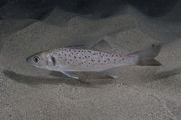 | **Robalo**<br><span style="opacity:.6;font-size:.85em">*Dicentrarchus labrax*</span> | **36 cm** | 🥇 o principal · corpo prateado, risca lateral escura, boca grande |
| 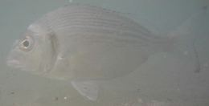 | **Dourada**<br><span style="opacity:.6;font-size:.85em">*Sparus aurata*</span> | **19 cm** | 🥇 o outro principal · **banda dourada entre os olhos**, mancha escura na guelra |
| 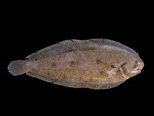 | **Linguado**<br><span style="opacity:.6;font-size:.85em">*Solea solea*</span> | **24 cm** | chato, os dois olhos do lado direito, cor de areia |
| 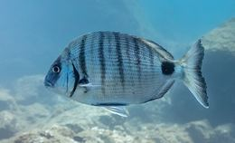 | **Sargo legítimo**<br><span style="opacity:.6;font-size:.85em">*Diplodus sargus*</span> | **17 cm** | **riscas verticais escuras** e mancha preta no pedúnculo da cauda |
| 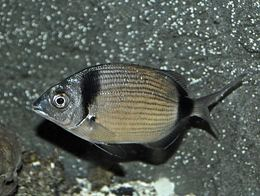 | **Sargo safia**<br><span style="opacity:.6;font-size:.85em">*Diplodus vulgaris*</span> | **17 cm** | duas manchas escuras: uma na nuca, outra na cauda |
| 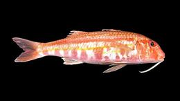 | **Salmonete**<br><span style="opacity:.6;font-size:.85em">*Mullus surmuletus*</span> | **18 cm** | avermelhado, **dois barbilhões** por baixo do queixo |
| 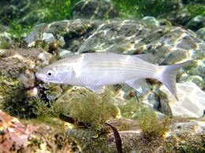 | **Tainha**<br><span style="opacity:.6;font-size:.85em">*Chelon labrosus*</span> | **20 cm** | cinzenta, cabeça achatada, lábio grosso |
| 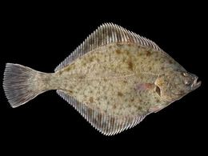 | **Solha-das-pedras**<br><span style="opacity:.6;font-size:.85em">*Platichthys flesus*</span> | **25 cm** | chata, castanha com manchas alaranjadas |
| 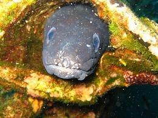 | **Safio / congro**<br><span style="opacity:.6;font-size:.85em">*Conger conger*</span> | **58 cm** | enguia grande e cinzenta · ⚠️ dentes |
| 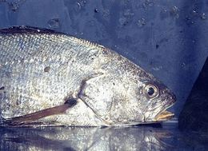 | **Corvina**<br><span style="opacity:.6;font-size:.85em">*Argyrosomus regius*</span> | **42 cm** | prateada, alongada · ⚠️ **interdita de 1 a 30 de junho** |
| 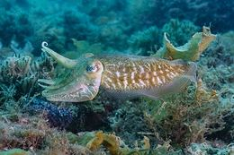 | **Choco**<br><span style="opacity:.6;font-size:.85em">*Sepia officinalis*</span> | **10 cm** | cefalópode · o "osso" branco é dele |
| 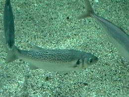 | **Baila**<br><span style="opacity:.6;font-size:.85em">*Dicentrarchus punctatus*</span> | **—** | parece robalo mas **tem pintas pretas nos flancos** · sem mínimo publicado |
| 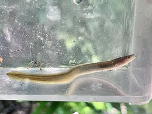 | **Enguia**<br><span style="opacity:.6;font-size:.85em">*Anguilla anguilla*</span> | **⛔** | **não se leva** — retenção proibida a nível nacional |

> ⛔ **A enguia não se leva, ponto.** O Anexo II de 1990 dá-lhe 22 cm, mas **a retenção de enguia está hoje proibida** a nível nacional. Se apanhares uma, devolve.
>
> ℹ️ **Espécie sem mínimo publicado pode ser retida em qualquer tamanho** — mas o peixe miúdo que ali abunda não vale o transporte.
>
> 📏 **Mede da ponta do focinho à ponta da cauda**, com a cauda no natural. Leva uma fita métrica ou marca os centímetros no cabo da cana.

**Quanto podes levar:** **10 kg de peixe ou cefalópodes por dia**, e o **exemplar maior não conta**. Bivalves e outros organismos que não sejam peixe: **2 kg**. Se cavares isco, **0,5 litros de minhoca e afins** — o casulo não entra nessa conta.

<span style="opacity:.6;font-size:.85em">Fotografias do Wikimedia Commons.</span>

### 📢 Editais em vigor da Capitania de Peniche

| Edital | O que diz | Afecta-te? |
|---|---|---|
| **[24/2014](https://www.amn.pt/DGAM/Capitanias/Peniche/Lists/Documentos_AMN/Edital%2024_2014%20PESCA-LUDICA_PROIBICOES.pdf)** | proibido pescar a **menos de 100 m** de rampas, embarcadouros e desembarcadouros | ✅ **sim** — está no mapa |
| **13/2026** | *"Durante a Época Balnear de 2026 (13 de junho a 13 de setembro) está **interdita a navegação a qualquer embarcação**"* a jusante da linha Cais da Foz do Arelho ↔ parque da Aldeia dos Pescadores. Coima 400 a 2500 € | ❌ **não** — é para embarcações. Da margem não te toca |
| **15/2026** | interdição de saltos para a água no antigo Cais da Foz do Arelho | ❌ não |

> 📐 **O 13/2026 dá as posições oficiais em WGS84**, e isso melhorou o mapa: o **Cais da Foz do Arelho** está em **39º 25.69' N, 009º 13.37' W** = [39.42817, -9.22283](https://www.google.com/maps?q=39.42817,-9.22283). É a âncora norte da linha que fecha a Zona de Utilização Livre, e agora está desenhada com a coordenada oficial em vez de estimada.

**Avisos à navegação activos para 12-13 de setembro: nenhum na zona.** Os que estão em vigor são no Algarve (Alcoutim e Monte Gordo). Verificado nos [Avisos Locais do Instituto Hidrográfico](https://geoanavnet.hidrografico.pt/local-warnings).

### 🚫 As rampas: 100 m, o ano todo, em toda a lagoa

O **[Edital n.º 24/2014 da Capitania de Peniche](https://www.amn.pt/DGAM/Capitanias/Peniche/Lists/Documentos_AMN/Edital%2024_2014%20PESCA-LUDICA_PROIBICOES.pdf)** é curto e não tem excepções:

> *"É proibido o exercício da pesca lúdica a menos de **100 metros das rampas de acesso de embarcações, de embarcadouros e desembarcadouros** existentes na área de jurisdição da Capitania do Porto de Peniche."*

O Anexo I do Regulamento das Lagoas lista **9 oficiais** na lagoa: *Cais da Lota · Penedo Furado · Parque de Caravanas* (Caldas da Rainha) e *Casalito 1 · Casalito 2 · Casal da Lapinha · Cais do Bom Sucesso · Braço da Barrosa* (Óbidos), mais dois centros náuticos. Estão desenhadas no mapa as **10 que o OpenStreetMap tem** — ⚠️ **o OSM pode não ter todas**, portanto olha à volta antes de lançar.

### 📍 Onde pescar — a margem toda varrida

Em vez de me fiar nos nomes do OpenStreetMap, varri **a margem inteira de 40 em 40 metros** — 1101 pontos — e fiquei só com os que passam em tudo: **água em frente classificada como Zona de Utilização Livre**, **mais de 100 m de qualquer rampa**, e **água que não seca ao alcance de lançamento**. Sobraram **702**. Destes, os 12 melhores, separados uns dos outros por pelo menos 500 m:

| # | Onde | Água aberta<br>*(raio 150 m)* | Lançamento | Estrada | Rampa | |
|---|---|---|---|---|---|---|
| **1** | **⭐ Ponta do Espichel — a ponta da língua de areia**<br>[39.40372, -9.21098](https://www.google.com/maps?q=39.40372,-9.21098) | **92%** | 11 m | 315 m | 1132 m | **o melhor** |
| **2** | **⭐ Braço sudoeste — canal estreito**<br>[39.39529, -9.21906](https://www.google.com/maps?q=39.39529,-9.21906) | **65%** | 11 m | 52 m | 1005 m | carro à beira de água |
| **3** | **Ponta da Ardonia**<br>[39.40364, -9.20088](https://www.google.com/maps?q=39.40364,-9.20088) | **48%** | 11 m | 28 m | 1845 m | o mais perto da Mariya |
| **4** | **Clube de Vela**<br>[39.40895, -9.20208](https://www.google.com/maps?q=39.40895,-9.20208) | **44%** | 11 m | 53 m | 1562 m | merendas a 176 m |
| **5** | **Extremo sul da lagoa**<br>[39.39052, -9.22436](https://www.google.com/maps?q=39.39052,-9.22436) | **48%** | 11 m | 27 m | 316 m |  |
| **6** | **Margem sul, 400 m a poente do teu spot**<br>[39.4031, -9.21693](https://www.google.com/maps?q=39.4031,-9.21693) | **48%** | 11 m | 43 m | 931 m |  |
| **7** | **Margem sul, 400 m a nascente do teu spot**<br>[39.40771, -9.21475](https://www.google.com/maps?q=39.40771,-9.21475) | **43%** | 11 m | 38 m | 591 m |  |
| **8** | **Margem nascente, junto às merendas do sul**<br>[39.39949, -9.19839](https://www.google.com/maps?q=39.39949,-9.19839) | **29%** | 11 m | 58 m | 2267 m |  |
| **9** | **Braço sudoeste, margem norte**<br>[39.3957, -9.21128](https://www.google.com/maps?q=39.3957,-9.21128) | **45%** | 11 m | 330 m | 1519 m | 330 m a pé |
| **10** | **Musaranhos — extremo sudoeste**<br>[39.38599, -9.22563](https://www.google.com/maps?q=39.38599,-9.22563) | **34%** | 11 m | 60 m | 213 m |  |
| **11** | **Junto ao Cais da Foz do Arelho**<br>[39.42769, -9.22051](https://www.google.com/maps?q=39.42769,-9.22051) | **39%** | 11 m | 64 m | 202 m | ⚠️ fecha na época balnear |
| **12** | **Ponta do Carro**<br>[39.42274, -9.20823](https://www.google.com/maps?q=39.42274,-9.20823) | **27%** | 11 m | 15 m | 260 m | ⚠️ 20% de banco · fecha na época |

> ⭐ **Se levas um só na cabeça, leva o #1.** É onde tens **92% de água que não seca à volta** — o valor mais alto de toda a lagoa. E é a **ponta da língua de areia que sai do teu spot**: deixas o carro na Ecopista, andas **177 m pela areia para fora** e ficas com água funda dos dois lados. Não precisas de lançar longe.
>
> 🚗 **Se preferes chegar de carro à água, é o #2** — canal estreito no braço sudoeste, com um caminho de terra que desce até à margem. Água escura encostada aos dois lados: é onde a corrente de maré fica apertada.
>
> 🏖️ **Se forem os dois, é o #4** — Clube de Vela, com parque de merendas a 176 m e margem limpa.

> 🧭 **Os rumos de lançamento só estão calculados a sério para o #1 e o #2** — nesses dois desci a imagem aérea a 0,92 m/pixel e varri os 360°. Para os outros dez, a coluna dá só a distância; o rumo lê-lo no local, ou no mapa com a camada de satélite ligada.

> 📐 **Como isto foi feito, e o que não prova.** *"Água aberta"* é a percentagem de superfície, num raio de 150 m, que **não fica a seco na baixa-mar** — medido numa imagem aérea apanhada em maré baixa. *"Lançamento"* é a distância da margem a essa água; **11 m é o mínimo da grelha**, quer dizer *"a água começa logo aos teus pés"*. Estrada e rampa são distâncias calculadas sobre dados do OpenStreetMap.
> **Isto diz-te onde há água que não seca — não diz a profundidade.** Não existe batimetria pública desta lagoa. Um sítio com 92% de água aberta pode ainda assim ter meio metro de fundo. Serve para escolher a margem antes de sair de casa; a profundidade descobres no local.

### 🎯 #1 ou #2? — e para onde lançar em cada um

Medi o perfil da água a partir de cada um: de quanto em quanto metros de lançamento, **a que distância ficas da margem mais próxima**. É geometria da água que não seca, medida em imagem aérea a **0,92 m/pixel**.

| Lançamento | **#1** *(Ponta do Espichel)* rumo O | **#2** *(braço sudoeste)* rumo ENE |
|---|---|---|
| 25 m | 20 m da margem | 12 m |
| 40 m | 35 m | 27 m |
| 60 m | **54 m** | **37 m** |
| 80 m | **73 m** | **45 m** |
| 100 m | 87 m | 28 m *(já a subir para a outra margem)* |

Os dois perfis descrevem sítios diferentes:

- No **#1** o número **sobe sempre** — é uma **ponta a entrar numa bacia larga**, com água funda de três lados e nada a atravessar.
- No **#2** o número **sobe até aos 80 m e depois desce** — é a assinatura de um **canal**. A 80 m estás no meio dele, com margem dos dois lados a ~45 m.

> 🥇 **O #1 é o melhor dos dois**, por três razões:
>
> 1. **Está no eixo principal da maré.** A água que entra e sai da lagoa passa pelo corpo central, e a ponta fica em cima dele. O **#2 é um braço lateral** — tem corrente mais concentrada, mas passa lá menos peixe.
> 2. **É uma ponta.** O peixe que anda ao longo da margem com a maré é obrigado a contorná-la, e tu tens água boa dos dois lados dela.
> 3. **Não há nada a atravessar.** Água que não seca a **11 m** dos teus pés e **92% de água aberta** num raio de 150 m — o valor mais alto da lagoa. Aos 60 m já estás a 54 m de qualquer margem.
>
> 🚗 **O #2 continua a valer a pena, e por motivos práticos fortes:** o carro chega à água (**estrada a 52 m** contra 315 m no #1), fica a **15 min da casa**, e num canal apertado a corrente da enchente é mais forte. É o teu sítio para a tarde de sábado, quando a corrente está no máximo.
>
> ⚠️ **Estado disto:** os perfis de água são **medidos**. Qual deles pesca melhor é **raciocínio** a partir da geometria e de como funciona a pesca em maré — **não tenho relatos de capturas em nenhum dos dois**.

#### 🎯 Onde pôr as duas canas no #1 — [39.40372, -9.21098](https://www.google.com/maps?q=39.40372,-9.21098)

Varri os **360° a partir da ponta**, de 15 em 15 graus. O resultado responde à pergunta de pôr uma para cada lado:

| Sector | O que lá está |
|---|---|
| **SO → NO (225°-315°)** | ✅ **o lado bom** — 90° de água aberta, e é o único que abre para lá dos 60 m |
| **S → SSO (180°-210°)** | 🟡 há água, mas **rasa e curta** — 24-29 m de afastamento aos 40 m, e fecha aos 80 |
| **N → SE (0°-165°)** | ❌ é a língua de areia e o raso atrás dela. Aos 60 m já é terra |

> 🎯 **Portanto: não é esquerda e direita da ponta — a água boa está toda de um lado.** Mas dentro desses 90° dá para abrir bem as duas canas, e vale a pena porque cobrem fundos diferentes:

| Cana | Rumo | Distância | A que ficas da margem |
|---|---|---|---|
| 🥇 **Cana do avô** *(100 g)* | **OSO 255°** | **60-80 m** | 54 → 74 m — **o perfil mais fundo da ponta** |
| 🥈 **Resifight** *(60 g)* | **SO 225°** | **40-60 m** | 31 → 40 m — o flanco sul, mais raso |

São **30° de separação**: não se enrolam, e apanhas duas profundidades diferentes em vez de duas linhas lado a lado no mesmo sítio. Se ao fim de uma hora só uma delas produzir, passas as duas para esse rumo.

**Se quiseres o máximo de água aberta**, o rumo mais aberto de todos é **O 270°** — aos 100 m tens **88 m** de água à volta, o valor mais alto da lagoa. Mas aos 60 m o OSO é melhor (54 contra 50), e 60-80 m é onde vais pescar.

⚠️ **Não lances entre N e SE.** Aos 60 m já estás em cima da língua de areia.

#### 🔬 Como é que eu decido isto — e porque é que o lado nascente engana

Vale a pena perceberes, porque a olho o lado de nascente parece bom: **é água escura**. Não é fundo, **é erva marinha**.

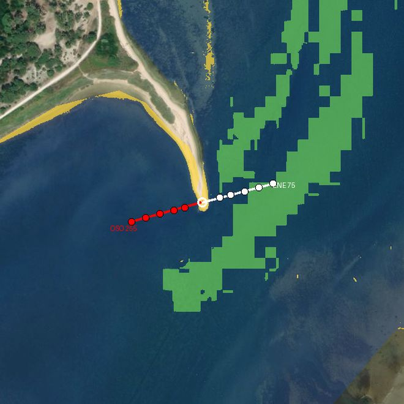

**O que estás a ver:** 🟡 amarelo = areia · 🟢 verde = raso com ervas · 🔵 azul = água aberta. A linha **vermelha é o OSO 255°** que te recomendei; a **branca é o ENE 75°**, o oposto.

**Como o classifico**, numa imagem aérea a 0,92 m por pixel, dentro do contorno da lagoa:

| Se o pixel tem… | É | Porquê |
|---|---|---|
| **muito vermelho** *(R > 95)* | **areia** | a água absorve o vermelho depressa. O que reflecte vermelho está seco ou quase |
| **verde muito acima do vermelho** *(G − R > 38)* | **erva** | as plantas reflectem verde. É o que dá aquele escuro esverdeado |
| o resto | **água aberta** | fica azulada |

Depois, para cada pixel de água, calculo **a que distância está da coisa mais próxima que não é água**. É esse o número que aparece nos perfis.

**E é isto que os dois lados dão:**

| Rumo | 25 m | 40 m | 60 m | 80 m | 100 m |
|---|:--:|:--:|:--:|:--:|:--:|
| 🔴 **OSO 255°** | 19 m | 34 m | **54 m** | **74 m** | **78 m** |
| ⚪ **ENE 75°** | 6 m | 12 m | 5 m | **erva** | **erva** |
| E 90° | 12 m | 3 m | 2 m | **erva** | **erva** |
| ESE 105° | 15 m | 3 m | **erva** | **erva** | **erva** |

> 📊 **A conta dos dois lados**, varrendo tudo até aos 100 m:
> **poente (SO→NO): 100% de água aberta.** **Nascente (NE→SE): 56%** — o resto é erva.

> 🌿 **E bate certo com o aviso do local:** *"há alturas da maré em que saem **saladas de 2 kg agarradas à chumbada**"*. Lançar para nascente é lançar para dentro do prado de ervas. É de lá que vem a salada.

⚠️ **O que isto não te diz:** continua a não dizer **profundidade**. Diz que a poente tens água aberta e limpa até 100 m, e que a nascente tens erva a partir dos 40-60 m. Se no local a água estiver diferente do que a imagem mostra — a lagoa muda —, acredita nos teus olhos.

#### 🎯 E no #2, o braço sudoeste — [39.39529, -9.21906](https://www.google.com/maps?q=39.39529,-9.21906)

Aqui é o contrário: por seres um canal, tens água dos dois lados **mas com formatos diferentes**.

| Cana | Rumo | Distância | A que ficas da margem |
|---|---|---|---|
| 🥇 **Cana do avô** *(100 g)* | **ENE 60°** | **60-80 m** | 32 → 39 m · perfil limpo, sobe direito |
| 🥈 **Resifight** *(60 g)* | **SE 135°** | **80-100 m** | 39 → 58 m · **é o que mais abre**, mas tens de passar dos 60 m |

**70° de separação** — cobres o canal em duas direcções.

⚠️ **A SE há um alto aos 40 m** (o afastamento cai para 0-4 m). Ou lanças curto, aos 25 m, ou passas dos 60 m. **Não deixes a montagem aos 40 m nesse rumo.**
⚠️ **Entre OSO e NNO (240°-345°) é terra.** Esse é o lado onde tu estás.

**As linhas de lançamento estão desenhadas no mapa** — camada *"para onde lançar"*, a vermelho o rumo principal e a laranja tracejado os alternativos. Cada ponto branco é uma distância de lançamento.

### 📲 Levar isto para o OsmAnd — funciona offline

Gerei um **ficheiro GPX** com tudo o que está no mapa: os **15 spots**, os **alvos de lançamento**, as **10 rampas** com o aviso dos 100 m, as **zonas legais** e os **bancos de areia**.

<div style="display:flex;flex-wrap:wrap;gap:.5em;margin:.6em 0">
  <a href="obidos.gpx" download style="display:inline-flex;align-items:center;gap:.45em;text-decoration:none;background:#0a7d5a;color:#fff;padding:.5em .9em;border-radius:8px;font-weight:600;font-size:.92em">📲 obidos.gpx</a>
  <a href="estuario.gpx" download style="display:inline-flex;align-items:center;gap:.45em;text-decoration:none;background:#2c6b8f;color:#fff;padding:.5em .9em;border-radius:8px;font-weight:600;font-size:.92em">📲 estuario.gpx</a>
</div>

Há dois: **`obidos.gpx`** (52 KB) com o detalhe todo da lagoa, e **`estuario.gpx`** (218 KB) com os spots de Lisboa, as **589 zonas proibidas** e as praias balneares.

**Como pôr no telemóvel:**

1. Abre o link acima no telemóvel — o ficheiro fica nas transferências
2. Toca nele e escolhe **abrir com OsmAnd** *(ou, dentro do OsmAnd: **Menu → Os meus lugares → Trilhos → Importar**)*
3. Liga-o em **Menu → Configurar mapa → Trilhos**

Depois disso **funciona sem rede** — é o que interessa, porque na margem sul da lagoa o sinal é fraco.

| No GPX vais ver | |
|---|---|
| 🟢 **Pontos verdes** | spots onde podes pescar, numerados por ordem |
| 🟡 **Pontos amarelos** | spots com ressalva — lê a descrição |
| 🔴 **Pontos vermelhos** | onde **não** pescar, e as 10 rampas com os 100 m |
| 🎣 **Quadrados vermelhos** | alvos de lançamento a 40, 60 e 80 m |
| **Linhas verdes** | Zona de Utilização Livre |
| **Linhas roxas / bordô** | Braço da Barrosa e Poça das Ferrarias — proibido |
| **Linhas laranja** | fecham só na época balnear (13 jun – 13 set) |
| **Linhas amarelas** | bancos de areia que ficam a seco na baixa-mar |

Cada ponto traz a descrição completa: distância de lançamento, rumo, se há banco pelo meio, distâncias à rampa e à estrada, e a base legal.

> 💡 **No OsmAnd também podes descarregar o mapa offline da região de Leiria/Lisboa** antes de ires — Menu → Transferências. Assim tens o mapa base e o GPX, ambos sem rede.

> 🔄 **Sempre que mudarmos alguma coisa aqui, descarrega outra vez.** Os botões estão também **[ao lado do mapa](#-mapa--onde-podes-e-onde-não)** e no cabeçalho do mapa em ecrã inteiro. A data de actualização aparece ao lado deles. No OsmAnd, importar por cima substitui a versão antiga.
> Os ficheiros são gerados a partir dos mesmos dados que alimentam o mapa (`python3 tools/gpx.py`), por isso **nunca ficam dessincronizados** do que está no site.

### 📌 Os teus dois pontos

| | Veredicto |
|---|---|
| **[39.40528, -9.21136](https://www.google.com/maps?q=39.40528,-9.21136)** · margem sul na Ecopista | ✅ **Bom, e é onde estacionas.** Água a 18 m para N sem banco, rampa a 988 m, ETAR a 407 m. **Anda mais 177 m pela areia e ficas no #1.** |
| **[39.41486, -9.22050](https://www.google.com/maps?q=39.41486,-9.22050)** · margem norte | ⚠️ **Há melhores.** Zona Livre, mas a rampa está a **165 m** (limite 100 m) e a água que não seca a **118 m para NE com banco pelo meio** — na baixa-mar lanças para areia. |

### 🐦 Os dois pontos das aves — e onde pescas em cada um

| | Onde ela fica | Podes pescar aí? | Spot legal mais próximo |
|---|---|---|---|
| **1** | [39.39813, -9.20018](https://www.google.com/maps?q=39.39813,-9.20018) | ⚠️ está **em terra**, a 193 m da água da Zona Livre | ✅ **#8 a apenas 216 m** — [39.39949, -9.19839](https://www.google.com/maps?q=39.39949,-9.19839) |
| **2** | [39.39983, -9.18685](https://www.google.com/maps?q=39.39983,-9.18685) | ⛔ **não** — a 14 m da bacia da Barrosa | #8, a 992 m |

**No ponto 1 ficam praticamente juntos.** O **#8** é Zona de Utilização Livre, tem a rampa mais próxima a **2234 m** (o limite são 100), e há um **parque de merendas a 185 m** do sítio dela. É o melhor arranjo dos dois: ela senta-se, tu andas 216 m e pescas.

**No ponto 2 não.** Fica encostado à bacia que o OpenStreetMap chama **"Barrosa"** — a **665 m** do **Braço da Barrosa**, que está **fechado à pesca todo o ano** (art. 12.º n.º 2 + art. 13.º n.º 1 a). A lei diz *"confinada ao Braço da Barrosa"* e remete para o Modelo Territorial do POC-ACE, que **não está publicado** — [na APA só estão](https://apambiente.pt/agua/programa-da-orla-costeira-alcobaca-cabo-espichel) as Diretivas, o Relatório e o Programa de Execução. É perfeitamente plausível que "Braço da Barrosa" na lei signifique o braço todo, incluindo esta bacia.

Somando: há um **pontão/embarcadouro oficial no Braço da Barrosa** com os seus 100 m, é a zona **mais assoreada** da lagoa, e é a de pior renovação de água — 2 dias junto à barra contra 3 semanas no interior.

> ✅ **Se ela for aos dois, pesca no ponto 1.** Ver aves não tem restrição em lado nenhum; a limitação é só para ti. *(As distâncias são medidas; a leitura do "Braço da Barrosa" é cautela minha — a geometria oficial não existe publicada.)*

### ⚠️ Os nomes dos pesqueiros não são de fiar — as coordenadas são

**48 dos 58 pesqueiros** que estão no mapa vêm de **um só contribuidor do OpenStreetMap**, entre 2018 e 2021. E há conflito com o Google: o nome **"Bico dos Corvos"** aparece no OSM em [39.39790, -9.21603](https://www.google.com/maps?q=39.39790,-9.21603) (extremo sul) e no Google em [39.42463, -9.22733](https://www.google.com/maps?q=39.42463,-9.22733) (noroeste, junto ao Bom Sucesso) — **3,2 km de distância**.

Verifiquei os dois: **ambos caem em Zona de Utilização Livre**, portanto nenhum te mete em sarilhos. Mas a lição fica:

> 🎯 **Navega pelas coordenadas e pelas zonas coloridas, não pelos nomes.** Os nomes servem para conversar com quem lá está; as coordenadas e a cor da zona é que estão verificadas.

### 🏖️ Os bancos de areia — a camada mais útil do mapa

A lagoa está assoreada e a maior parte dela é raso. Extraí os bancos de uma **imagem aérea apanhada em maré baixa**: **1,64 km², 29% da área da lagoa**, fica a seco ou quase.

Estão a **amarelo** no mapa. A regra é simples: **não lances para o amarelo, lança para lá dele.** É isso que quer dizer "lançar para os canais".

> ⚠️ **O que isto é e não é.** É a classificação de uma imagem aérea, não batimetria oficial — **não existe batimetria pública desta lagoa**. A barra migra, a lagoa assoreia e a imagem tem a data que tem. Serve para escolher a margem antes de sair de casa; no local, **olha para a água na baixa-mar** e confirma. Também tentei separar os canais fundos por cor da água e **não é fiável aqui**: o escuro tanto é fundo como são prados de ervas marinhas — a lagoa perdeu ~150 ha para elas e para o assoreamento.

### 🌊 A maré manda — e dentro da lagoa chega **duas horas** mais tarde

**Sim, a maré importa, e não dá para pescar o dia todo com a mesma expectativa.** Mas o mais importante é isto: **a maré que vês na tabela do topo é a do oceano, à barra. Dentro da lagoa acontece muito mais tarde e muito mais fraca.**

O número está publicado. [Delft3D modelling of Óbidos Lagoon, *JMSE* 9(1):91](https://doi.org/10.3390/jmse9010091):

> *"The phase of M2 constituent increases from **70° at the mouth** of both systems to (…) **150° at Óbidos upstream regions**."*
> *"The amplitude of M2 (…) reach**ing 1 m at the estuaries inlet while decreasing until (…) 0.25–0.30 m at the (…) Óbidos upstream regions**."*

80° de fase de M2 entre a barra e o fundo da lagoa = **166 minutos**, quase 2h45. E a amplitude cai de 1 m para 0,25-0,30 m — **fica em cerca de um quarto**.

Escalando pela distância ao longo do canal a partir da barra:

| Onde | Distância da barra | Atraso face ao oceano |
|---|---|---|
| Foz do Arelho, à barra | 0 | — |
| #4 Clube de Vela | 3,6 km | **+1h36** |
| #1 e o teu spot A | 3,7-3,9 km | **+1h44** |
| #2 braço sudoeste | 4,3 km | **+1h57** |
| #3 e #8, junto às aves | 4,7-5,0 km | **+2h12** |
| Fundo da Barrosa | 6,1 km | +2h46 |

> ⚠️ **Estado:** os 166 min e a atenuação da amplitude são **medidos e publicados**; a repartição pela distância ao longo do canal é **interpolação minha** e assume que a onda de maré avança a velocidade constante — não é bem assim. **Conta com ±20 min** e confirma na primeira maré a olhar para a água.

**E a enchente é mais curta que a vazante:** dentro da lagoa a maré **enche em ~5 h e vaza em ~7 h**. Passa o mesmo volume em menos tempo, portanto **a corrente de enchente é mais forte** — é por isso que o conselho de quem lá pesca é *"fins da enchente e inícios da vazante"*. Na prática a baixa-mar local atrasa ainda mais que a preia-mar (~36 min de diferença, que é o que produz esta assimetria).

| Momento | Vale a pena? |
|---|---|
| 🟢 **Última hora e meia antes da preia-mar local** | **a melhor janela** — corrente máxima, água nova a entrar |
| 🟢 **Primeira hora de vazante** | **segunda melhor** — o peixe recua pelos mesmos sítios |
| 🟡 Meio da enchente | razoável, já com corrente |
| 🔴 Estofa da preia-mar | água parada, o pior |
| 🔴 Baixa-mar num spot com banco | ficas a lançar para areia seca |

⚠️ **No inverno marítimo** a amplitude dentro da lagoa cai mais 50% e a dominância da enchente aumenta.

**A tabela do topo desta página** dá a maré do oceano. Para Peniche/Foz do Arelho o Open-Meteo adianta **+33 min** — medido em 6 eventos contra a TideTime, desvio 1,2 min. Soma o atraso da tabela acima e tens a hora no teu spot.

### 📅 Sábado 12 no #1 — hora a hora

Marés do oceano calibradas (+33 min) mais o atraso local do #1 (+1h44 médio). **Sol nasce 07:15, põe-se 19:50.**

**Preia-mar 05:17 · baixa-mar 12:29 · preia-mar 17:31.** Altura da maré ali: **~1,7 m** — no oceano são 3,05 m.

| Hora | Maré | Nível | Corrente | |
|---|---|---|---|---|
| 04:30 | enchente | +0,73 m | 48% | ▓▓▓▓▓ |
| **05:17** | **PREIA-MAR** | +0,83 m | ~0% | água parada |
| 06:00 | vazante | +0,79 m | 21% | ▓▓ |
| 06:45 | vazante | +0,66 m | 41% | ▓▓▓▓ |
| **07:15** | vazante | +0,55 m | ~52% | 🌅 **nascer do sol** |
| 07:30 | vazante | +0,47 m | 57% | ▓▓▓▓▓▓ |
| 08:15 | vazante | +0,23 m | 66% | ▓▓▓▓▓▓▓ |
| **09:00** | vazante | −0,04 m | **69%** | ▓▓▓▓▓▓▓ pico da vazante |
| 10:30 | vazante | −0,54 m | 53% | ▓▓▓▓▓ |
| **12:29** | **BAIXA-MAR** | −0,83 m | ~0% | água parada |
| 13:30 | enchente | −0,67 m | 59% | ▓▓▓▓▓▓ |
| 14:15 | enchente | −0,37 m | 88% | ▓▓▓▓▓▓▓▓▓ |
| **15:00** | enchente | 0,00 m | **99%** | ▓▓▓▓▓▓▓▓▓▓ **corrente máxima do dia** |
| 15:45 | enchente | +0,37 m | 88% | ▓▓▓▓▓▓▓▓▓ |
| 16:30 | enchente | +0,67 m | 59% | ▓▓▓▓▓▓ |
| **17:31** | **PREIA-MAR** | +0,83 m | ~0% | água parada |
| 18:45 | vazante | +0,72 m | 34% | ▓▓▓ |

**Duas leituras diferentes, e não concordam — vale a pena saber isso:**

| | Diz o quê | Aponta para |
|---|---|---|
| 💨 **A física** | a corrente é máxima **a meio da maré** — 15:00 na enchente, 09:00 na vazante | **14:30 – 17:00** |
| 🐟 **O local das Caldas** | *"fins da enchente e inícios da vazante"* — na lagoa 29% fica a seco, e o peixe só sobe às margens com água | **16:30 – 18:30** |

As duas fazem sentido e medem coisas diferentes: uma mede **água a mexer**, a outra mede **peixe ao teu alcance**. Estão desencontradas cerca de duas horas, e **não tenho como decidir entre elas** — o meu modelo é um modelo, ele pesca lá.

> ✅ **A resposta que não te obriga a escolher: fica das 14:30 às 18:30.** Quatro horas que cobrem as duas leituras. Começas com a corrente no máximo e acabas na preia-mar com o peixe em cima das margens. **Não arrumes às 17:00**, que é onde as duas leituras se separam.
>
> 🌅 **E de manhã, 06:30 – 09:30** — aí não há conflito. Chegas logo a seguir à preia-mar das 05:17 (o *"início da vazante"* do local), a corrente sobe de 21% para 69% às 09:00, e o nascer do sol às 07:15 cai a meio. As duas leituras apontam para o mesmo sítio.
>
> 📊 **Onde é que a manhã fica no dia:** pontuei as 24 horas. **14:30-17:00 dá 0,74** (o topo), a enchente da madrugada 0,69, **a tua manhã 06:45-09:15 dá 0,61**, o anoitecer 0,60. A manhã vale **83% do melhor momento** — vale bem a pena.
>
> 😴 **O que podes saltar:** 10:00 às 13:30 — maré a esvaziar e depois parada, com o nível no fundo. É quando os bancos de areia ficam à mostra.

⚠️ **Precisão disto:** as horas das marés do oceano estão verificadas contra **duas fontes independentes** — a TideTime (calibração, desvio 1,2 min) e a tabuademares para este fim de semana, que dá **PM 04:05 e 16:20** no sábado contra os meus 04:09 e 16:23: **erro de 3 a 6 min**. O atraso de +1h44 vem da fase de M2 publicada, repartida por mim ao longo do canal — **conta ±20 min**. A curva de corrente é um modelo sinusoidal entre os extremos: serve para comparar horas entre si, **não é uma velocidade real em nós**.

> 🔒 **Estas horas estão fechadas.** As marés do oceano batem certo com duas fontes independentes (3 a 6 min de erro) e o atraso da lagoa vem de fase de M2 publicada. O que pode ainda mexer é o **vento**, e isso não muda a maré — muda só qual dos dois spots te dá o vento nas costas.

**Domingo vemos na sexta**, mais perto, para apanhar a previsão de vento certa.

### 🎣 As canas e as linhas

A [**Resifight 500 3,00 m X-Heavy**](https://www.decathlon.pt/p/cana-de-pesca-ao-fundo-resifight-500-3-00-p-x-heavy/350489/m8843322) é a cana certa para a lagoa. Ficha do produto: **3 m · potência 40-100 g · acção semi-parabólica · 3 elementos**.

| | Porquê |
|---|---|
| **40-100 g** | a lagoa pede **50-60 g** — o teu chumbo de 60 g cai **a meio da janela dela**, que é onde uma cana lança melhor e mostra melhor as picadas |
| **Semi-parabólica** | dobra ao longo do branco: amortece a ferragem e não arranca o anzol da boca mole da dourada |
| **3 m** | curta para surf, **certa para margem de lagoa** — chegas aos 60-80 m que precisas no #2 e no #1 |

**A telescópica grande fica em casa.** Foi feita para meter 150 g dentro da rebentação; aqui não há ondulação nenhuma e os lançamentos são curtos.

**O FX 4000 chega bem:** travão prático **4 kg** (máximo 8,5) contra peixe de 1-3 kg, **170 m de 0,35 mm**, 5,2:1, 320 g.

#### 🧵 Shock leader: fica numa cana, sai da outra

**A regra que decide, e é só uma:** o shock leader **existe para o lançamento, não para o peixe**. Precisas dele quando a **linha-mãe é mais fraca do que o chumbo exige**. A conta é ~**10 lb de leader por onça de chumbo**:

| Cana | Linha-mãe | Chumbo | Leader que a conta pede | Tens? | Veredicto |
|---|---|---|---|---|---|
| **Cana do avô** | Tournament 0,33 → **~8-9 kg** | 100 g *(3,5 oz)* | **~16 kg** | mãe fica **muito abaixo** | ✅ **shock leader 0,60 FICA** |
| **Resifight 500** | trançada **27 kg** | 60 g *(2,1 oz)* | 9,5 kg | mãe tem **quase 3× a mais** | 🤷 **não precisas — mas podes deixar** |

Na cana do avô isto **não é opcional**: a mãe de 8-9 kg é metade do que 100 g pedem. Sem o 0,60, mais cedo ou mais tarde estalas no lançamento e mandas **100 gramas de chumbo pelo ar**. Foi por isso que to mandei fazer, e continua certo.

Na Resifight a trançada de 27 kg já tem margem de sobra, portanto o 0,60 **não está a proteger nada**. Mas isso não quer dizer que faça mal:

#### 🤔 O 0,60 na Resifight espanta o peixe? **Não.**

O que o peixe inspecciona são os **últimos 30-60 cm, junto ao isco** — e esses são o teu **estralho de fluoro**. O topshot acaba no destorcedor, antes da montagem: fica a meio metro do anzol e deitado no fundo. É por isso que na carpa e no surf se usa há décadas linha grossa na mãe com empates finos — e apanha-se à mesma.

**O que o 0,60 te custa mesmo é distância de lançamento**, não peixe. E aí a pergunta é onde vais estar:

| Onde | Água começa a | Precisas de lançar longe? |
|---|---|---|
| **#1 / spot A** *(a tua manhã)* | **11-18 m** da margem | ❌ **não** — o 0,60 não te tira nada |
| **#2** *(a tarde)* | 11 m, mas o meio do canal está aos 80 m | ⚠️ ajuda, mas aos 60 m já estás bem |

> ✅ **Veredicto: mantém o 0,60 na Resifight este fim de semana.** No #1 a água começa aos 11 m — não há distância nenhuma a ganhar, e às 6h30 da manhã, no escuro, com duas canas para montar, não é altura de andar a refazer nós.
> 🔧 Se um dia quiseres mesmo o máximo de distância no #2, troca por 1,5 m de fluoro.

> 🎯 **O fluoro vai nos estralhos, nas duas canas** — 0,28-0,35. É a única parte que o peixe inspecciona.

> ❌ **Shock leader de fluoro? Não.** O shock leader é **mono**, e por três razões:
> 1. **A função dele é esticar.** É isso que absorve o tranco do lançamento. O fluoro estica muito menos que o mono — faz pior o único trabalho que tem.
> 2. **É mais rígido.** O nó que liga a mãe ao leader tem de passar pelos passadores a cada lançamento; em fluoro fica mais volumoso e sai pior da bobina.
> 3. **Nunca chega ao peixe** — acaba no destorcedor. Gastar fluoro em 10 m que o peixe não vê é deitar dinheiro fora.

#### ⚖️ Os chumbos que tens, e onde cada um vai

| Chumbo | Vai para | Porquê |
|---|---|---|
| **50 g de correr** | 🥇 **Resifight — montagem de corrida** | é literalmente para isto: corre na linha-mãe, o peixe puxa e não sente peso. A melhor arma para dourada desconfiada e para a estofa |
| **60 g** | 🥇 **Resifight — fundo de 2 anzóis** | a meio da janela 40-100 g da cana. **É o teu chumbo por defeito** |
| **100 g** | 🥈 **Cana do avô** | para quando 60 g começar a arrastar — o pico da enchente de sábado (14h-16h) e o canal do #2 |
| **120-150 g** | 🏠 **ficam em casa** | passam da potência da Resifight e a lagoa não pede tanto. Isso é chumbo de rebentação |

> 🎯 **A regra no local:** começas com **60 g na Resifight**. Se o chumbo arrastar e a montagem vier para a margem, **passas para a cana do avô com 100 g** — que é exactamente o trabalho dela. Não andes a lutar com 60 g num sítio onde não segura.

**Resumindo as duas montagens da ponta:**

| | Cana do avô | Resifight 500 |
|---|---|---|
| Mãe | Tournament 0,33 branco | trançada 27 kg |
| A seguir | **10 m de mono 0,60** *(shock leader — obrigatório)* | **o 0,60 que já lá tens** *(opcional)* |
| Depois | destorcedor → montagem | destorcedor → montagem |
| Estralhos | **fluoro 0,28-0,35** | **fluoro 0,28-0,35** |
| Chumbo | **100 g** | **60 g** fixo · **50 g** de correr |
| Dedo | o 0,60 protege | ⚠️ dedeira ou luva se tirares o 0,60 |

✅ **As contas do shock leader com estes chumbos:** 100 g = 3,5 oz → pede ~**16 kg**, e o teu mono 0,60 dá 20-24 kg ✓. Na Resifight, 60 g = 2,1 oz → pede ~9,5 kg, e a trançada tem 27 ✓.

⚠️ **Com trançada e 60 g na Resifight, protege o dedo** — dedeira ou luva. A trançada corta e 27 kg não parte para te avisar. Na cana do avô o 0,60 já te protege o dedo, que é meia razão de ele existir.

#### 🎣 E a cana do avô

Vais levá-la, e é meio caminho andado — é uma cana de **surfcasting**, pesada, e o avô pescava com chumbos de **~100 g**.

**Isso dá-lhe um trabalho próprio na lagoa, e é um bom trabalho:** a enchente de sábado à tarde é a **corrente mais forte do fim de semana** (88-99% entre as 14:00 e as 16:00), e o **#2 é um canal estreito onde a corrente aperta ainda mais**. É aí que um chumbo de 60 g começa a arrastar e um de 100 g segura — e 100 g é onde ela trabalha, não onde a Resifight trabalha.

| Cana | Chumbo | Onde brilha |
|---|---|---|
| **Cana do avô** (surf, ~100 g) | **100 g** | corrente forte — a enchente da tarde, e o canal do #2 |
| **Resifight 500** (40-100 g) | **60 g** · 50 g de correr | corrente fraca, estofa, e a picada fina da dourada |

**São as tuas duas canas, e dá exactamente o limite legal de 2.** Uma segura o fundo na corrente, a outra é a fina.

✅ **Está restaurada** — passadores, porta-carretos e verniz novos. Passadores novos significa que podes lançar sem medo de linha cortada, que era o único risco real que ela tinha.

> ⚠️ **A de spinning fica em casa** se levares estas duas — o limite são **2 canas por pescador**. Se quiseres atirar amostras à boca do canal, trocas, não acrescentas.

### ⚙️ As montagens — com o material que tens

🪜 **[Diagrama à escala das duas montagens](https://claude.ai/code/artifact/e9bf1b62-a95d-4687-bd3a-d0fbed3d29a6)** — abre no telemóvel, tem as medidas todas e o que muda face ao rig do siluro.


Duas canas, o máximo que a lagoa permite. Ambas podem levar corrida, porque tens chumbos de correr para as duas.

> 🪝 **Os anzóis vão em milímetros de abertura, não em números.** Os números mudam de marca para marca e não querem dizer nada em concreto. A abertura — do bico à haste — é o que a **lei** mede (mínimo **8 mm** na lagoa) e o que decide se a boca do peixe leva o anzol. Mede os teus contra o corpo de uma caneta Bic: tem 8 mm.
>
> | Onde | Abertura | Qual dos teus |
> |---|---|---|
> | **Estralho de cima** *(robalo, 2 navalhas)* | **8,3 mm** | os de mar com barbelas |
> | **Estralho de baixo** *(dourada, 1 navalha)* | **8,3 mm** | idem — as barbelas seguram a navalha mole |
> | **Corrida** | **8,3 mm** | idem |
>
> ⚠️ Os teus **octopus de 15 mm ficam em casa** — são para peixe de 10 kg, e o que sai da lagoa anda em 1-3 kg.

**🥇 Fundo de 2 anzóis** — *a montagem base, é a que trabalha sozinha enquanto esperas*

<div style="overflow-x:auto">
<svg viewBox="0 0 460 512" style="display:block;width:100%;max-width:400px;margin:.6em auto;background:#fbfcfc;border:1px solid #e2e6ea;border-radius:10px" role="img" aria-label="Montagem de fundo de dois anzóis para a Lagoa de Óbidos, à escala">
<g fill="none" stroke="#33505a" stroke-linecap="round">
  <path d="M136 4 V18" stroke-width="2.6"/>
  <path d="M136 18 V34" stroke-width="4" opacity=".5"/>
  <path d="M136 62 V142" stroke-width="2.6"/>
  <path d="M136 165 V354" stroke-width="2.6"/>
  <path d="M136 377 V466" stroke-width="2.6"/>
</g>
<g fill="none" stroke="#0e7490" stroke-width="1.5" stroke-linecap="round">
  <path d="M153 152 H252 V300"/><path d="M252 300 V316 a8 8 0 0 0 16 0 V310"/><path d="M268 310 l-3 4"/>
  <path d="M153 364 H228 V440"/><path d="M228 440 V454 a7 7 0 0 0 14 0 V449"/><path d="M242 449 l-3 4"/>
</g>
<g fill="#233034">
  <rect x="132" y="44" width="8" height="9" rx="2"/>
  <rect x="128" y="140" width="16" height="4" rx="1"/><rect x="128" y="161" width="16" height="4" rx="1"/>
  <rect x="128" y="352" width="16" height="4" rx="1"/><rect x="128" y="373" width="16" height="4" rx="1"/>
  <circle cx="136" cy="152" r="5.5"/><circle cx="136" cy="364" r="5.5"/>
  <circle cx="136" cy="480" r="13"/>
</g>
<g fill="#fbfcfc" stroke="#233034" stroke-width="2">
  <circle cx="136" cy="40" r="4.5"/><circle cx="136" cy="58" r="4.5"/>
</g>
<g fill="#fbfcfc" stroke="#233034" stroke-width="1.6">
  <circle cx="149" cy="152" r="4"/><circle cx="149" cy="364" r="4"/>
</g>
<g fill="#c9b79c" stroke="#233034" stroke-width=".9">
  <ellipse cx="248" cy="300" rx="6" ry="13"/><ellipse cx="256" cy="307" rx="6" ry="13"/>
  <ellipse cx="224" cy="440" rx="5" ry="11"/>
</g>
<rect x="231" y="424" width="10" height="13" rx="4" fill="#e0b03a" stroke="#233034" stroke-width="1"/>
<g stroke="#b8471f" stroke-width="1.2" fill="none">
  <path d="M100 62 H112 M100 142 H112 M106 62 V142"/>
  <path d="M100 152 H112 M100 360 H112 M106 152 V360"/>
  <path d="M100 364 H112 M100 472 H112 M106 364 V472"/>
</g>
<g fill="#b8471f" font-family="system-ui,sans-serif" font-weight="700" font-size="15" text-anchor="end">
  <text x="94" y="107">25 cm</text><text x="94" y="252">60 cm</text><text x="94" y="424">40 cm</text>
</g>
<g fill="#b8471f" font-family="system-ui,sans-serif" font-weight="700" font-size="15">
  <text x="262" y="164">50 cm</text><text x="250" y="376">30 cm</text>
</g>
<g fill="#12242b" font-family="system-ui,sans-serif" font-weight="600" font-size="12.5">
  <text x="150" y="14">Tournament 0,33</text>
  <text x="150" y="47">destorcedor · PALOMAR</text>
  <text x="18" y="150">ESTAÇÃO 1</text><text x="18" y="362">ESTAÇÃO 2</text>
  <text x="262" y="150">estralho fluoro 0,30-0,35</text>
  <text x="278" y="296">anzol 8,3 mm · ROBALO</text>
  <text x="250" y="362">estralho fluoro 0,28-0,30</text>
  <text x="250" y="436">anzol 8,3 mm · DOURADA</text>
  <text x="156" y="478">chumbo 100 g</text>
</g>
<g fill="#5c6c70" font-family="system-ui,sans-serif" font-size="11.5">
  <text x="150" y="30">→ shock leader mono 0,60 · 10 m</text>
  <text x="18" y="163">2 nós de stop</text><text x="18" y="175">+ missanga</text><text x="18" y="187">+ destorcedor</text>
  <text x="278" y="309">2 navalhas, elástico</text><text x="278" y="321">rabo curto, 2-3 cm</text>
  <text x="94" y="268" text-anchor="end">estralho &lt; 60</text>
  <text x="250" y="449">1 navalha · milho de esponja</text>
  <text x="156" y="491">com garra se houver corrente</text>
</g>
<g stroke="#b9c4c2" fill="none">
  <path d="M14 500 H446" stroke-width="2"/>
  <path d="M24 500 l-6 8 M64 500 l-6 8 M104 500 l-6 8 M144 500 l-6 8 M184 500 l-6 8 M224 500 l-6 8 M264 500 l-6 8 M304 500 l-6 8 M344 500 l-6 8 M384 500 l-6 8 M424 500 l-6 8" stroke-width="1"/>
</g>
</svg>
</div>


| Peça | Cana do avô | Resifight 500 |
|---|---|---|
| **Madre** | Tournament 0,33 branco | trançada 27 kg |
| **Shock leader** | **10 m de mono 0,60** — obrigatório | o 0,60 que já lá tens *(opcional)* |
| **Chumbo** | **100 g** | **60 g** |
| **Estralho de cima** | fluoro **0,30-0,35** · **50 cm** | idem |
| **Estralho de baixo** | fluoro **0,28-0,30** · **30 cm** | idem |
| **Anzóis** *(abertura)* | **8,3 mm** nos dois — os de mar com barbelas | idem |
| **Nós** | Palomar nas argolas · cirurgião nos estralhos | idem |

> 📏 **Os vãos entre estações, e porque é que a medida do estralho depende deles.**
>
> **O estralho tem de ser sempre mais curto que o vão abaixo dele**, senão o anzol de cima cai em cima da estação de baixo e enrola.
>
> | | Medida |
> |---|---|
> | Destorcedor → Estação 1 | **25 cm** |
> | Estação 1 → Estação 2 | **60 cm** · estralho de cima **50 cm** |
> | Estação 2 → chumbo | **40 cm** · estralho de baixo **30 cm** |
>
> Assim o anzol de cima fica 10 cm acima da estação de baixo, e o de baixo 10 cm acima do chumbo. Nada se cruza.

> 📏 **A que altura do chumbo fica o estralho de baixo? A ~40 cm, não encostado ao clip.**
>
> Há dois desenhos por aí e servem para coisas diferentes:
>
> | | Onde o estralho prende | Para que serve |
> |---|---|---|
> | **Paternoster normal** *(o teu)* | **~40 cm acima do chumbo** | pescar. O isco fica no fundo, a arrastar atrás, mas **acima da erva que se agarra à chumbada** |
> | **Clip-down / impact shield** | **encostado ao clip do chumbo** | **lançar longe.** Prende o isco ao chumbo em voo — menos resistência do ar e protege isco mole. Solta no impacto |
>
> O clip-down é ferramenta de **surfcasting de distância**. Aqui não precisas: lanças 40-80 m e, o que é pior, o local avisa que *"há alturas da maré em que saem **saladas de 2 kg agarradas à chumbada**"* — com o estralho no clip, o isco entra directo nessa erva. **Deixa os 40 cm.**
>
> ⚠️ **A excepção:** se as navalhas te saltarem do anzol no lançamento, o problema é o isco mole, não a altura. A solução é **elástico de isco, 12 voltas** — está no desenho acima. Só se isso não chegar é que vale a pena montar um clip-down.

**🥈 Corrida** — *para dourada desconfiada e para a estofa*

<div style="overflow-x:auto">
<svg viewBox="0 0 460 512" style="display:block;width:100%;max-width:400px;margin:.6em auto;background:#fbfcfc;border:1px solid #e2e6ea;border-radius:10px" role="img" aria-label="Montagem de corrida para a Lagoa de Óbidos, à escala">
<g fill="none" stroke="#33505a" stroke-linecap="round">
  <path d="M136 4 V18" stroke-width="2.6"/>
  <path d="M136 18 V34" stroke-width="4" opacity=".5"/>
  <path d="M136 62 V286" stroke-width="2.6"/>
  <path d="M142 158 L184 196" stroke-width="2.6"/>
</g>
<path d="M136 324 V452" fill="none" stroke="#0e7490" stroke-width="1.5"/>
<g fill="none" stroke="#0e7490" stroke-width="1.5" stroke-linecap="round">
  <path d="M136 452 V468 a8 8 0 0 0 16 0 V462"/><path d="M152 462 l-3 4"/>
</g>
<g fill="#233034">
  <rect x="132" y="44" width="8" height="9" rx="2"/><rect x="132" y="308" width="8" height="8" rx="2"/>
  <circle cx="136" cy="290" r="5.5"/><circle cx="194" cy="206" r="12"/>
</g>
<g fill="#fbfcfc" stroke="#233034" stroke-width="2">
  <circle cx="136" cy="40" r="4.5"/><circle cx="136" cy="58" r="4.5"/>
  <circle cx="136" cy="140" r="8"/><circle cx="136" cy="155" r="4"/>
  <circle cx="136" cy="304" r="4.5"/><circle cx="136" cy="320" r="4.5"/>
</g>
<g fill="#c9b79c" stroke="#233034" stroke-width=".9">
  <ellipse cx="132" cy="452" rx="6" ry="13"/><rect x="140" y="446" width="9" height="20" rx="2"/>
</g>
<g stroke="#b8471f" stroke-width="1.2" fill="none">
  <path d="M100 62 H112 M100 286 H112 M106 62 V286"/>
  <path d="M100 324 H112 M100 460 H112 M106 324 V460"/>
  <path d="M116 120 V172 M112 126 l4 -6 4 6 M112 166 l4 6 4 -6"/>
</g>
<g fill="#b8471f" font-family="system-ui,sans-serif" font-weight="700" font-size="15" text-anchor="end">
  <text x="94" y="178">70 cm</text><text x="94" y="396">70 cm</text>
</g>
<g fill="#12242b" font-family="system-ui,sans-serif" font-weight="600" font-size="12.5">
  <text x="150" y="14">trançada 27 kg</text>
  <text x="150" y="47">destorcedor · PALOMAR</text>
  <text x="18" y="132">desliza livre</text>
  <text x="152" y="150">destorcedor a correr</text>
  <text x="212" y="204">chumbo 50 g de correr</text>
  <text x="150" y="313">destorcedor · PALOMAR</text>
  <text x="150" y="392">estralho fluoro 0,30</text>
  <text x="166" y="452">anzol 8,3 mm</text>
</g>
<g fill="#5c6c70" font-family="system-ui,sans-serif" font-size="11.5">
  <text x="150" y="30">→ o topshot 0,60 que já lá tens</text>
  <text x="18" y="145">o peixe leva</text><text x="18" y="157">70 cm sem</text><text x="18" y="169">sentir peso</text>
  <text x="94" y="194" text-anchor="end">curso do chumbo</text>
  <text x="212" y="217">sem fusível — o fundo é areia</text>
  <text x="150" y="293">missanga (batente)</text>
  <text x="150" y="405">sem flutuação</text>
  <text x="166" y="465">navalha ou tira de choco</text>
</g>
<g stroke="#b9c4c2" fill="none">
  <path d="M14 488 H446" stroke-width="2"/>
  <path d="M24 488 l-6 8 M64 488 l-6 8 M104 488 l-6 8 M144 488 l-6 8 M184 488 l-6 8 M224 488 l-6 8 M264 488 l-6 8 M304 488 l-6 8 M344 488 l-6 8 M384 488 l-6 8 M424 488 l-6 8" stroke-width="1"/>
</g>
<g stroke="#6f8f5e" stroke-width="1.6" fill="none" stroke-linecap="round">
  <path d="M300 486 c6 -10 10 4 16 -8 M330 486 c5 -12 9 2 14 -10 M360 486 c6 -9 11 5 16 -7"/>
</g>
</svg>
</div>


Chumbo de correr na madre → conta amortecedora → destorcedor → **70 cm de fluoro 0,30** → anzol de **8,3 mm**.
Na Resifight usas o **50 g**; na cana do avô podes juntar dois para chegares ao peso que a corrente pedir.

> ⚠️ **Na corrida, não deixes o freio apertado.** O chumbo corre na linha, mas se a linha não puder sair o peixe sente na mesma. Freio lavado ou bail aberto com indicador — senão a montagem não faz o que veio fazer.

> ⚖️ **Corrida ou high/low? Uma de cada.**
>
> | Cana | Montagem | Porquê |
> |---|---|---|
> | **Cana do avô** *(100 g)* | **high/low, 2 anzóis** | 100 g de correr em corrente forte rola e enrola-se. Quer chumbo fixo |
> | **Resifight** *(50 g de correr)* | **corrida** | é a cana fina — para a dourada que larga ao sentir peso |
>
> Não conheces a água, e os dois problemas que te podem estragar a manhã são opostos: **peixe desconfiado que larga ao sentir o chumbo** (a corrida resolve) ou **peixe miúdo a roubar isco** (o high/low com 2 anzóis mostra-te mais depressa). Com uma de cada, ao fim de duas horas sabes qual tens. **A primeira que der peixe, passa a outra para a mesma montagem.**
>
> ⚠️ **Se a erva entupir o chumbo de correr** e ele deixar de correr na linha, a corrida perde a razão de existir — passa essa cana também a high/low.

**🥉 Spinning leve** — vinil de 7-12 cm ou spinner #2-3, leader fluoro 0,30, 7-20 g. À boca dos canais, na enchente, ao robalo.
⚠️ **É troca, não acréscimo** — o limite são 2 canas por pescador.

⚖️ **Regra da lagoa: máx. 2 canas, máx. 3 anzóis por cana.** Duas de fundo com 2 anzóis cada = 4 anzóis na água, dentro da lei.

**Na caixa:** chumbos de 50 (correr), 60 e 100 g · fluoro 0,28 e 0,35 · anzóis de **8,3 mm** · destorcedores · contas · **ancinho e balde** *(ver o isco)* · **dedeira ou luva** se pescares com a trançada à vista · e o camaroeiro, que a margem é baixa e lamacenta.

### ⏱️ De quanto em quanto tempo verificar o isco

Depois do diagnóstico do primeiro lançamento, o ritmo é este:

| Isco | Verifica a cada | Porquê |
|---|:--:|---|
| **Navalha** | **20-30 min** | é mole, e ali há muito peixe pequeno. Passado isso ou já foi, ou já não cheira |
| **Tira de choco salgada** | **45-60 min** | aguenta — é para isso que a levas |
| **Bomboca** | **45-60 min** | isco duro, mesma lógica |

**Três excepções que mandam recolher já:**

1. **Sentiste picadas e não ferrou** — o isco foi-se, ou está esfarrapado. Não vale a pena esperar.
2. **A cana deu um toque seco e ficou frouxa** — pode ser peixe que levou tudo, pode ser erva a bater na linha. Vê.
3. **A montagem começou a vir para a margem** — arrastou, e a essa altura já trouxe erva.

> ⏳ **O truque de aproveitar a maré:** re-isca **na estofa**, que é quando a água está parada e a pescaria é fraca de qualquer maneira. Assim não gastas os minutos de corrente forte a mexer no anzol. No sábado isso é por volta das **12:30** (baixa-mar) e das **17:30** (preia-mar).

⚠️ **Não caias no vício de recolher de 10 em 10 minutos.** Cada recolha tira-te a montagem da água e mexe o fundo. Se o isco está a durar, deixa-o trabalhar.

### 🔍 O primeiro lançamento é um diagnóstico

Lança, deixa assentar, **estica a linha** e dá-lhe **10-15 minutos**. Depois recolhe e olha para o chumbo e para os dois anzóis antes de voltar a lançar. O que vier diz-te o que mudar:

| O que vês ao recolher | O que se passa | O que fazes |
|---|---|---|
| Chumbo limpo, iscos intactos | está tudo bem | deixa 30-40 min da próxima |
| **Chumbo com erva, isco enterrado** | erva no fundo | **muda de rumo primeiro.** Se persistir, põe flutuação no estralho de baixo |
| **Iscos comidos, anzóis nus** | peixe miúdo | passa para **tira de choco** num dos anzóis |
| **Montagem veio para a margem** | chumbo leve de mais | sobe para **100 g na cana do avô** |
| Só o de baixo suja/some | o fundo ali é mau | sobe o estralho de baixo para 60-80 cm |

> ⚠️ **A erva agarra-se quando a montagem arrasta.** Antes de mexer na montagem, garante que o chumbo está quieto: **chumbo com garra** e linha esticada resolvem metade dos casos. Só depois é que vale a pena levantar o isco.

### 🌽 Os teus milhos impressos — no de baixo, mas só quando for preciso

**Por defeito, não.** A montagem já está desenhada com uma divisão de trabalho:

- **Estação 1 (a de cima)** — o isco já anda **acima do fundo**. É a estação do **robalo**.
- **Estação 2 (a de baixo)** — o isco fica **no fundo**, e é isso que queres: **dourada e linguado revolvem a areia**, é aí que comem. Levantá-lo tira-te o peixe que mais procuras.

**🧽 O milho de esponja não levanta nada — e isso não é problema.** A conta:

| | |
|---|---|
| Água da lagoa | ~1,02 g/cm³ |
| Milho de esponja | ~0,95 g/cm³ |
| Volume de um milho | ~1 cm³ |
| **Impulsão** | **~0,07 g** |

**70 miligramas.** Um anzol de 8,3 mm sozinho pesa 300-500 mg. A esponja não levanta a navalha nem se levanta a si própria.

**O que ela é, então:** um **atractor visual e batente de isco** — dá cor, dá volume, e impede que a navalha escorregue pela curva do anzol abaixo.

> 🎯 **Vai no estralho de baixo.** Contas, pérolas e milhos são doutrina antiga para **dourada, sargo e linguado** — peixe que revolve o fundo e inspecciona de perto. Para robalo em isco natural é discutido. E como não levanta nada, o isco de baixo continua no fundo, que é onde tem de estar.

⚠️ **Para levantar mesmo o isco por causa da erva precisas do PLA oco** (~0,3-0,5 g/cm³) — esse dá 0,5-0,7 g por cm³, **dez vezes** mais que a esponja. Nesse caso, um só, no estralho de baixo, criticamente equilibrado. Nunca nos dois: ficavas sem isco nenhum no fundo.

### 🪱 O isco — e a boa notícia sobre as tuas navalhas

🎯 **A navalha que já tens é o primeiro isco que o local nomeia.** Ele chama-lhe *lingueirão* — é o mesmo bivalve (*Ensis siliqua*). Vais com o isco certo.

| Isco | Onde arranjas | Notas |
|---|---|---|
| 🥇 **Navalha / lingueirão** | ✅ **já tens** · também há nas margens | o primeiro da lista do local |
| 🥇 **Tiras de choco** | supermercado, cêntimos | ⭐ **leva.** Ver abaixo — resolve o peixe miúdo |
| 🥈 **Americana** | **cavando numa coroa**, na baixa-mar | isco de topo p/ robalo e dourada |
| 🥈 **Casulo** | margens na baixa-mar, ou loja | *Diopatra neapolitana*, fosforescente |
| 🥈 **Mexilhão · berbigão** | margens na baixa-mar | moles — bons quando o peixe está fino |
| 🥉 **Camarita · coreana** | loja | da lista do local |
| 🥉 **Caranguejo** | margens na baixa-mar | p/ sargo e robalo |

#### 🔪 Como iscar a navalha

Nem cabeça-com-rabo-solto, nem tudo enrolado — o meio-termo, e a razão é o peixe miúdo.

1. **O anzol entra pela parte rija** — o pé, o músculo. É essa que aguenta o lançamento. Enfia ao longo dela, não de través.
2. **O resto vai amarrado à haste** com elástico, em espiral, 10-12 voltas. Fica um pacote compacto que não se desfaz no ar.
3. **Deixa só 2-3 cm de rabo livre.**
4. **A ponta do anzol fica de fora.** Se estiver enterrada no isco, não ferra — e num anzol de 8,3 mm isso acontece depressa.

> ⚠️ **Porque não deixar o rabo comprido à corrente:** dá movimento e cheiro, mas com *"muito peixe pequeno"* é o que eles atacam primeiro. Levam-te o rabo, tu sentes picadelas, ferras a seco e recolhes com o anzol vazio — **nunca chegaram ao anzol**. Com 2-3 cm continuas a ter cheiro, e quem morde tem de chegar ao anzol para levar alguma coisa.
>
> 🪝 **No anzol de cima, com duas navalhas:** não as ponhas em fila a fazer um chouriço. **Lado a lado ao longo da haste**, amarradas juntas — volume compacto, mais fácil de lançar, sem rabos a mais. **O cheiro é o que traz a dourada, não a silhueta** — isco amarrado liberta cheiro na mesma, só não se desfaz.

**🦑 O problema que vais ter, e a solução.** O local avisa duas vezes: *"muito peixe pequeno como é habitual na lagoa"*. As tuas navalhas são **moles** e vão ser depenadas. A dica veio dos comentários de um vídeo de pesca na Foz do Arelho:

> *"Tinhas levado umas **tiras de choco** — assim levavam mais tempo a ratar."*
> — comentário em [Pesca SurfCasting - Foz do Arelho](https://www.youtube.com/watch?v=9Tq8gwEc8g8), Canal Peixe Português

**Compra um choco, corta em tiras.** Custa pouco, aguenta no anzol, e é isco que robalo e dourada comem. Alterna: navalha num anzol, tira de choco no outro — ao fim de meia hora vês qual sobreviveu.

**🪱 E há americana na lagoa, de graça.** O mesmo local:

> *"Decidi fazer uns buracos numa coroa e para minha surpresa **encontrei lá americanas pequenas**. Ainda consegui tirar uma à mão, **elas enterram-se muito rápido**."*
> — [Pesqueiro, tópico 30405](https://www.pesqueiro.pt/index.php?topic=30405.0)

Corroborado por outro utilizador com 6357 mensagens: *"Um amigo meu vai regularmente para a lagoa e já me tinha falado nisso."* Chega **uma hora antes da baixa-mar** com ancinho e balde.

⚠️ **Para isco, sim; para comer, não** sem verificar. A apanha de bivalves tem zonas fechadas por saúde pública — consulta o [IPMA](https://www.ipma.pt/pt/bivalves/) antes de levares marisco para casa.

### 🗣️ O que dizem quem lá pesca — tudo junto

Todos do **Usersd**, das Caldas da Rainha (276 mensagens), em dois tópicos diferentes do Pesqueiro:

| Sobre | O que diz |
|---|---|
| ⏱️ **Maré** | *"**Fins da enchente e inícios da vazante**, a lançar para os canais."* |
| 🎯 **Onde** | *"Escolher **sítios que permitam chegar aos canais mais fundos no lançamento**."* |
| 🪱 **Isco** | *"Já usei **lingueirão, mexilhão, camarita, casulo, coreano**… Depende dos dias e da fome."* |
| 🐟 **Tamanho** | *"Têm saído alguns peixinhos, **muito peixe pequeno** como se pode imaginar. Com algumas surpresas pelo meio."* · *"Saíram uns sarguitos, alguns já bons."* |
| 🥇 **Dourada** | *"Douradas supostamente já lá andam, **já vi saírem do lado do covão dos musaranhos**."* |
| 🌿 **Aviso** | *"Há **alturas da maré em que saem saladas de 2 kg agarradas à chumbada**."* |

**Três coisas a reter:**

1. 🥇 **O sítio das douradas tem nome: Covão dos Musaranhos** — é o nosso **[#10](https://www.google.com/maps?q=39.38599,-9.22563)**, canto sudoeste. É a tua alternativa se o #1 estiver morto.
2. 🌿 **Conta com ervas na chumbada** nalgumas alturas da maré. É o assoreamento de que fala a [notícia de out-2025](https://jornaldascaldas.pt/2025/10/30/aumento-da-area-de-pesca-na-lagoa-de-obidos-e-criacao-de-infraestruturas-de-apoio-aos-pe) — *"150 hectares perdidos devido às ervas marinhas"*. Se te vier, muda de rumo em vez de insistir.
3. ⛔ **"As Chapas", que ele refere como bom sítio, estão fechadas este fim de semana.** É o [Pesqueiro das Chapas](https://www.google.com/maps?q=39.4288,-9.22799), lá a norte junto ao Cais, e cai na zona que só abre a **14 de setembro**.

### 🐙 Ao choco — a montagem de quem lá pesca

A partir de setembro entra choco na lagoa. Montagem do Rafael Reis: **destorcedor triplo** na madre; da argola de baixo, **um palmo** de nylon até ao chumbo; da que sobra, **dois palmos de fluorocarbono** com um clip para prender a toneira. Chumbo de **20 a 60 g** — *"em 90% das vezes uso chumbadas de 30 g"*.

Duas toneiras de cores diferentes ao mesmo tempo até perceberes qual está a funcionar, e depois iguala as duas.

### 🎣 Como pescar — o resumo

| Chave | O que fazer |
|---|---|
| ⏱️ **Maré** | **fim da enchente, início da vazante.** Não a estofa |
| 🎯 **Onde** | margem de onde o lançamento **passe o amarelo** do mapa |
| 🧭 **Rumo** | no #1, **OSO 255° aos 60-80 m** e **SO 225° aos 40-60 m** |
| 🪱 **Isco** | **grande e resistente.** Navalha num anzol, **tira de choco** no outro |
| 🪝 **Anzóis** | **8,3 mm** nos dois — os de mar, que as barbelas seguram a navalha |
| 🐟 **Espécies** | robalo, dourada, baila, linguado, sargo, salmonete, tainha, enguia, choco, polvo — e já saiu corvina |
| 🚫 **Erro clássico** | lançar 20 m para o raso e esperar. É o que faz branquear ali |

### 🏕️ Dormir lá — o que a lei diz

**Pernoitar no parque de merendas não é permitido.** O [Edital de Praia](https://www.amn.pt/Documents/Editais%20Praia/Edital%20de%20Praia%20-%20Continente%20e%20Madeira%20-%20Lingua%20portuguesa.pdf) proíbe expressamente, nas zonas sob jurisdição marítima, *"A prática de campismo ou **qualquer forma de pernoita**"*, e o [Código da Estrada, art. 50.º-A](https://diariodarepublica.pt/dr/legislacao-consolidada/decreto-lei/1994-34528575) proíbe autocaravanas a pernoitar fora de locais autorizados em áreas protegidas e na orla costeira.

**Pescar de noite é outra coisa e é legal** na Zona Livre — o que não podes é montar acampamento. Se querem dormir lá:

| Opção | Onde | Distância ao spot A |
|---|---|---|
| ⛺ **Orbitur Foz do Arelho** | [39.42967, -9.20235](https://www.google.com/maps?q=39.42967,-9.20235) | 2,8 km |
| ⛺ **Huttopia Óbidos** | [39.41483, -9.22634](https://www.google.com/maps?q=39.41483,-9.22634) | 1,7 km |

**Parques de merendas** (bons para ela ficar instalada, não para dormir): [39.41052, -9.20185](https://www.google.com/maps?q=39.41052,-9.20185) junto ao Clube de Vela — a **50 m de um pesqueiro** e o melhor dos dois mundos; [39.39816, -9.19803](https://www.google.com/maps?q=39.39816,-9.19803) a sul; [39.38879, -9.19159](https://www.google.com/maps?q=39.38879,-9.19159) no extremo sul.

### ⚠️ Antes de ires

- **Trânsito na água.** O Rafael Reis avisa: *"Há muita atividade piscatória embarcada na lagoa, e mariscadores a mergulhar em diversos pontos. Para além disso, há ainda (…) Stand Up Paddle, Windsurf, Kite Surf e aulas de vela, e muitas vezes os praticantes destas modalidades não respeitam regras."* Olha antes de lançar.
- **Confirma o edital do dia.** Mesmo conselho dele: *"Aconselho vivamente a consultar os editais antes de fazer uma jornada na lagoa, isto porque dependendo da época há zonas que estão interditas à navegação ou mesmo à pesca."* — [Capitania de Peniche](https://www.amn.pt/DGAM/Capitanias/Peniche/Paginas/Capitania-do-Porto-de-Peniche.aspx).
- **Marisco não.** Podes pescar, mas **apanhar bivalves tem regras próprias e zonas fechadas** por razões de saúde pública — não apanhes berbigão nem lingueirão para comer sem verificar a zona no IPMA.
- **Placa manda sempre.**

## 🟡 E o ponto de Sesimbra, [38.51992, -9.09618](https://www.google.com/maps?q=38.51992,-9.09618)?

**Não é na Lagoa de Albufeira** — fica a **8 km** dela, no interior, na **EN 378 (Caminho Branco, Castelo, Sesimbra)**. O que ali está é uma **charca sem nome a 4 m** da estrada, num conjunto de charcas entre mato, pedreira (866 m) e floresta.

| Verificação | Resultado |
|---|---|
| Nome, operador ou tag de pesca no OSM | **nenhum** |
| Concessão ou ZPL do ICNF | **não consta** |
| Ligação a linha de água pública | Ribeira da Pateira a 601 m — a charca **não** está ligada |
| Contexto | `access=customers` a 361 m; **Sesimbra Natura Park** (Casa da Mesquita, Soc. Agro-Industrial) a 1301 m |

> ⚠️ **Leitura honesta: é quase de certeza água privada**, charca de propriedade agrícola. Água privada precisa de **autorização do dono** — a licença do ICNF não serve de nada aí. Não tenho prova documental de quem é o terreno, por isso o estado disto é **estimado, não medido**. Se quiseres mesmo, o caminho é bater à porta da Casa da Mesquita, não aparecer com a cana.

## 🎣 Montagens

### 🧭 Porque é que vês medidas tão diferentes

Três montagens diferentes andam com o mesmo nome. **O comprimento do estralho não é preferência — é consequência de qual delas estás a usar:**

| Montagem | Estralho | Porquê |
|---|:--:|---|
| **Flapper / paternoster** — estralhos acima do chumbo, anzóis soltos | **30-45 cm** | têm de ser **mais curtos que o espaço entre estações**, senão os anzóis tocam-se e enrolam |
| **Clipped down** — estralhos presos a clipes no corpo, soltam-se no impacto | **70-150 cm** | vão presos durante o voo, por isso podem ser compridos. É a montagem de **praia, para lançar longe** |
| **Chumbo corrido / linha longa** — **um** anzol, chumbo a correr na madre | **60 cm a 1,8 m** | não há nada por baixo para enrolar. É a **montagem clássica de robalo** — e é o "metro de estralho junto ao peso" que se vê por aí |

**A regra que resolve tudo** ([Sea Angler](https://www.seaangler.co.uk/fishing-tips/rigs/two-hook-flapper-rig-for-beach-and-shore-fishing/)): *"Make the length of line between snoods long enough so that the two hooks do not touch, and therefore do not tangle."*

**Os números de referência** ([Ultima UK, 1-up-1-down](https://www.ultimauk.com/ultima-the-best-sea-line/sea-rigs/the-1-up-1-down-rig-how-to-make-it-work-effectively/) · [Norrik](https://norrik.com/fishing-rigs/flapper-rig/) · [Talk Sea Fishing](https://www.talkseafishing.co.uk/forums/threads/length-of-snood.1770/)):
- corpo **1,8-2,4 m** · estralhos **30-45 cm** · estações **30-60 cm** entre si
- **fundo sujo ou maré a correr → 30-45 cm** · **fundo limpo e água parada → 60-90 cm** (o isco move-se mais natural)
- 🌙 **noite → mais curto; dia → mais comprido** — de noite o peixe está menos desconfiado e não precisa da apresentação solta ([Surfcasting Pura Paixão](https://www.youtube.com/watch?v=a1OxBWKsSCo))
- ⚠️ o mesmo vídeo dá o critério prático: **duas enleadas e encurtas.** Não insistas por teimosia

### 🎣 A montagem da muralha — 2 anzóis, à escala

<div style="overflow-x:auto">
<svg viewBox="0 0 420 470" style="display:block;width:100%;max-width:380px;margin:.6em auto;background:#fbfcfc;border:1px solid #e2e6ea;border-radius:10px" role="img" aria-label="Montagem paternoster de dois anzóis para a muralha">
<g fill="none" stroke="#33505a" stroke-linecap="round">
  <path d="M132 6 V30" stroke-width="2.4"/>
  <path d="M132 52 V128" stroke-width="2.4"/>
  <path d="M132 130 V152" stroke-width="2.4"/>
  <path d="M132 156 V288" stroke-width="2.4"/>
  <path d="M132 292 V376" stroke-width="2.4"/>
  <path d="M148 140 H196 V186" stroke-width="1.5"/>
  <path d="M196 186 V204 a7 7 0 0 0 14 0 V199" stroke-width="1.5"/>
  <path d="M210 199 l-3 4" stroke-width="1.5"/>
  <path d="M148 292 H190 V330" stroke-width="1.5"/>
  <path d="M190 330 V348 a7 7 0 0 0 14 0 V343" stroke-width="1.5"/>
  <path d="M204 343 l-3 4" stroke-width="1.5"/>
</g>
<g fill="#1b2f36">
  <rect x="128" y="34" width="8" height="9" rx="2"/><rect x="124" y="126" width="16" height="4" rx="1"/>
  <rect x="124" y="152" width="16" height="4" rx="1"/><rect x="124" y="288" width="16" height="4" rx="1"/>
  <rect x="124" y="314" width="16" height="4" rx="1"/><rect x="128" y="380" width="8" height="8" rx="2"/>
  <circle cx="132" cy="140" r="5.5"/><circle cx="132" cy="302" r="5.5"/>
  <path d="M120 396 q12 -8 24 0 l-6 40 h-12 z"/>
</g>
<g fill="#fbfcfc" stroke="#1b2f36" stroke-width="2">
  <circle cx="132" cy="30" r="4"/><circle cx="132" cy="48" r="4"/>
  <circle cx="132" cy="376" r="4"/><circle cx="132" cy="392" r="4"/>
</g>
<g fill="#fbfcfc" stroke="#1b2f36" stroke-width="1.6"><circle cx="145" cy="140" r="3.5"/><circle cx="145" cy="302" r="3.5"/></g>
<g fill="#e8d8c3" stroke="#c9a87c"><ellipse cx="193" cy="192" rx="6" ry="12"/><ellipse cx="199" cy="198" rx="6" ry="12"/><ellipse cx="188" cy="336" rx="5" ry="10"/></g>
<g stroke="#b8471f" stroke-width="1.1" fill="none"><path d="M187 184 h18 M187 191 h18 M187 198 h18 M183 330 h14 M183 337 h14"/></g>
<g stroke="#0e7490" stroke-width="1.2" fill="none">
  <path d="M100 52 H110 M100 128 H110 M105 52 V128"/>
  <path d="M100 140 H110 M100 300 H110 M105 140 V300"/>
  <path d="M100 302 H110 M100 396 H110 M105 302 V396"/>
</g>
<g fill="#0e7490" font-family="system-ui,sans-serif" font-weight="700" font-size="14" text-anchor="end">
  <text x="94" y="95">25 cm</text><text x="94" y="222">50 cm</text><text x="94" y="352">35 cm</text>
</g>
<g fill="#12242b" font-family="system-ui,sans-serif" font-weight="600" font-size="12">
  <text x="146" y="16">madre 0,6</text><text x="146" y="40">destorcedor · Palomar</text>
  <text x="14" y="138">ESTAÇÃO 1</text><text x="14" y="300">ESTAÇÃO 2</text>
  <text x="220" y="150">estralho fluoro 0,35</text><text x="220" y="164">40 cm · ROBALO</text>
  <text x="220" y="192">molho de 2-3 navalhas</text>
  <text x="214" y="292">estralho fluoro 0,35</text><text x="214" y="306">30 cm · DOURADA</text>
  <text x="214" y="336">1 navalha, pé no anzol</text>
  <text x="152" y="420">chumbo 60-100 g</text>
</g>
<g fill="#57707a" font-family="system-ui,sans-serif" font-size="11">
  <text x="14" y="150">missanga + destorcedor</text><text x="14" y="312">missanga + destorcedor</text>
  <text x="220" y="206">anzol 8,3 mm · elástico 12 voltas</text>
  <text x="214" y="350">anzol 8,3 mm c/ barbelas</text>
  <text x="152" y="434">garra se houver corrente</text>
  <text x="94" y="238" text-anchor="end">estralho &lt; 50</text>
</g>
<g stroke="#57707a" fill="none"><path d="M14 452 H406" stroke-width="1.6"/><path d="M26 452 l-5 7 M66 452 l-5 7 M106 452 l-5 7 M146 452 l-5 7 M186 452 l-5 7 M226 452 l-5 7 M266 452 l-5 7 M306 452 l-5 7 M346 452 l-5 7 M386 452 l-5 7" stroke-width=".9"/></g>
</svg>
</div>

**Porquê estas medidas:** 50 cm entre estações → nada acima de 50. O de cima leva **40 cm** (o robalo testa o isco antes de engolir; a folga deixa-o acompanhar o puxão) e o de baixo **30 cm** (a dourada come colada ao fundo, e ainda sobram 5 cm de folga até ao chumbo). Ambos dentro dos 30-45 cm de referência.

> 💡 **Deixa o peixe votar:** se só picar em baixo, o grande não está lá — passa as duas para pequeno. Se a de cima levar toques e a de baixo vier limpa, sobe as duas. É o mesmo leque das distâncias, aplicado ao tamanho.

**Paternoster — o esquema em texto:**
```
mãe → destorcedor
  ├─ 25 cm
  ├─ ESTAÇÃO 1 → estralho 40 cm → anzol + isco    (robalo)
  ├─ 50 cm                    ⚠️ estralho < 50
  ├─ ESTAÇÃO 2 → estralho 30 cm → anzol + isco    (dourada)
  ├─ 35 cm
  └─ destorcedor → chumbo 60-100 g (garra/pirâmide)
```
- **Estralhos curtos (20-35 cm) na muralha** — a regra: **estralho < distância entre estações**, senão emaranha ([doutrina UK de pier fishing](https://www.planetseafishing.com/wp-content/uploads/downloads/psf-book-of-rigs.pdf)). Na praia usam-se compridos (70-150 cm) porque o problema lá é o voo do lançamento, não a corrente.
- **Robalo: montagem de 1 anzol com estralho longo (70 cm-1,8 m)** — *running ledger*, é a montagem clássica de estuário.
- **Estações deslizantes** (nós de stop + missangas + destorcedor) em vez de laços fixos: ajustas a altura na margem e não enfraqueces a espinha.
- 🪢 **Nó mãe→shock leader:** [Slim Beauty](NOS.md) (fino, passa nas anilhas) ou cirurgião de 3 voltas (mais forte, mais rápido).
- ⚖️ **A lei limita a montagem:** máx. **3 anzóis por cana** e **abertura mínima 8 mm** no estuário (Portaria 330/2026/1). A montagem de 2 anzóis está dentro; o que tens de vigiar é o **tamanho** — anzol de dourada pequeno demais é infração, não só menos peixe.

## 🛒 Lojas de isco (OSM, verificadas)

🗺️ **[Todas no mapa](https://www.google.com/maps/dir/38.73143,-9.13595/38.67127,-9.17084/38.66700,-9.18792/38.67332,-9.23142/38.46351,-9.10051/38.52194,-8.88330)**

| Loja | 📍 | Onde | Perto de |
|---|---|---|---|
| 🥇 **Casa Diana** | [38.73143, -9.13595](https://www.google.com/maps?q=38.73143,-9.13595) ✅ · ☎ 213 192 940 | R. Pascoal de Melo 62, **Arroios** | **1 km de casa** — a pé! *(loja de caça e pesca)* |
| **Go Fishing Portugal** | [38.67127, -9.17084](https://www.google.com/maps?q=38.67127,-9.17084) ✅ | Pragal, **Almada** | passagem para a Caparica |
| **Aquatorres** | [38.66700, -9.18792](https://www.google.com/maps?q=38.66700,-9.18792) ✅ | Banática, **Caparica/Trafaria** | a caminho da Caparica |
| **Sal e Pesca** | [38.67332, -9.23142](https://www.google.com/maps?q=38.67332,-9.23142) ✅ · ☎ 212 950 280 | Av. Bulhão Pato, **Caparica** | **em cima das praias da Caparica** |
| **Zimbromotor** | [38.46351, -9.10051](https://www.google.com/maps?q=38.46351,-9.10051) ✅ · ☎ 212 686 650 | Av. João Paulo II, **Sesimbra** | para os dias de Sesimbra |
| **Casa Pita** | [38.52194, -8.88330](https://www.google.com/maps?q=38.52194,-8.88330) ✅ | Fontaínhas, **Setúbal** | para o Sado/Figueirinha |

> ⚠️ **Horários não confirmados** em nenhuma — liga antes, sobretudo ao domingo e depois das 19h. ⚠️ A "Pescópeixe" da Matinha que circula em diretórios **não existe no OSM nem no Maps** — provavelmente fechou.

## 🪱 Iscos — o que comprar

> 🐛 **O casulo é o isco da casa.** É a ***Diopatra neapolitana***, um verme que constrói um tubo de areia e vive dentro dele — daí o nome. Tem uma **risca fosforescente ao longo do corpo**, visível dentro de água, e é por isso **o isco de eleição para o anoitecer e a noite** — exatamente a tua janela na muralha. Apanha robalo, dourada, corvina, sargo, safia, besugo, linguado e pregado. ([Wilder](https://wilder.pt/especies/que-especie-e-esta-anelideo-poliqueta-diopatra-neapolitana) · [apesca](https://www.apesca.pt/casulo/))

| Isco | O que é | Melhor para | Anzol | Conservação | € Decathlon |
|---|---|---|:--:|---|:--:|
| 🥇 **Casulo SALGADO** | *Diopatra* salgado e congelado | **robalo, corvina, sargo** · 🌙 fosforescente | ⭐⭐⭐⭐ | **congelador, 2 meses** a -15/-20 °C ([Valbaits](https://valbaits.com/en_GB/Portfolio/casulo-salgado/)) | **2,70** |
| 🥇 **Casulo VIVO** | o mesmo, vivo | tudo — o melhor que há | ⭐⭐⭐ | frigorífico, **10 dias** a 11-16 °C, no tubo e em jornal | 2,70 |
| 🥇 **Lulas congeladas** | lula/pota crua | robalo · **resiste a caranguejos** | ⭐⭐⭐⭐⭐ | congelador, **recongela** sem perder | **1,70** |
| 🥈 **Coreano XL / Jumbo** | *Perinereis aibuhitensis* | **robalo** — o tamanho seleciona peixe maior | ⭐⭐⭐ | vivo, **10 dias** ([Valbaits](https://valbaits.com/en_GB/Portfolio-category/iscos-vivos/)) | 3,70 |
| 🥈 **Lingueirão / navalha** | bivalve | dourada, robalo | ⭐⭐ (⭐⭐⭐⭐ salgado) | congelador · anzol pelo **pé** (a parte firme) | 2,90 |
| 🥈 **Caranguejo** | verde/mole | **dourada** — o isco-rei dela | ⭐⭐⭐⭐ | **vivo é muito melhor**; congelado funciona mas perde | 2,30 |
| 😐 **Sardinha** | peixe gordo | **robalo à noite** · nada para dourada | ⭐⭐ (⭐⭐⭐⭐ salmoura) | congelador **1-2 meses** — depois fica rançosa | 3,30 |
| 😐 **Camarinha** | *Palaemonetes varians*, camarão de estuário | robalo, sargo, dourada, peixe da pedra | ⭐⭐ | ⚠️ a própria ficha diz **"atrativo quando se encontra vivo"** — congelada perde | 1,85 |
| 😐 **Coreano verde** | o coreano pequeno | peixe médio | ⭐⭐⭐ | vivo | 2,60 |
| ❌ **Camarão congelado** | — | robalo, dourada | ⭐⭐⭐ | **o mais caro da lista** — camarão cru com casca do supermercado faz o mesmo por metade | 5,90 |
| ❌ **Casulo salgado ≠ despensa** | — | — | — | ⚠️ o sal endurece e conserva, **mas não substitui o congelador** | — |
| 🏞️ Minhoca da terra | — | é isco de **água doce** | — | — | 2,15 |
| 🥈 **Bomboca** | bivalve branco e elástico, tipo berbigão — isco típico de Setúbal | besugo, sargo, safio, choupa, **peixe de rocha** ⚠️ *não robalo nem dourada* | ⭐⭐⭐⭐ | **congelador, 2 meses** a -15/-20 °C ([Valbaits](https://valbaits.com/en_GB/Portfolio/bomboca/)) · *"isco duro com boa consistência"* | 2,80 |

**Amostras** (vinil, minnow 7-14 g): robalo à cana de spinning, **paralelo à muralha** ao entardecer. **Pão** à superfície: taínha.

> 🛒 **A compra-tipo (~8,10 €):** **casulo salgado + lulas + caranguejo** — cobre robalo (casulo, noite), dourada (caranguejo) e o isco que aguenta tudo (lula). **Coreano XL** se fores no próprio dia e o quiseres vivo. **Nunca esquecer o fio elástico.**

## 🧊 Isco de congelador — o guia

Para sair de casa às 18h sem passar na loja. Investigado em fóruns PT, ES e UK — cada linha com fonte.

### Ranking (0-5)

| Isco | Robalo | Dourada | Dura no anzol | Onde comprar |
|---|:--:|:--:|:--:|---|
| 🥇 **Lula/pota NÃO lavada** | 4 | 3 | **1** | peixaria ou loja asiática — ⚠️ **não** a "lula limpa ultracongelada" do super (é **branqueada** para consumo humano e perde o cheiro) |
| 🥇 **Camarão CRU com casca** | 4 | 4 | 3 | supermercado, congelados crus |
| 🥇 **Lingueirão/navalha congelado** | 4 | 4 | 3 (5 salgado) | peixaria/congelados — congelado **vivo** para consumo, logo qualidade equivalente ao apanhado |
| **Sardinha/cavala inteira** | 4 | 1 | 2 (**4 em salmoura**) | super/peixaria · ⚠️ **filetes já cortados: não** — *"they just fall apart"* |
| 🥇 **Casulo / tita SALGADO** | **1** | 4 | 4 | Decathlon 2,70 € · 🌙 fosforescente · **2 meses a -15/-20 °C** — ou salgar em casa (receita abaixo) |
| **Mexilhão** (congelar p/ abrir, depois salgar) | 2 | 4 | 1 cru / **4 salgado** | super |
| **Amêijoa/berbigão** | 1 | 3 | 1 (3 c/ sal) | super · ⚠️ [*"congeladas perdem muito das características, ficam macias e com pouco cheiro"*](https://www.pesca-pt.com/iscos-de-pesca) |
| ❌ **Minhoca do mar / casulo POR salgar** | 1 | 1 | 1 | *"perdem todas as qualidades, são 90% água"* — é a salga que faz a diferença, não o frio |
| ❌ Camarão **cozido** · mexilhão/amêijoa **já cozidos** | — | — | — | o cozimento mata o cheiro |
| ⚠️ Caranguejo (verde/mole) | 4 vivo / 2-3 cong. | 5 vivo / 3 cong. | 4 | *"não se destaca pelo cheiro mas pelas vibrações; morto não se mexe"*. UK: [*"much less effective when frozen and thawed"*](https://www.seaangler.co.uk/fishing-tips/six-of-the-best-sea-fishing-baits/) — **funciona congelado, mas vivo vale o dobro** |
| ⚠️ Camarinha | 3 vivo / 1 cong. | 3 vivo / 1 cong. | 2 | a ficha do fabricante diz **"atrativo quando se encontra vivo"** — não é isco de congelador |

> 🥇 **A regra que resume tudo** ([World Sea Fishing](https://www.worldseafishing.com/threads/frozen-bait-from-supermarket.42677283/)): ***"anything not cooked frozen is a good bait"*** — e prefere a **peixaria** à secção dos congelados processados.

### 🧂 Salga — é isto que separa isco bom de papa

**Sardinha/cavala — salmoura** ([receita de fórum ES, verificada](https://foro.latabernadelpuerto.com/showthread.php?t=42599)):
- **¼ a ⅓ de sal por parte de água**, dissolver até ficar quase xaroposo · **6 horas** · **mantém FRIO** o tempo todo (*"senão acabam literalmente cozidas"*) · depois fileta.
- Resultado: *"os filetes ficam duros que baste para não se desfazerem no anzol antes de chegar ao fundo"*. ⚠️ **Não uses sal grossa a seco** em peixe gordo — *"resseca, queima-se e perde as gorduras e óleos"*.

**Tita/casulo — o método que permite RECONGELAR** ([fórum ES, verificado](https://www.pescamediterraneo2.com/foros/topic/32901-conservar-titas-congeladas/)):
1. Abrir em canal, tirar só as tripas indispensáveis · 2. **NÃO lavar** (*"que fiquem impregnadas do seu sumo"*) · 3. Tirar o nervo · 4. Tupperware, polvilhar com pouco sal, **frigorífico ~12 h** · 5. Enxaguar **só um pouco** e congelar.
- *"Não chegam a congelar de todo e guardam a textura como se estivessem acabadas de morrer… as que não gastares podes voltar a congelar e ficam exatamente na mesma."*
- 💡 **Truque:** guarda o líquido que largam ao cortar, congela-as dentro dele, e **molha o isco nesse líquido antes de cada lançamento**.

**Casulo — salga a seco, e duas regras que os pescadores PT repetem** ([O Sítio do Pescador](https://forum.pescador.com.pt/viewtopic.php?t=7612&start=32)):
- *"Descasco o casulo, ponho dentro de uma tupperware com sal mas assim bastante, chego a casa e congelo."*
- ⚠️ **"O casulo não se congela na água"** — sal seco, nunca água salgada; na água fica mole.
- ⚠️ **Descongelar:** *"metes num jornal para que este absorva a água que surge, em lugar fresco e **nunca em água**"*. Descongelado em água perdes a firmeza toda, que é a razão de o salgares.

**Minhoca-preta — salga a seco** ([WSF, verificado](https://www.worldseafishing.com/threads/re-freezing-frozen-bait.190864/)): *"uma colher de chá por 5 minhocas"*, sobre papel de cozinha, **30 min**, virar de vez em quando, sacudir o excesso, embrulhar **individualmente** em papel e agrupar em alumínio. *"Duram meses assim."* ⚠️ **Minhoca vermelha não se salga** — *"papa instantânea"*.

### ❄️ Como congelar (o melhor conselho técnico da pesquisa)

De um capitão de charter, [citado num fórum ES](https://foro.latabernadelpuerto.com/showthread.php?t=42599):
- **Seca ao máximo cada pedaço** antes de congelar — *"se há restos líquidos congelados, é porque foi recongelado ou perdeu a parte mais importante do isco: a gordura e o sangue"*;
- **Pacotes o mais pequenos possível** → congelam mais depressa (e resolvem as porções);
- **Não esmagar** — *"no isco esmagado rompem-se muitas fibras; ao descongelar fica com hematomas por onde se desintegra"*;
- **Tira o ar** (queimadura de congelação = manchas roxas = isco seco e mole).

**Descongelar:** devagar, ao natural — nada de micro-ondas nem água morna. Truque de campo: leva a lula num **termo de boca larga** e tira 2 de cada vez, para o resto não descongelar.

**Recongelar:** ✅ lula (*"congelo vezes sem conta até começar a ficar amarelada"*) e cavala inteira · ❌ galeota, caranguejo, filetes moles.

### 🧵 Fio elástico — doutrina de 5 países

Obrigatório em tudo o que é mole: amêijoa, tita, lingueirão (aqui o anzol fura o **pé**, a parte firme), caranguejo. **10-20 voltas apertadas + 2 nós.** Alternativa barata: **fio de meia de senhora**. ⚠️ **Não** em sardinha já mole — *"só a cortas"*; primeiro salmoura, depois elástico.

### 🎯 Por espécie

**Dourada** — tritura conchas: **lingueirão + camarão cru + tita salgada + amêijoa**. Procura zonas com bancos naturais de amêijoa/berbigão. É sensível a **movimento**; a doutrina francesa e espanhola dá o **caranguejo verde** como isco-rei… mas esse tem de ser vivo, não entra no congelador. Camarão: deixa a **cabeça** no anzol a largar sucos.

**Robalo** — predador: **casulo salgado** (a fosforescência é feita para a tua hora), **sardinha** (consenso ibérico nº 1 de margem), **lula**, **camarão cru**, **lingueirão**. Cocktail que aparece nos fóruns: **minhoca enfiada dentro da lula inteira**. E a janela dele bate certo contigo: *"ao entardecer-noite perdem a desconfiança"*.

> 💡 **A rotina de dias de semana:** **casulo salgado** (robalo, ao escurecer) + **lula não-lavada** + **camarão cru com casca**, tudo em **doses de uma sessão** feitas antes de congelar. Tiras uma dose, e os 30-40 min de bicicleta até ao Parque Ribeirinho descongelam-na no caminho. **Casulo vivo fica para os dias planeados.**

> ⚠️ **Honestidade:** **não existe nenhum teste comparativo controlado** de fresco vs congelado nestas espécies — tudo o que está aqui é relato de pescadores experientes, não medição. O baseline honesto dos próprios fóruns: *"o isco congelado não é tão eficaz, mas ao menos tira-te do aperto"*. E a perda que te custa mais é nos **iscos de dourada** (bivalves e vermes); os de robalo (lula, sardinha, camarão) são precisamente os que melhor congelam.

## 🟠 Fundo sujo, água turva — e as contas

A muralha do Parque Ribeirinho tem **fundo muito sujo e visibilidade de ~50 cm**. Isso muda três decisões.

**1. A água turva inverte as prioridades do isco.** O peixe não vê — **cheira e sente**. Cor natural deixa de valer; contam **cheiro forte, volume e contraste**. É por isso que as contas **luminosas** são recomendadas precisamente para **escuro e água suja** ([British Sea Fishing](https://britishseafishing.co.uk/terminal-tackle-2/beads-and-attractors/)) — a tua água e a tua hora.

**2. Fundo sujo pede o CONTRÁRIO do estralho comprido.** Quanto mais comprido, mais fundo ele varre e mais encontra. Três medidas, e nenhuma é alongar:

| # | Medida | Porquê |
|:--:|---|---|
| 1 | **Isco 2-3 cm acima do lodo** (contas flutuantes) | tira-o das ervas **e** do alcance dos caranguejos, que limpam o anzol antes do peixe chegar |
| 2 | **Elo fraco no chumbo** — 10-15 cm de mono mais fina | encrava, parte-se ali, e perdes o chumbo em vez da montagem toda |
| 3 | **Estralho de baixo curto** (30 cm) | menos fundo varrido, menos enroscos |

**3. Contas — onde pôr e onde NÃO.**

- ✅ **Linguado e peixe plano: clássicas.** Fonte PT: *"servem em cores como os **vermelhos, rosa, roxo e amarelo** para atrair os peixes planos principalmente os **linguados**"*. UK: alternar preto/verde para solha; azul/branco e vermelho/branco para linguado
- ⚠️ **Robalo a isco natural: a opinião divide-se** — *"por vezes as contas estragam o movimento do isco e reduzem as capturas"*
- ➜ **Põe na estação de BAIXO, deixa a de cima limpa.** Assim, se picar em baixo, sabes se foi a conta ou o sítio

**Flutuação: quanto é preciso, e de que material**

```
navalha ~12 g, densidade ~1,05 → puxa só ~0,6 g dentro de água
anzol 8,3 mm em aço                       → ~0,7 g
                                   TOTAL ≈ 1,5 g de impulsão
```

| Material | Impulsão | Veredito |
|---|:--:|---|
| 🥇 **Esponja de célula fechada** | ~0,95 g/cm³ → **2 pedaços do tamanho de um milho chegam** | **mole: esmaga na ferrada e o anzol atravessa** |
| **PLA oco impresso** | ~0,3-0,5 g/cm³ → precisavas de 4-5 cm³ | 4× o volume para o mesmo efeito · ⚠️ **duro: em frente à ponta trava a penetração** |

⚠️ **Em qualquer dos casos, a conta nunca fica em frente à ponta do anzol** — encostada ao olhal, ou uma de cada lado do isco. **Teste caseiro:** copo de água com o anzol iscado e as contas — sobe devagar = ponto certo; fica no fundo = falta uma; sobe a disparar = tira uma.

## 💡 Doutrina da muralha

- **O robalo caça COLADO à parede** à noite — lança a **5-20 m, ou ao comprido da muralha**. O erro nº 1 é lançar por cima do peixe.
- **Mede com o conta-manivelas:** ~80 cm por volta → 50 voltas ≈ 40 m. Achaste a distância que dá peixe? Marca a linha.
- **A baixa-mar é o teu mapa** — vai ver o lodo exposto e **fotografa**: os regos e valas que ficam a descoberto são as autoestradas de comida, e sabes onde lançar em qualquer fase da maré.
- **Alvos por hora:** linguado na baixa/início de enchente (lodo, noite) · robalo com a água a subir e ao escuro · dourada de dia na enchente.
