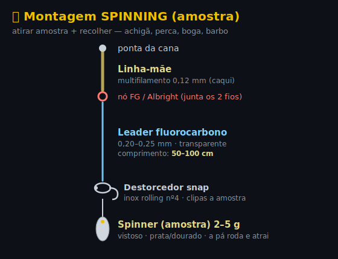
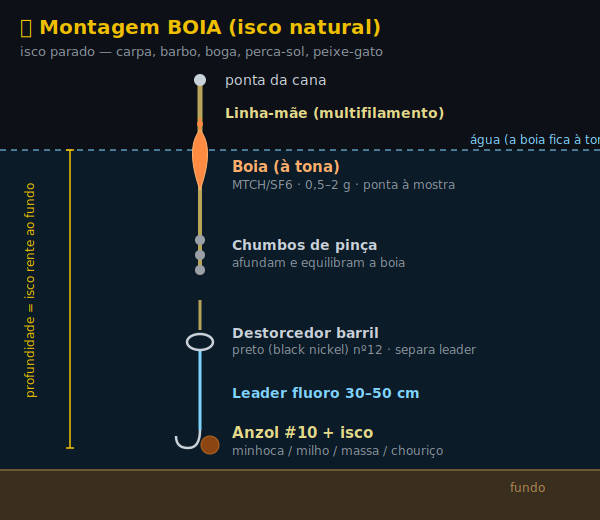
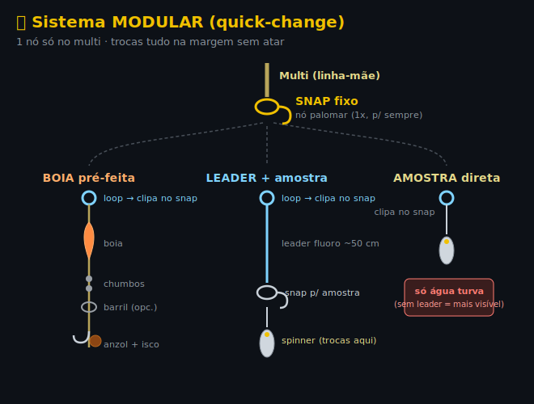

# 🎣 Setup Pesca Barragem

Setup casual para barragens portuguesas (achigã, perca-sol, carpa, barbo, boga/ruivaco).
**Spinning** (atirar amostra + recolher) + **boia** ocasional.

> **Todos os produtos abaixo são "Vendido e expedido pela Decathlon"** (sem Marketplace/3os).
> Preços de Junho/2026 — podem variar.

📍 **Onde vou pescar:** ver [**Guia de Peixes das 4 barragens**](PEIXES-BARRAGENS.md) (Alqueva, Odivelas, Castelo do Bode, Idanha) — espécies, tamanhos reais e o que o material aguenta.

---

## ✅ Lista de compra (carrinho completo)

| Item | Produto | Preço |
|------|---------|------:|
| 🎣 Carreto | [CAPERLAN WXM 100 **2500**](https://www.decathlon.pt/p/carreto-de-pesca-com-amostras-wxm-100-2500/345242/m8784314) | 24,90 € |
| 🧵 Linha mãe | [CAPERLAN TX4 multifilamento](https://www.decathlon.pt/p/multifilamento-de-pesca-com-amostra-4-fibras-tx4-130-m-caqui/362170/c109m8933473) — escolher **0,12/100** (150 m) | 7,90 € |
| 🪢 Leader fluoro | [CAPERLAN Fluorocarbono 100% Soft](https://www.decathlon.pt/p/fio-de-pesca-fluorocarbono-100percent-soft/376353/m8978545) — escolher **0,20–0,25** | 4,90 € |
| 🔗 Destorcedor snap (spinning) | [CAPERLAN Rolling Snap Inox](https://www.decathlon.pt/p/destorcedor-de-alfinete-de-pesca-rolling-snap-inox-2025-x-10/307904/m8939626) — **nº4** | 2,50 € |
| 🔗 Destorcedor barril (boia) | [CAPERLAN Barril Black Nickel](https://www.decathlon.pt/p/destorcedor-de-barril-de-pesca-black-nickel/350475/c1m8842759) — **nº12** | 1,90 € |
| ⚖️ Chumbos sortidos | [CAPERLAN Caixa Lastro 6 divisórias](https://www.decathlon.pt/p/caixa-com-lastro-de-pesca-6-divisorias/7814/m4451823) | 3,90 € |
| 🟠 Boias | [CAPERLAN MTCH 100 VISI x3](https://www.decathlon.pt/p/boia-polivalente-de-pesca-mtch-100-visi-x3/359268/m8919567) | 5,50 € |
| 🪝 Anzóis (soltos, c/ olhal) | [CAPERLAN ANZOL CARP POLE](https://www.decathlon.pt/p/anzol-carp-pole-para-a-pesca-direta-de-carpa/150242/m8371260) — escolher **#10** | 2,10 € |
| ✨ Amostras spinning | [CAPERLAN Kit Colheres Rotativas Predadores (4x)](https://www.decathlon.pt/p/kit-colheres-rotativas-pesca-de-predadores/171832/c255m8405651) | 8,90 € |
| | **TOTAL** | **≈ 62,50 €** |

> 🪝 **Anzóis soltos com olhal** (atas tu — aprender!). Tamanhos do pack: 10/12/14. Leva **#10** (perca, carpa pequena, barbo, achigã c/ minhoca); #12–14 p/ boga/ruivaco. Olhal = nó **clinch** fácil (ver Nós).

### 💸 Versão ultra-barata (~53 €)
Troca 3 itens:
- Boias → [CAPERLAN SF6 deslizantes x2](https://www.decathlon.pt/p/boias-de-pesca-deslizantes-em-espuma-sf6-4g-e-6g-x2/370126/m8954905) — **3,50 €**
- Spinner → [CAPERLAN WETA F #1](https://www.decathlon.pt/p/colher-rotativa-para-pesca-com-amostras-weta-f-1-ou-ponto-vermelho/310012/c141c14m8561097) — **2,90 €**
- Anzóis → [CAPERLAN Carpa ferro PF-HK CCT](https://www.decathlon.pt/p/anzois-pesca-direta-da-carpa-ferro-pf-hk-cct/307208/m8545335) — **2,90 €**

### ➕ Opcional (se a pescaria pegar — achigã exigente)
- [CAPERLAN YUBARI Worm vinil x10](https://www.decathlon.pt/p/amostra-flexivel-de-pesca-do-achiga-yubari-stick-bait-worm-pumpkin-worm-x-10/355324/c213m8883482) — **6,90 €**
- [CAPERLAN Anzol Texan Wide Gap (p/ vinil)](https://www.decathlon.pt/p/anzol-de-pesca-de-predadores-texan-wide-gap-abertura-larga/357866/m8911969) — **3,90 €**
- [CAPERLAN Kit Box BOXSB Achigã](https://www.decathlon.pt/p/kit-box-caixa-de-amostras-boxsb-achiga/355363/m8883541) — **14,90 €**

### 🐛 Iscos naturais (NÃO Decathlon)
- **Minhoca** — apanha tudo (perca-sol, boga, barbo, achigã pequeno).
- **Lata de milho doce** — carpa e barbo.

---

## 🎨 Cores + tamanhos (confirmado)

Regra: **o que o peixe vê debaixo de água = discreto** (leader, anzol, destorcedor). **Amostra = o contrário, vistosa.**

| Item | Cor | Tamanho |
|--|--|--|
| Braid | **Caqui** (low-vis, único cor TX4) | **0,12** (ou 0,16 +força) |
| Leader fluoro | **Transparente** (invisível) | **0,20–0,25 mm** |
| Anzol CARP POLE | **Escuro/black** (VMC) | **#10** · #12–14 p/ peixe pequeno |
| Destorcedor barril | **Black Nickel** | **nº12** |
| Destorcedor snap | Inox (rolling) | **nº4** |
| Spinner | **Vistoso** (prata/dourado) | 2–5 g |

> Água turva → cor importa pouco (peixe guia-se por cheiro/vibração). Achigã desconfiado em água limpa → snap **Black Nickel** em vez de inox.

---

## ⚖️ Peso — o que este setup aguenta

Elo mais fraco = **leader fluoro 0,20–0,25 mm (~3–4,5 kg)**. É aí que parte. ✅ **Bem dimensionado p/ os alvos casuais.**

| Peixe | Aguenta? |
|--|--|
| Achigã (2–3 kg), barbo normal, truta pequena, boga, perca-sol | ✅ **Confortável** |
| Sandre 1–3 kg, carpa/barbo 4–8 kg | ⚠️ **No limite** — freio suave, água aberta |
| Carpa 10 kg+, sandre 4–8 kg | ❌ **Acima** — bycatch que vais perder |
| **Siluro** (Idanha, Castelo do Bode), peixe-gato grande (Alqueva) | ❌ **Intocável** — parte logo. Material pesado à parte |

**Se quiseres apanhar os grandes em certas barragens:**
- Leva também **fluoro 0,28 mm (~6 kg)** p/ carpa/barbo grande (Alqueva margens, Odivelas/Idanha).
- Uns **anzóis #1–2 wide-gap** p/ fisgar sandre/predador (o #10 é mole p/ isso).
- Freio do 2500 a ~1,5–2 kg + deixa a cana trabalhar = landas mais peixe no limite.

➡️ Detalhe por barragem: [**PEIXES-BARRAGENS.md**](PEIXES-BARRAGENS.md)

---

## 🔧 Montagens (com nome das peças)

### Spinning — amostra

`Linha-mãe → nó FG/Albright → leader fluoro → destorcedor snap → spinner`

### Boia — isco natural

`Linha-mãe → boia → chumbos de pinça → destorcedor barril → leader → anzol + isco`

### 🔁 Sistema modular (quick-change) — opcional
Ponta do multi com **1 snap fixo** → encaixas boia / leader+amostra / amostra. Trocas tudo na margem **sem atar**.

**3 regras (importantes):**
1. **Nó no multi = palomar ou uni, NÃO clinch.** Multi é escorregadio; clinch desliza e solta. Atas **1 vez**, dura imenso.
2. ⚠️ **Destorcedor não passa bem nos aneis.** Leader **curto (~50 cm)** pra a junção ficar **fora da ponta** quando atiras — senão "bate" nos aneis = mau lançamento + nós.
3. **Amostra direta no multi = perdes o leader** (invisibilidade + abrasão). Só em **água turva** / peixe não exigente. Água limpa (Castelo do Bode) / pedras / sandre → **mantém leader**.

> 💡 O nó FG **não se desfaz a cada saída** — dura várias. O snap só acelera trocas; não é obrigatório.

---

## 🎯 Como pescar (profundidade, fios, técnica)

### Comprimento dos fios
| Fio | Comprimento | Notas |
|--|--|--|
| **Leader (spinning)** | **50–100 cm** | mais comprido = mais discreto; nó FG fica no carreto sem problema |
| **Leader/hooklength (boia)** | **30–50 cm** | do anzol ao destorcedor barril |
| **Anzol → chumbo** | **20–30 cm** | distância do isco ao primeiro chumbo |
| **Encher carreto** | até **~2 mm da borda** | pouco = embaraça; demais = salta |

### Profundidade
- **Boia fixa** → só até **profundidade = comprimento da cana** (~2–3 m). Água rasa/margens.
- **Boia deslizante** → corre no fio até um **nó-batente** que pões à profundidade que quiseres → pescas **água funda**. Essencial em barragem funda (Castelo do Bode, canais do Alqueva).
- **Regra do isco:** ajusta o nó-batente até o isco ficar **rente ao fundo** (carpa, barbo, peixe-gato) ou a **meia-água** (perca, boga). Mede o fundo primeiro: põe um chumbo pesado no anzol e vê onde a boia assenta.
- **Spinning:** deixa a amostra **afundar contando** (1, 2, 3… ≈ 30 cm/seg) para escolher a camada de água; recolhe a profundidades diferentes até encontrar o peixe.

### Técnica rápida
- **Spinning (achigã/perca):** atira para junto de **estrutura** (pedras, troncos, vegetação, paredão). Recolhe com **paragens** (para-anda-para) — o ataque vem quase sempre na pausa/queda. Manhã cedo e fim de tarde = melhor.
- **Boia (carpa/barbo/boga/peixe-gato):** atira, deixa assentar, **vê a boia**. Mordida = boia afunda ou deita/foge → **ferra** (levanta a cana com firmeza). Peixe-gato e carpa = paciência, deixa o isco pousado. Anoitecer = peixe-gato ataca.
- **Freio do carreto:** ~**1,5–2 kg** (cede fio antes de partir o leader). Peixe grande → deixa correr, não forces.
- **Água:** limpa (Castelo do Bode) → fino + cores naturais + discreto. Turva (depois de chuva) → cor importa pouco, peixe guia-se por cheiro/vibração (isco cheiroso, amostra com vibração).

---

## 📏 Tamanhos (anzol + chumbo)

**Anzol** (nº maior = anzol menor). Isco = minhoca/milho/massa:

| Peixe | Anzol |
|-------|-------|
| Boga / ruivaco | #12 |
| Perca-sol | #10–12 |
| Carpa | #8 (grande #6–4) |
| Barbo | #8 |
| Achigã c/ minhoca | #6–8 (ou amostra) |

➡️ Na prática: **#10** chega p/ quase tudo; **#12–14** p/ boga/ruivaco pequeno. (Carpa/barbo grandes → #8 num pack à parte.)

**Chumbo** — de pinça (cravado), pequeno. Regra: junta chumbo até a boia ficar **quase submersa** (só ponta à mostra). Põe ~20–30 cm acima do anzol. A Caixa 6 divisórias traz tamanhos sortidos — não precisas decorar números.

---

## 📋 Specs verificadas

- **TX4 braid** — diâmetros: **0,12 / 0,16 / 0,20 / 0,25 / 0,30 / 0,33 mm** (bobinas 150 m e 300 m). ⭐ 4,5 (295 aval).
- **Fluoro Soft** — gama **0,128 → 0,81 mm**, Made in Japan. ⭐ 4,7 (45 aval). Para leader: 0,20–0,25.
- **ANZOL CARP POLE** — soltos c/ olhal, tamanhos 10/12/14. ⭐ 4,7 (74 aval).

---

## 🐟 Notas de iniciante

| Peixe | Como apanhar |
|-------|--------------|
| **Achigã** | Predador. Spinner ou vinil junto a estruturas (pedras, troncos, vegetação). Recolhe com paragens. |
| **Perca-sol** | Pequena, agressiva, fácil. Minhoca à boia ou spinner pequeno. Boa p/ praticar. |
| **Carpa / Barbo** | Fundo, isco milho/minhoca. Paciência, deixa pousar. |
| **Boga / Ruivaco** | Cardume. Minhoca pequena à boia, anzol pequeno (#10–12). |

**Boias — fixa vs deslizante:**
- **Fixa** — profundidade ≤ comprimento da cana. Águas rasas/médias. (MTCH/SF6 chegam.)
- **Deslizante** — corre no fio até nó-batente → pescas **água funda**. Precisas se as zonas forem fundas ou para isco no fundo (predadores).
- "Boia de pesca **ao fundo**" = isco assenta no fundo, boia só marca mordida (alvo carpa grande / achigã c/ peixe-isco). Nicho diferente do milho/minhoca à meia-água.

**Nós:**
- **Clinch melhorado** (anzol de olhal / destorcedor):
  1. Passa o fio pelo olhal, deixa ~15 cm de sobra.
  2. Dá **5–6 voltas** com a ponta à volta da linha principal.
  3. Passa a ponta pelo **laço junto ao olhal**.
  4. Passa pelo **laço grande** que se formou.
  5. **Molha** o nó, puxa devagar pela linha principal, corta a sobra.
- **Snell** (avançado — no anzol de olhal, puxão alinhado c/ a haste = fisgada direta):
  1. Passa a ponta pelo olhal (frente→trás), ~20 cm de sobra.
  2. Passa **a mesma ponta** pelo olhal outra vez, mesmo sentido → fica um **laço** ao lado da haste.
  3. Encosta o laço à haste.
  4. Com o laço, dá **6–7 voltas** à volta da **haste + fio**, do olhal pra baixo, apertadas e lado a lado.
  5. Segura as voltas; puxa a **linha principal** devagar pra fechar.
  6. **Molha**, aperta pela linha principal, corta a sobra.
- Juntar multi + leader → **FG** (melhor) ou **Albright** (mais fácil).

> ℹ️ Decathlon só vende anzol **solto de olhal** (pala/spade só pré-atado). Snell faz-se na mesma no olhal.

**Dica:** enche a bobina do carreto até ~2 mm da borda — pouco fio embaraça, demasiado salta.

---

## 📄 Licença (quando quiseres)
Barragem = águas interiores → **Licença Geral de Pesca Lúdica** (ICNF). Ano civil, tira no **Multibanco** (CC + NIF), poucos €. 16+. [Info ICNF](https://www.icnf.pt/pesca/pescaludicaedesportiva/licencas)
