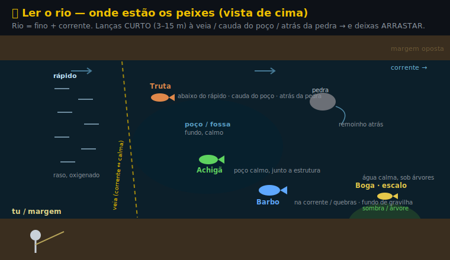

# 🏞️ Rios — Centro & Serra da Estrela

Spots de **rio** (e uma lagoa de montanha), diferentes das [4 barragens](PEIXES-BARRAGENS.md). Aqui entra a **truta** 🐟 — que nas barragens não há.

> ⚠️ **Alguns destes troços são concessões / zonas reguladas** (Ceira-Góis, Lagoas da Estrela, Isna): precisam de **licença própria + edital**. **O Alva nos campings (Arganil/Côja/Bica/3 Entradas) é águas livres** (só a geral, isco+amostra) — a concessão "só-mosca" do Alva é **só em Poiares, a jusante**. Confirma sempre antes de ir → [⚖️ Regras & licença](REGRAS.md). Quase todos são **praias fluviais** (cuidado com zona balnear).

---

## 🗺️ Mapa — local → rio → peixes

| Local | Rio | Peixes | Tipo |
|---|---|---|---|
| **Góis** | Ceira | 🐟 truta · boga · barbo · escalo | montanha (frio) |
| **Arganil** (Secarias) | Alva | barbo · boga · escalo · carpa · achigã | rio médio |
| **Côja** | Alva | barbo · boga · escalo · carpa · achigã | rio médio (açude) |
| **Bica** (Pomares) | Rib. de Pomares → Alva | 🐟 truta · boga · escalo | ribeira de montanha |
| **Ponte das Três Entradas** | Alva + Alvôco | barbo · boga · achigã · carpa | transição |
| **Valhelhas** | alto Zêzere | 🐟 truta · boga · escalo | montanha (frio) |
| **Janeiro de Baixo** | Zêzere (médio) | barbo · boga · achigã · carpa | rio médio |
| **Vale do Rossim** | Lagoa (1437 m) | 🐟 truta · perca-sol | lagoa de altitude |
| **Aldeia Ruiva** | Rib. da Isna | barbo · boga · achigã (truta nos rápidos) | ribeira quente |
| **Bostelim** | Rib. do Bostelim → Isna | barbo · boga · escalo · achigã | ribeira c/ açudes |
| **Oleiros** (vila) | Rib. de Oleiros | barbo · boga · achigã | ribeira açudada |

> 🎣 **Perto de Oleiros**, o **Rio Zêzere** (praias de Cambas/Mosteiro) é destino forte de **achigã** desportivo (barco, visitantes ES/FR).

> 🐠 **Outros rios de barbo/carpa no Centro** (vistos em vídeos — confirma sempre licença/edital): **Rio Nabão** (Tomar — barbo grande; na cidade, da **Ponte dos Arcos p/ jusante**, é **obrigatório soltar**) · **Rio Lis** (Leiria) · **Bª de Fagilde / Riodão** (barbo XXL na corrente, esvazia com chuva) · **Aguieira** (carpa nas **entradas de ribeiros**; tem siluro).

> 🔗 **Como pescar cada peixe** (mesmos setups das barragens): 🐟 [Truta](EXEMPLOS-MODULAR.md#ex-truta) · 🟢 [Achigã](EXEMPLOS-MODULAR.md#ex-achiga) · 🔵 [Barbo](EXEMPLOS-MODULAR.md#ex-barbo) · 🟡 [Boga](EXEMPLOS-MODULAR.md#ex-boga). Predador/truta = **amostra**; barbo/boga = **boia ou fundo leve**.

> 🗺️ **Ler o rio** (≠ barragem — mais fino + corrente): lança **curto** à **veia / cauda do poço / atrás da pedra**, e **deixa arrastar**.

---

## 🌊 Por rio

### 🔵 Rio Alva — Arganil · Côja · Três Entradas · Bica
- **Peixes:** barbo, boga, escalo, carpa e achigã; **truta** nos **afluentes salmonícolas** — **Alvôco** (3 Entradas) e **Rib. de Pomares** (Bica) — até 31 jul.
- **Licença: nestes spots o Alva é ÁGUAS LIVRES** → só a **licença geral**, e podes usar **isco E amostra**. ✅
- ⚠️ **Não confundir:** a concessão **só-mosca** (fly-only, anzol sem barbela, licença diária) da **Câmara de V.N. Poiares** é **apenas um troço lá em baixo** (freguesias de **Lavegadas / S. Martinho da Cortiça**, ~20 km a jusante de Côja) — **não se aplica a Arganil/Côja/Bica/3 Entradas**. ([Edital 12/2025](https://www.jfsaomiguelpoiares.pt/ficheiros/fic707_1743514998.pdf))
- **Como:** barbo/boga/carpa a [fundo/boia](EXEMPLOS-MODULAR.md#ex-boga) com **isco**; achigã a [vinil/amostra](EXEMPLOS-MODULAR.md#ex-achiga) (**devolução proibida** em rio — matar); truta nos **afluentes salmonícolas** (Alvôco/Pomares, até 31 jul) a [colher](EXEMPLOS-MODULAR.md#ex-truta).

### 🔵 Rio Ceira — Góis
- Rio **clássico de truta**; o troço de Góis já leva boga, barbo e escalo a jusante.
- **Concessão (Município de Góis):** precisa **licença especial diária** (residentes 2 €, outros ~5 €; máx. **18 pescadores/dia**). Só **3 espécies — truta, barbo, boga** (**achigã não conta** aqui). Truta máx. 10/dia (mín. 20 cm); barbo/boga **sem morte**; sem barco nem larvas naturais.
- **Como:** [truta](EXEMPLOS-MODULAR.md#ex-truta) a colher/vinil pequeno; boga à [boia](EXEMPLOS-MODULAR.md#ex-boga).

### 🟢 Rio Zêzere — Valhelhas · Janeiro de Baixo · Oleiros (Cambas)
- **Valhelhas (alto):** água fria = **truta** + boga/escalo. **Janeiro de Baixo (médio):** barbo, boga, achigã, carpa. **Cambas/Mosteiro (Oleiros):** **achigã** de barco.
- 📋 **Licença: o Zêzere é ÁGUAS LIVRES** em Valhelhas, Janeiro de Baixo e Cambas → só a **licença geral** (isco + amostra). **Valhelhas** é água **salmonícola** (truta): 1 cana, isco = **só minhoca/anzol simples, sem asticot**. 🐟 **Bónus:** no Zêzere a época da truta vai até **31 ago** (exceção, não 31 jul — confirma c/ ICNF Guarda).
- **Como:** truta no alto a [colher/mosca](EXEMPLOS-MODULAR.md#ex-truta); achigã a [vinil](EXEMPLOS-MODULAR.md#ex-achiga); barbo/boga a [boia](EXEMPLOS-MODULAR.md#ex-boga).

### 🟡 Ribeira da Isna — Aldeia Ruiva · Bostelim · Oleiros (vila)
- Ribeiras mais **quentes** (bacia Zêzere/Tejo): barbo, boga, escalo, achigã; truta só nos **rápidos** frios.
- **Concessão "Malhadal" (Município de Proença-a-Nova):** **licença diária especial, máx. 10/dia** (residentes 1–1,5 €, outros 4,99 €), comprada **presencialmente** (câmara/posto de turismo). ⚠️ Regulamento **antigo/sem data e fora do registo ICNF** → **confirma com a câmara (274 670 000)** se está a correr. Nota: **Aldeia Ruiva** é outra praia da **mesma** ribeira (a concessão é no **Malhadal**).
- **Como:** [boia/fundo leve](EXEMPLOS-MODULAR.md#ex-boga) para barbo/boga · [vinil](EXEMPLOS-MODULAR.md#ex-achiga) para achigã.

### ⛰️ Lagoa do Vale do Rossim — Serra da Estrela (~1437 m)
- A **praia fluvial mais alta do país**. **Truta arco-íris** (repovoada) + fário, e perca-sol. Água muito fria e limpa.
- ⚠️ **Zona de Pesca Reservada (ICNF) — em 2026 NÃO há época individual:** só se pesca **integrado em provas** (competições) autorizadas, **sem morte**. Um pescador sozinho **não pode ir pescar** (licença coletiva da prova = 120 €/lagoa/dia). **Confirma o edital do ano** antes de planeares a viagem.
- **Como:** [truta](EXEMPLOS-MODULAR.md#ex-truta) a colher/vinil pequeno ou mosca; cores naturais, fio fino.

---

## ⚖️ Regras & licenças — rios (confirmado nos editais ICNF/câmaras)

> 💳 **Tudo sobre licenças (incl. onde comprar cada uma)** está junto em [**💳 Licenças**](LICENCAS.md). Resumo aqui:

**1. Licença geral (ICNF) — sempre obrigatória** (16+; menores isentos mas acompanhados). Tira-se no **Multibanco** (o talão é o título) ou nos balcões do ICNF; é **anual** (Nacional/Regional). **Não há "diária" na geral** — *não confundir com o BMAR, que é pesca no mar.*

**2. Época da TRUTA: 1 mar – 31 jul** (fechado ago–fev). Mín. **20 cm** (21 cm no Alva). Limite/dia **varia por zona** (4–10).
> ⚠️ O **16 mar – 14 jun** é o **defeso dos ciprinídeos nativos** (boga, escalo, barbo) — **não** da truta. Nessas datas, boga/barbo estão protegidos mesmo na época da truta.

**3. Precisa de licença ESPECIAL (além da geral)?**

| Local | Tipo | Licença especial |
|---|---|---|
| **Alva** — campings (Arganil/Côja/Bica/3 Entradas) | **águas livres** | ❌ só geral (isco+amostra) |
| **Alva** — só troço de **Poiares** (a jusante) | concessão **só-mosca** | ✅ diária — *não afeta os campings* |
| **Ceira** (Góis) | concessão (município) | ✅ diária 2–5 €, máx. 18/dia |
| **Vale do Rossim / Lagoas** | zona reservada | ✅ **só em provas** (120 €/lagoa, coletiva) |
| **Isna / Malhadal** (Proença) | concessão municipal ⚠️ | ✅ diária 1–5 €, máx. 10/dia — *confirma c/ câmara* |
| **Zêzere em Oleiros** (Cambas) | **águas livres** | ❌ só a licença geral |

**4. Confirma SEMPRE o edital do ano** — datas, preços e troços mudam. Muitos troços só permitem **iscos artificiais / anzol sem barbela**, captura **sem morte**, 1 cana. Leva sempre **licença geral + (onde aplica) licença especial + cartão de cidadão**. Geral em [⚖️ Regras & licença](REGRAS.md).

> 📍 Locais confirmados por mapa (correções aos rótulos): **Bica** = Pomares/**Arganil** · **Bostelim** = **Vila de Rei** · **Oleiros** (pin) = praia da vila na Ribeira de Oleiros (o Zêzere fica em Cambas/Mosteiro).
